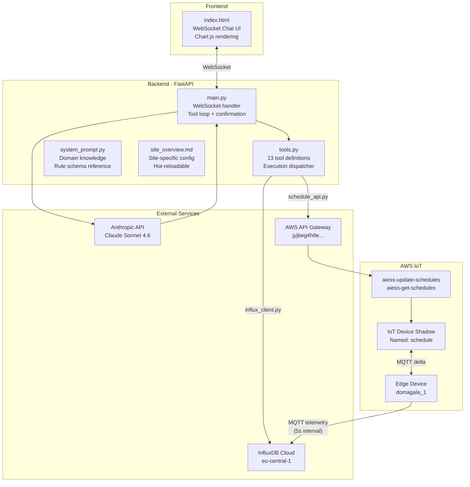
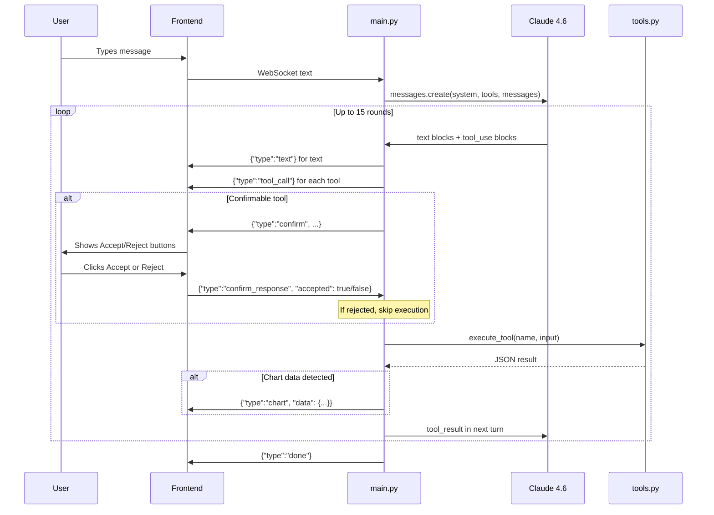
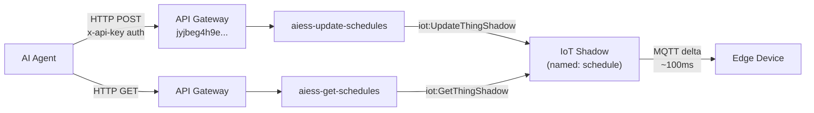

# AIESS Energy Core — Architecture Overview

## System Summary

AIESS Energy Core is an AI-powered conversational agent for managing a Battery Energy Storage System (BESS). It uses Claude Sonnet 4.6 with tool-use to read/write schedule rules via AWS IoT Device Shadow, query real-time and historical energy telemetry from InfluxDB Cloud, and render interactive charts inline in a mobile-style chat UI.

The agent operates in Polish and is designed for a single site (`domagala_1`), with hot-reloadable site-specific configuration.

---

## High-Level Architecture

---

## Agent Conversation Loop

---

## Data Flow — Telemetry Pipeline

```mermaid
graph LR
    Device["Edge Device<br/>domagala_1"] -->|"MQTT 5s"| IoTCore["AWS IoT Core"]
    IoTCore -->|"IoT Rule"| Forwarder["Lambda<br/>iot-to-telegraf-forwarder"]
    Forwarder -->|"HTTP POST"| Telegraf["EC2 Telegraf<br/>3.66.189.107:8080"]
    Telegraf -->|"Line Protocol"| Raw["aiess_v1<br/>(5s, 90d)"]
    Raw -->|"Lambda 1m"| Agg1m["aiess_v1_1m<br/>(180d)"]
    Agg1m -->|"Lambda 15m"| Agg15m["aiess_v1_15m<br/>(1095d)"]
    Agg15m -->|"Lambda 1h"| Agg1h["aiess_v1_1h<br/>(3650d)"]
```

The telemetry payload from the device includes:
- `grid_power`, `pcs_power`, `soc`, `total_pv_power`, `compensated_power`
- `active_rule_id`, `active_rule_priority`, `active_rule_action`, `active_rule_power`

Aggregation Lambdas run on EventBridge schedules and compute `*_mean`, `*_min`, `*_max` for each window.

---

## Control Flow — Schedule Rules

---

## Component File Map

| File | Purpose |
|------|---------|
| `ai_agent/main.py` | FastAPI server, WebSocket chat handler, tool loop, confirmation gate |
| `ai_agent/tools.py` | 13 tool definitions (Anthropic format), execution dispatcher |
| `ai_agent/system_prompt.py` | System prompt with domain knowledge, rule schema, InfluxDB reference |
| `ai_agent/influx_client.py` | InfluxDB Cloud client, Flux queries, chart data generation |
| `ai_agent/schedule_api.py` | AWS API Gateway client for schedule CRUD operations |
| `ai_agent/site_overview.md` | Site-specific config (hot-reloadable without server restart) |
| `ai_agent/static/index.html` | Frontend: WebSocket chat UI, Chart.js rendering, confirmation dialogs |
| `ai_agent/.env` | Environment variables (API keys, tokens) |

---

## Configuration

### Environment Variables

| Variable | Required | Default | Purpose |
|----------|----------|---------|---------|
| `ANTHROPIC_API_KEY` | Yes | — | Anthropic API key for Claude Sonnet 4.6 |
| `AIESS_API_KEY` | No | Hardcoded | AWS API Gateway key for schedule API |
| `INFLUX_TOKEN` | Yes | — | InfluxDB Cloud read token (aiess org) |
| `INFLUX_URL` | No | `https://eu-central-1-1.aws.cloud2.influxdata.com` | InfluxDB Cloud URL |
| `INFLUX_ORG` | No | `aiess` | InfluxDB organization |
| `PORT` | No | `8100` | Server port (default avoids Windows Hyper-V reserved range) |

### Key Constants

| Constant | Value | Location |
|----------|-------|----------|
| `MODEL` | `claude-sonnet-4-6` | `main.py` |
| `MAX_TOKENS` | `4096` | `main.py` |
| `MAX_TOOL_ROUNDS` | `15` | `main.py` |
| `SITE_ID` | `domagala_1` | `influx_client.py`, `schedule_api.py` |
| API Gateway endpoint | `https://jyjbeg4h9e.execute-api.eu-central-1.amazonaws.com/default` | `schedule_api.py` |

### Endpoints

| Endpoint | Method | Purpose |
|----------|--------|---------|
| `GET /` | HTTP | Serves chat UI (`static/index.html`) |
| `GET /health` | HTTP | Health check (returns model, tools list) |
| `WebSocket /ws/chat` | WS | Main conversation endpoint |
| `GET /static/*` | HTTP | Static file serving |

---

## Key Design Decisions

1. **Single-file frontend** — Everything in one `index.html` with inline JS/CSS for simplicity and portability.
2. **Hot-reloadable site config** — `site_overview.md` is re-read on every message, allowing live edits without server restart.
3. **Confirmation gate** — Write operations require explicit user Accept/Reject via WebSocket round-trip before execution.
4. **Chart detection via marker** — Tool results with `_chart: True` are intercepted by `main.py` and sent as a separate `chart` message type to the frontend.
5. **Polish language** — All user-facing text is in Polish; system prompt enforces Polish responses from Claude.
6. **Source tagging** — All AI-created rules automatically get `"s": "ai"` to distinguish from manual rules.
