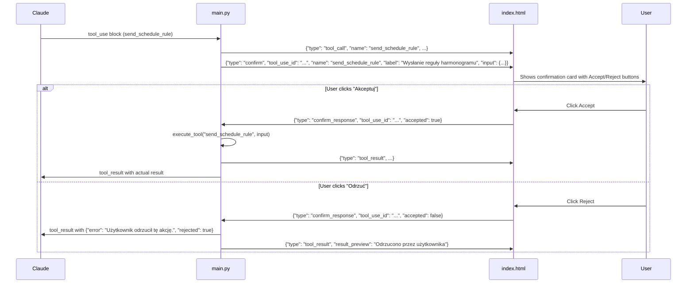

# AIESS Energy Core — Safety & Confirmation Layer

This document describes all safety measures, guardrails, and the user confirmation flow that protect the physical battery system from unintended operations.

---

## Confirmation Layer

### Which Tools Require Confirmation

Four tools that perform **write operations** to the battery system require explicit user acceptance before execution:

| Tool | Polish Label Shown in UI | What It Does |
|------|--------------------------|--------------|
| `send_schedule_rule` | "Wysłanie reguły harmonogramu" | Creates or updates a schedule rule |
| `delete_schedule_rule` | "Usunięcie reguły harmonogramu" | Removes a schedule rule |
| `set_system_mode` | "Zmiana trybu systemu" | Changes automatic/semi-auto/manual mode |
| `set_safety_limits` | "Zmiana limitów bezpieczeństwa" | Changes SoC min/max safety limits |

All **read-only** tools (status, summaries, queries, history, charts) execute immediately without confirmation.

### Configuration in `main.py`

```python
CONFIRMABLE_TOOLS = {
    "send_schedule_rule",
    "delete_schedule_rule",
    "set_system_mode",
    "set_safety_limits",
}

TOOL_CONFIRM_LABELS = {
    "send_schedule_rule": "Wysłanie reguły harmonogramu",
    "delete_schedule_rule": "Usunięcie reguły harmonogramu",
    "set_system_mode": "Zmiana trybu systemu",
    "set_safety_limits": "Zmiana limitów bezpieczeństwa",
}
```

---

## Confirmation Flow (WebSocket Protocol)



### Backend Confirmation Gate (excerpt from `main.py`)

```python
if block.name in CONFIRMABLE_TOOLS:
    await websocket.send_text(json.dumps({
        "type": "confirm",
        "tool_use_id": block.id,
        "name": block.name,
        "label": TOOL_CONFIRM_LABELS.get(block.name, block.name),
        "input": block.input,
    }))
    raw = await websocket.receive_text()
    try:
        confirm_msg = json.loads(raw)
    except json.JSONDecodeError:
        confirm_msg = {}

    if not confirm_msg.get("accepted"):
        tool_results.append({
            "type": "tool_result",
            "tool_use_id": block.id,
            "content": json.dumps({
                "error": "Użytkownik odrzucił tę akcję.",
                "rejected": True,
            }),
        })
        continue
```

### Frontend Confirmation Card

The UI renders a compact confirmation card with:
- Amber warning icon
- "Potwierdzenie akcji" header
- Tool label (e.g., "Wysłanie reguły harmonogramu")
- Key details extracted from tool input (rule ID, action type, power, priority, time window)
- Two buttons: "Akceptuj" (green) and "Odrzuć" (gray)

After the user clicks, the buttons are disabled and a status label ("Zaakceptowano" / "Odrzucono") appears.

---

## System Prompt Guardrails

The system prompt (`system_prompt.py`) enforces several behavioral constraints on the AI:

### 1. No Double Confirmation

> "Do NOT ask 'Czy na pewno?' or similar — the UI already handles confirmation."

Since the UI provides Accept/Reject buttons, Claude must not add its own confirmation questions. It should briefly explain what it's about to do, then call the tool directly.

### 2. Never Speculate About Rules

> "NEVER write 'prawdopodobnie aktywna była reguła' or 'possibly a rule was active'."

Before commenting on battery behavior, Claude MUST call `get_active_rule_history` to determine which rule was actually executing. If no data is available (firmware too old), it must say so explicitly.

### 3. Always Check Before Modifying

> "Always read current schedules before modifying to understand existing state."

Claude must call `get_current_schedules` before creating or deleting rules to avoid conflicts.

### 4. Respond in Polish

> "All explanations, analysis, and conversation must be in Polish."

Technical terms (SoC, kW, kWh, PV, grid) remain in English; sentences are in Polish.

### 5. Respect User Authority

> "When user explicitly asks you to do something, do it."

Claude should not block user actions with excessive warnings. A short one-line note about consequences is acceptable, but the confirmation UI handles the safety gate.

### 6. Rejection Acknowledgment

> "If the user rejects, acknowledge politely and ask what they'd like to do instead."

When Claude receives `"rejected": true` in a tool result, it should gracefully acknowledge and offer alternatives.

---

## Priority Restrictions

| Priority Range | Access Level |
|----------------|-------------|
| P1–P3 | Read-only — local device rules, cannot be modified by AI |
| P4–P9 | Read/write — cloud rules, AI can create/update/delete |
| P10–P11 | Read-only — system safety rules, cannot be modified by AI |

The AI can only write rules to priorities P4–P9. The `send_schedule_rule` tool enforces `minimum: 4, maximum: 9` in its input schema, so Claude physically cannot request a priority outside this range.

---

## Source Tagging

All AI-created rules automatically receive `"s": "ai"` in the `execute_tool` dispatcher:

```python
elif name == "send_schedule_rule":
    rule = input_data["rule"]
    rule["s"] = "ai"  # Always mark as AI-generated
```

This allows distinguishing AI-created rules from manually created ones (`"s": "man"`) in the shadow history.

---

## Max Tool Rounds

```python
MAX_TOOL_ROUNDS = 15
```

Each conversation turn allows a maximum of 15 tool-call rounds. If Claude exceeds this, the server sends an error:
> "Reached maximum tool execution rounds. Please try a simpler request."

This prevents infinite loops where Claude keeps calling tools without reaching a conclusion.

---

## Site-Specific Constraints

The `site_overview.md` file (hot-reloaded on every message) contains critical business rules for the `domagala_1` site:

| Constraint | Reason |
|------------|--------|
| **Never charge from grid** | Fixed tariff (0.70 PLN/kWh) — no price arbitrage, charging from grid is a net loss (~10% round-trip efficiency loss) |
| **Only charge from PV surplus** | When `grid_power < 0` (exporting), meaning PV produces more than consumption |
| **Don't discharge below 40% SoC without PV** | Preserve buffer for peak shaving; no way to recharge without PV |
| **Peak shaving only when necessary** | Only discharge for grid protection (>80 kW connection limit), not for "optimization" |
| **Don't suggest nighttime charging** | Same price 24/7 → no benefit, only efficiency loss |
| **Grid connection limit: 80 kW** | Contractual maximum, protected by P9 site_limit rule |
| **Max export: 40 kW** | Grid export capped |
| **SoC warranty limit: ≥5%** | Never discharge below 5% |

These constraints are embedded in the system prompt and guide Claude's decision-making.

---

## Safety Limits (P11)

The SoC safety limits are enforced at the highest priority level (P11) by the edge device:

```json
{"safety": {"soc_min": 5, "soc_max": 100}}
```

- **soc_min**: Battery won't discharge below this percentage
- **soc_max**: Battery won't charge above this percentage
- **Hot-reload**: Changes apply in ~1 second, zero downtime
- **Validation**: `soc_min` must be 1-50, `soc_max` must be 50-100, `soc_min < soc_max`

---

## Error Handling

All tool executions are wrapped in try/except. On failure:

```json
{
  "error": "Error description",
  "type": "ExceptionClassName",
  "traceback": "(last 500 chars)"
}
```

Claude receives this error and can explain it to the user in Polish, suggesting alternatives or retries.

---

## Summary of Safety Layers

| Layer | What | Where |
|-------|------|-------|
| UI confirmation | User must click Accept/Reject for write operations | Frontend + Backend WebSocket |
| Priority restriction | AI limited to P4-P9 | Tool input schema validation |
| Source tagging | All AI rules marked with `"s": "ai"` | Backend dispatcher |
| Max tool rounds | 15 rounds per turn | Backend loop |
| System prompt rules | No speculation, always check data, Polish responses | `system_prompt.py` |
| Site constraints | No grid charging, PV-only, peak shaving logic | `site_overview.md` |
| SoC safety limits | P11 hardware enforcement | Edge device firmware |
| Validation | Parameter bounds checked (SoC ranges, priority ranges) | Tool schemas + backend |
