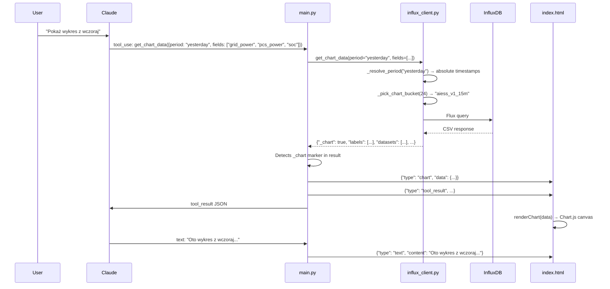

# AIESS Energy Core — Chart System

The AI agent can generate interactive Chart.js charts that render inline within the chat conversation. This document describes the full pipeline from tool invocation to rendered chart.

---

## End-to-End Flow



---

## Tool: `get_chart_data`

### Parameters

| Parameter | Type | Required | Description |
|-----------|------|----------|-------------|
| `source` | string | No | `"energy"` (default) or `"tge_price"` |
| `period` | string | No | `"today"`, `"yesterday"`, `"this_week"`, `"last_week"` |
| `fields` | array | No | Fields to plot (energy source only). Default: `["grid_power", "pcs_power", "soc"]` |
| `hours` | integer | No | Hours to look back. Only for explicit "last N hours" requests |
| `chart_type` | string | No | `"line"` (default) or `"bar"` |
| `title` | string | No | Chart title in Polish. Auto-generated if omitted |

### Available Fields (source: `energy`)

| Field | Label (Polish) | Color | Y-Axis |
|-------|----------------|-------|--------|
| `grid_power` | Moc sieci (kW) | `#2196F3` (blue) | Primary (kW) |
| `pcs_power` | Moc baterii (kW) | `#4CAF50` (green) | Primary (kW) |
| `soc` | SoC (%) | `#FF9800` (orange) | Secondary (0–100%) |
| `total_pv_power` | Moc PV (kW) | `#9C27B0` (purple) | Primary (kW) |
| `compensated_power` | Kompensacja (kW) | `#00BCD4` (cyan) | Primary (kW) |
| `active_rule_power` | Moc reguły (kW) | `#E91E63` (pink) | Primary (kW) |

### TGE Price Charts (source: `tge_price`)

When `source` is `"tge_price"`, no `fields` parameter is needed. Returns a single dataset:

| Dataset | Label | Color | Y-Axis Unit |
|---------|-------|-------|-------------|
| Price | Cena (PLN/kWh) | `#E91E63` | PLN/kWh |

Prices are converted from PLN/MWh (raw InfluxDB) to PLN/kWh (÷1000) for user readability.

---

## Chart Data Return Format

The `get_chart_data` function returns a dictionary with the special `_chart: True` marker that `main.py` uses to detect chart data and route it to the frontend.

### Energy Chart

```json
{
  "_chart": true,
  "chart_type": "line",
  "title": "Dane energetyczne — dziś",
  "labels": [
    "2026-02-09T00:00:00Z",
    "2026-02-09T00:15:00Z",
    "..."
  ],
  "datasets": [
    {
      "label": "Moc sieci (kW)",
      "data": [25.3, 24.8, "..."],
      "color": "#2196F3"
    },
    {
      "label": "SoC (%)",
      "data": [65.4, 65.3, "..."],
      "color": "#FF9800",
      "yAxisID": "y1",
      "fill": true
    }
  ],
  "point_count": 480,
  "hours": 8
}
```

### TGE Price Chart

```json
{
  "_chart": true,
  "chart_type": "line",
  "title": "Ceny energii TGE — dziś",
  "labels": ["2026-02-09T00:00:00Z", "2026-02-09T01:00:00Z", "..."],
  "datasets": [
    {
      "label": "Cena (PLN/kWh)",
      "data": [0.3505, 0.3202, "..."],
      "color": "#E91E63",
      "fill": true
    }
  ],
  "point_count": 24,
  "hours": 24,
  "y_unit": "PLN/kWh"
}
```

---

## Chart Detection in `main.py`

After tool execution, `main.py` checks if the result contains chart data:

```python
result_obj = json.loads(result_str)
if isinstance(result_obj, dict) and result_obj.get("_chart"):
    await websocket.send_text(json.dumps({
        "type": "chart",
        "data": result_obj,
    }))
```

This sends the chart data as a separate WebSocket message **before** the tool_result message, ensuring the frontend renders the chart before any follow-up text.

---

## Smart Bucket Selection

To keep charts responsive and avoid data truncation, the backend automatically selects the optimal InfluxDB bucket:

| Time Range | Bucket | Resolution | ~Data Points |
|------------|--------|-----------|-------------|
| ≤ 8 hours | `aiess_v1_1m` | 1 minute | ≤ 480 |
| 8–125 hours | `aiess_v1_15m` | 15 minutes | ≤ 500 |
| > 125 hours | `aiess_v1_1h` | 1 hour | varies |

The `limit(n:)` in the Flux query is dynamically calculated to cover the entire requested range plus a small buffer:

```python
resolution_min = {"aiess_v1_1m": 1, "aiess_v1_15m": 15, "aiess_v1_1h": 60}
max_points = int((effective_hours * 60) / resolution_min.get(bucket, 1)) + 10
```

---

## Frontend Rendering (Chart.js)

### Libraries

- **Chart.js 4.4.4** — core charting library
- **chartjs-adapter-date-fns 3.0.0** — time scale adapter

Both loaded via CDN in `index.html`.

### `renderChart(chartData)` Function

1. Creates a container `<div>` with title and a 240px-height canvas
2. Converts ISO 8601 labels to `Date` objects
3. Maps datasets with colors, border width, point radius (0 for performance)
4. Configures dual Y-axis if any dataset has `yAxisID: "y1"`
5. Sets up adaptive X-axis formatting based on chart time range

### Dual Y-Axis Configuration

| Axis | Position | Use | Range |
|------|----------|-----|-------|
| `y` (primary) | Left | Power values (kW) or price (PLN/kWh) | Auto-scaled |
| `y1` (secondary) | Right | SoC (%) | Fixed 0–100% |

The secondary axis is only created when at least one dataset specifies `yAxisID: "y1"` (currently only SoC).

### Adaptive X-Axis Formatting

The time scale formatting adapts based on the `hours` value in chart data:

| Hours | Unit | Tick Format | Example |
|-------|------|------------|---------|
| ≤ 6 | minute | `HH:mm` | `14:30` |
| ≤ 24 | hour | `HH:mm` | `14:00` |
| ≤ 72 | hour | `dd.MM HH:mm` | `09.02 14:00` |
| ≤ 336 (14 days) | day | `dd.MM (day)` | `09.02 (pon)` |
| > 336 | day | `dd.MM` | `09.02` |

Day abbreviations are in Polish: `ndz`, `pon`, `wt`, `śr`, `czw`, `pt`, `sob`.

### Tooltip Configuration

- Background: semi-transparent black (`rgba(0,0,0,0.78)`)
- Mode: `index` (shows all datasets at hovered X position)
- Title format: `dd.MM.yyyy (day) HH:mm` in Polish (e.g., `09.02.2026 (pon) 14:30`)
- Values: numeric with dataset labels

### Visual Settings

| Property | Value |
|----------|-------|
| Point radius | 0 (hidden for performance) |
| Point hover radius | 4 |
| Border width | 2 |
| Tension | 0.3 (smooth curves) |
| Fill | Only for SoC and TGE price datasets |
| Background color | Dataset color + `18` alpha (very transparent) |
| Grid lines | Primary Y only, `#f0f0f0` |
| Legend | Bottom position, 10px box width, 10px font |
| Chart height | 240px (fixed) |
| Max width | 95% of chat container |

---

## Common Chart Scenarios

### "Pokaż wykres baterii z dziś"

```json
{
  "source": "energy",
  "period": "today",
  "fields": ["pcs_power", "soc"],
  "title": "Moc baterii i SoC — dziś"
}
```

### "Wykres zużycia z tego tygodnia"

```json
{
  "source": "energy",
  "period": "this_week",
  "fields": ["grid_power", "pcs_power", "total_pv_power", "soc"],
  "title": "Przegląd energii — ten tydzień"
}
```

### "Ceny energii na wczoraj"

```json
{
  "source": "tge_price",
  "period": "yesterday",
  "title": "Ceny energii TGE — wczoraj"
}
```

### "Wykres z ostatnich 6 godzin"

```json
{
  "source": "energy",
  "hours": 6,
  "fields": ["grid_power", "pcs_power", "soc"],
  "title": "Dane energetyczne — ostatnie 6h"
}
```
