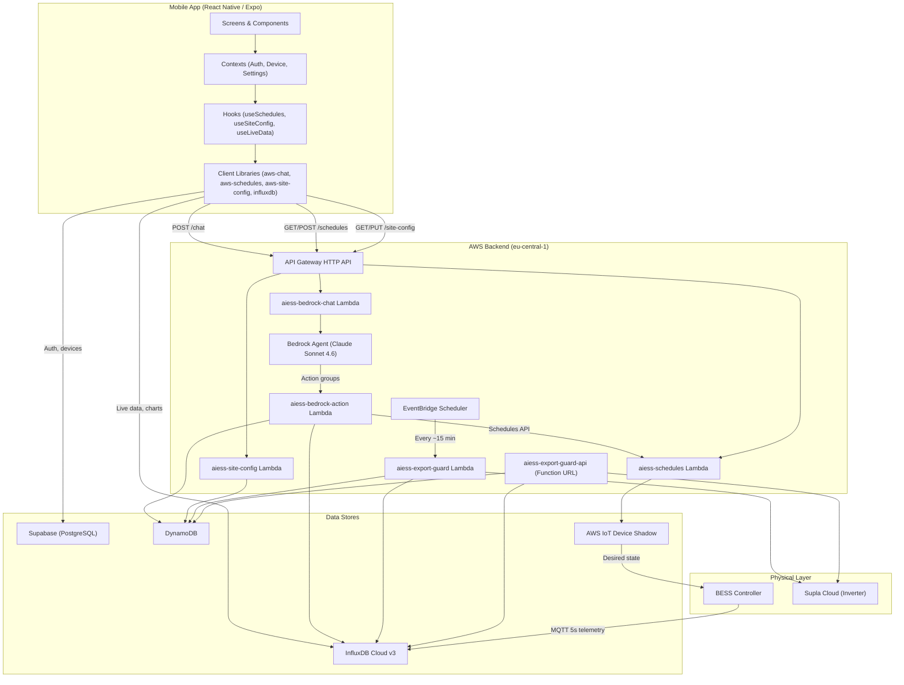
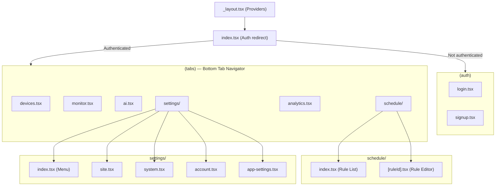

# 01 — System Architecture

> AIESS Mobile Energy App — single-site BESS management platform.
> This document is the entry point for understanding the full system before
> building the multi-site **AIESS Cloud** VPP / clustering layer.

---

## 1. High-Level Overview



---

## 2. Tech Stack

| Layer | Technology | Details |
|-------|-----------|---------|
| **Mobile App** | React Native 0.81 / Expo ~54 / Expo Router ~6 | Cross-platform (iOS, Android, Web) |
| **State Management** | React Query 5, Zustand 5, React Context | Server-state caching + local UI state |
| **Auth** | Supabase Auth | Email/password, Google OAuth, Apple Sign-In |
| **AI Agent** | AWS Bedrock | Claude Sonnet 4.6, Agent with action groups |
| **Serverless** | AWS Lambda (Node.js 20, ESM) | 5 Lambda functions |
| **API Gateway** | AWS HTTP API Gateway | REST routes with API key auth |
| **Relational DB** | Supabase (PostgreSQL) | Users, devices, roles |
| **Document DB** | DynamoDB | Site config, export guard state |
| **Time-Series DB** | InfluxDB Cloud v3 (Flux) | Telemetry at 5s/1m/15m/1h, TGE prices |
| **Device Control** | AWS IoT Core Named Shadows | Schedule rules, safety limits, system mode |
| **Scheduling** | EventBridge Scheduler | Periodic export guard checks |
| **Geocoding** | Amazon Location Service | Address → lat/lng for site config |
| **Inverter Control** | Supla Cloud HTTP API | On/off commands for export guard |
| **i18n** | i18next / react-i18next | Polish and English |
| **Charts** | react-native-gifted-charts | Line and bar charts in app + AI chat |
| **Voice** | expo-speech-recognition | Voice input for AI chat |

---

## 3. Mobile App Navigation Structure



### Tab Descriptions

| Tab | Screen | Purpose |
|-----|--------|---------|
| **Devices** | `devices.tsx` | List user's BESS devices, select active device, view status |
| **Monitor** | `monitor.tsx` | Real-time dashboard — SoC, grid/PV/battery power, active rule |
| **AI** | `ai.tsx` | Chat with Bedrock AI agent, voice input, charts, confirmations |
| **Schedule** | `schedule/index.tsx` | List schedule rules, toggle/edit/delete; FAB to add new |
| **Schedule** | `schedule/[ruleId].tsx` | Create or edit a rule (action, conditions, validity) |
| **Analytics** | `analytics.tsx` | Historical energy charts, energy flow, summaries |
| **Settings** | `settings/` | Site config, system mode, account, app preferences |

---

## 4. Provider Hierarchy

The root layout wraps the entire app in a layered provider stack:

```
QueryClientProvider          ← React Query cache
  └─ GestureHandlerRootView  ← Gesture support
       └─ AppLoadingProvider  ← Splash / intro animation
            └─ SettingsProvider  ← Language, app prefs (AsyncStorage)
                 └─ AuthProvider  ← Supabase session, user profile
                      └─ DeviceProvider  ← Devices list, selected device, live data
```

Each provider depends on its parent:
- `AuthProvider` needs settings (language) to exist.
- `DeviceProvider` needs auth (user ID) to fetch devices from Supabase.
- All API calls downstream use `selectedDevice.device_id` as `site_id`.

---

## 5. Key Client Libraries

| File | Purpose | Communicates With |
|------|---------|-------------------|
| `lib/supabase.ts` | Supabase client init, auth adapter (SecureStore) | Supabase |
| `lib/influxdb.ts` | `fetchLiveData()`, `fetchChartData()`, energy stats | InfluxDB Cloud |
| `lib/aws-chat.ts` | `sendChatMessage()`, `sendConfirmationResult()` | API Gateway → Bedrock |
| `lib/aws-schedules.ts` | `getSchedules()`, `saveSchedules()`, rule helpers | API Gateway → IoT Shadow |
| `lib/aws-site-config.ts` | `getSiteConfig()`, `updateSiteConfig()`, `geocodeSiteAddress()` | API Gateway → DynamoDB |

---

## 6. Environment Variables

### Mobile App (Expo — `EXPO_PUBLIC_*`)

| Variable | Purpose |
|----------|---------|
| `EXPO_PUBLIC_SUPABASE_URL` | Supabase project URL |
| `EXPO_PUBLIC_SUPABASE_ANON_KEY` | Supabase anonymous key |
| `EXPO_PUBLIC_AWS_ENDPOINT` | API Gateway base URL |
| `EXPO_PUBLIC_AWS_API_KEY` | API key for all AWS API calls |
| `EXPO_PUBLIC_INFLUX_URL` | InfluxDB Cloud endpoint |
| `EXPO_PUBLIC_INFLUX_ORG` | InfluxDB organization |
| `EXPO_PUBLIC_INFLUX_TOKEN` | InfluxDB read token |
| `EXPO_PUBLIC_GOOGLE_WEB_CLIENT_ID` | Google OAuth web client ID |

### Lambda Functions

| Function | Variables |
|----------|-----------|
| `aiess-bedrock-chat` | `AWS_REGION`, `BEDROCK_AGENT_ID`, `BEDROCK_AGENT_ALIAS_ID` |
| `aiess-bedrock-action` | `SITE_CONFIG_TABLE`, `SCHEDULES_API`, `SCHEDULES_API_KEY`, `INFLUX_URL`, `INFLUX_TOKEN`, `INFLUX_ORG` |
| `aiess-site-config` | `SITE_CONFIG_TABLE`, `LOCATION_INDEX` |
| `aiess-export-guard` | `GUARD_TABLE`, `SUPLA_BASE_URL`, `SITE_ID`, `INFLUX_URL`, `INFLUX_TOKEN`, `INFLUX_ORG`, `COOLDOWN_MINUTES`, `EXPORT_THRESHOLD`, `RESTART_THRESHOLD`, `DAYLIGHT_START`, `DAYLIGHT_END` |
| `aiess-export-guard-api` | `GUARD_TABLE`, `SUPLA_BASE_URL`, `SITE_ID`, `INFLUX_URL`, `INFLUX_TOKEN`, `INFLUX_ORG` |

---

## 7. Key Identifiers

The system revolves around a single identifier that links everything together:

| Concept | Field Name | Example | Where Used |
|---------|-----------|---------|------------|
| **Site ID** | `device_id` / `site_id` | `domagala_1` | Supabase `devices.device_id`, DynamoDB PK, InfluxDB tag, IoT Shadow thing name, Bedrock session attribute |

This `site_id` is the single pivot that connects:
- A Supabase device record to its telemetry in InfluxDB
- A DynamoDB site config to the correct IoT Shadow
- A Bedrock agent session to the right data and control endpoints

---

## 8. Source File Map

| Category | Files |
|----------|-------|
| **Types** | `types/index.ts` |
| **Contexts** | `contexts/AuthContext.tsx`, `contexts/DeviceContext.tsx`, `contexts/SettingsContext.tsx` |
| **Hooks** | `hooks/useSchedules.ts`, `hooks/useSiteConfig.ts` |
| **Libraries** | `lib/supabase.ts`, `lib/influxdb.ts`, `lib/aws-chat.ts`, `lib/aws-schedules.ts`, `lib/aws-site-config.ts` |
| **Screens** | `app/(tabs)/devices.tsx`, `monitor.tsx`, `ai.tsx`, `analytics.tsx`, `schedule/`, `settings/` |
| **Lambdas** | `lambda/bedrock-chat/`, `lambda/bedrock-agent-action/`, `lambda/site-config/`, `lambda/export-guard/`, `lambda/export-guard-api/` |
| **Agent Config** | `lambda/bedrock-agent-instructions.txt`, `lambda/bedrock-agent-action/openapi*.json` |
| **Locales** | `locales/en.ts`, `locales/pl.ts`, `locales/index.ts` |
| **Docs** | `docs/aws_bedrock/`, `docs/ai_agent_documentation/`, `docs/rules_guide/`, `docs/api/` |
