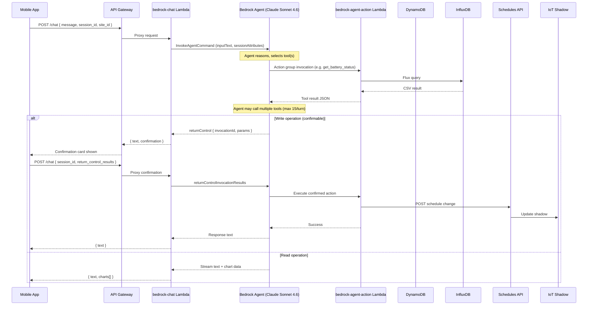
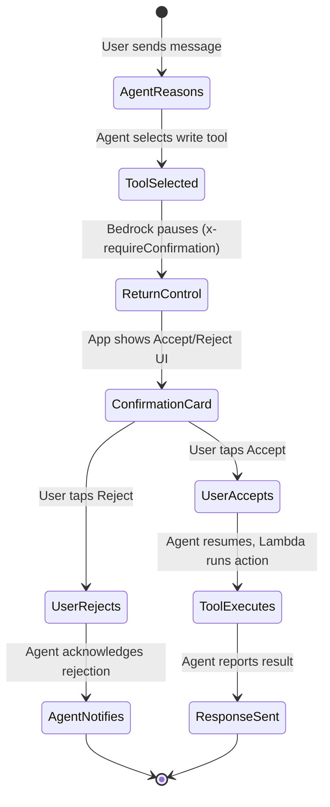

# 02 — AI Agent (Bedrock)

> Deep dive into the AWS Bedrock-powered AI assistant that can monitor,
> analyze, and control a single BESS installation through natural language.

---

## 1. Architecture



---

## 2. Agent Configuration

| Property | Value |
|----------|-------|
| **Agent ID** | `EUNJYANOZX` |
| **Agent Alias** | `ITHHACXCBB` |
| **Foundation Model** | Claude Sonnet 4.6 (EU CRIS) |
| **Region** | `eu-central-1` |
| **Session TTL** | 600 seconds (10 minutes) |
| **Max tool calls/turn** | 15 |
| **Instructions file** | `lambda/bedrock-agent-instructions.txt` |

### Persona & Behavior

The agent is configured as **"AIESS Energy Core"** with these characteristics:

- **Language**: Always responds in Polish; technical terms (SoC, kW, kWh, PV) remain in English
- **Personality**: Warm, approachable energy consultant — not a programmer
- **Scope**: Energy-only — politely declines non-energy questions
- **Confidentiality**: Never reveals internal rule format, JSON schema, field names, priority system internals, or API structure (AIESS proprietary technology)
- **Proactive**: Suggests optimizations (e.g., "I see night prices are low — should I set up night charging?")

### Safety Rules

1. ALWAYS read current schedules before making modifications
2. NEVER speculate about active rules — check first
3. All AI-created rules are auto-tagged with `s: "ai"` source marker
4. Priority must be P4–P9 (P1–P3 and P10–P11 are hardware-reserved)
5. Safety SoC limits: `soc_min` range 1–50, `soc_max` range 50–100
6. Write operations require explicit user confirmation via a confirmation card
7. Maximum 15 tool calls per conversation turn
8. Before suggesting changes, check current state and explain impact in plain terms

---

## 3. Action Groups & Tools

The agent has two action groups containing 11 tools total, backed by a single Lambda (`bedrock-agent-action`).

### 3.1 `aiess-management` — 6 Tools

| Tool | HTTP | Description | Data Source | Confirmable |
|------|------|-------------|-------------|-------------|
| `get_site_config` | GET | Read full site configuration | DynamoDB `site_config` | No |
| `get_current_schedules` | GET | Read all schedule rules and safety limits | Schedules API → IoT Shadow | No |
| `send_schedule_rule` | POST | Create or update a schedule rule | Schedules API → IoT Shadow | **Yes** |
| `delete_schedule_rule` | POST | Remove a schedule rule by ID and priority | Schedules API → IoT Shadow | **Yes** |
| `set_system_mode` | POST | Set automation mode (automatic/semi-automatic/manual) | DynamoDB `automation.mode` | **Yes** |
| `set_safety_limits` | POST | Set global SoC safety limits | Schedules API → IoT Shadow | **Yes** |

### 3.2 `aiess-analytics` — 5 Tools

| Tool | HTTP | Description | Data Source | Confirmable |
|------|------|-------------|-------------|-------------|
| `get_battery_status` | GET | Real-time battery status (last 2 minutes) | InfluxDB `aiess_v1` | No |
| `get_energy_summary` | GET | Aggregated energy stats for a period | InfluxDB (auto-selects bucket) | No |
| `get_tge_prices` | GET | Current and/or historical TGE prices | InfluxDB `tge_energy_prices` | No |
| `get_rule_history` | GET | History of rule configs and active rules | InfluxDB `aiess_v1_1m` | No |
| `get_chart_data` | GET | Time-series data formatted for charts | InfluxDB (auto-selects bucket) | No |

### 3.3 Internal Handler (not exposed as action group)

| Tool | Description | Data Source |
|------|-------------|-------------|
| `update_site_config` | Partial update of site configuration | DynamoDB `site_config` |

This tool is implemented in the Lambda but not registered in the Bedrock action groups.

---

## 4. Tool Details

### 4.1 `get_battery_status`

**Parameters**: `site_id`

Queries the last 2 minutes of `energy_telemetry` from the raw `aiess_v1` bucket (5s resolution). Returns:

```json
{
  "soc": 72,
  "battery_power_kw": -15.3,
  "grid_power_kw": 8.2,
  "pv_power_kw": 23.5,
  "load_kw": 16.4,
  "active_rule_id": "night_charge_01",
  "active_rule_action": "ch",
  "timestamp": "2026-03-01T12:00:05Z"
}
```

### 4.2 `get_energy_summary`

**Parameters**: `site_id`, `hours` (default 24)

Auto-selects bucket by time range:
- ≤1h → `aiess_v1`
- ≤24h → `aiess_v1_1m`
- ≤168h → `aiess_v1_15m`
- >168h → `aiess_v1_1h`

Returns mean values for grid, battery, PV, SoC, and load over the period.

### 4.3 `get_chart_data`

**Parameters**: `site_id`, `fields` (comma-separated), `hours`, `chart_type`, `title`

Returns chart-ready data with `_chart: true` flag:

```json
{
  "_chart": true,
  "chart_type": "line",
  "title": "grid_power, soc (24h)",
  "labels": ["2026-03-01T00:00:00Z", "..."],
  "datasets": [
    { "label": "grid power", "data": [8.2, ...], "color": "#ef4444" },
    { "label": "soc", "data": [72, ...], "color": "#22c55e" }
  ],
  "point_count": 144,
  "hours": 24
}
```

**Color map**: `grid_power` = red, `pcs_power` = blue, `soc` = green, `total_pv_power` = amber, `compensated_power` = purple.

### 4.4 `get_tge_prices`

**Parameters**: `site_id`, `hours`

- If `hours` is 0 or absent: returns current price only
- If `hours` > 0: returns current price AND a bar chart of historical prices

Price chart includes `_chart: true` for automatic rendering.

### 4.5 `send_schedule_rule`

**Parameters**: `site_id`, `priority` (4–9), `rule` or `rule_json`

Workflow:
1. Reads current schedules for the priority level
2. Filters out any existing rule with the same ID
3. Tags the rule with `s: "ai"` source marker
4. Pushes the updated rule array back via Schedules API

### 4.6 `delete_schedule_rule`

**Parameters**: `site_id`, `priority`, `rule_id`

Reads the current priority array, removes the rule with matching ID, pushes back.

### 4.7 `set_system_mode`

**Parameters**: `site_id`, `mode` (`automatic` | `semi-automatic` | `manual`)

Updates `automation.mode` in DynamoDB `site_config` and timestamps the change.

### 4.8 `set_safety_limits`

**Parameters**: `site_id`, `soc_min`, `soc_max`

Pushes safety limits via the Schedules API (stored in IoT Shadow alongside rules).

### 4.9 `get_rule_history`

**Parameters**: `site_id`, `hours`, `type` (`config` | `active` | `both`)

Returns two datasets:
- **config_history**: Snapshots of rule configurations over time (from `rule_config` measurement)
- **active_history**: Which rule was active at each point (from `active_rule_*` fields in `energy_telemetry`)

---

## 5. Confirmation Flow

Write operations go through a human-in-the-loop confirmation:



### Confirmable Tools

```
send_schedule_rule, delete_schedule_rule, set_system_mode, set_safety_limits, update_site_config
```

### OpenAPI Configuration

Each confirmable tool has `x-requireConfirmation: ENABLED` in its OpenAPI schema, causing Bedrock to pause execution and return control to the client.

### Confirmation Card Labels

| Tool | English | Polish |
|------|---------|--------|
| `send_schedule_rule` | Send schedule rule | Wysłanie reguły harmonogramu |
| `delete_schedule_rule` | Delete schedule rule | Usunięcie reguły harmonogramu |
| `set_system_mode` | Change system mode | Zmiana trybu systemu |
| `set_safety_limits` | Change safety limits | Zmiana limitów bezpieczeństwa |

---

## 6. Chart System

### How Charts Flow Through the System

1. Agent calls `get_chart_data` or `get_tge_price_history` (analytics action group)
2. Action Lambda queries InfluxDB and returns JSON with `_chart: true`
3. Chat proxy Lambda intercepts the tool output from Bedrock trace:
   ```
   event.trace.trace.orchestrationTrace.observation.actionGroupInvocationOutput.text
   ```
4. If the parsed JSON contains `_chart: true`, it's added to a `charts[]` array
5. The response includes `{ text, charts: [...] }`
6. Mobile app renders each chart via the `ChatChart` component

### Chart Data Structure

```typescript
interface ChartData {
  _chart: true;
  chart_type: 'line' | 'bar';
  title: string;
  labels: string[];          // ISO timestamps
  datasets: {
    label: string;
    data: number[];
    color: string;           // hex color
  }[];
  point_count: number;
  hours: number;
}
```

### ChatChart Component (`components/ChatChart.tsx`)

- Uses `react-native-gifted-charts` (LineChart, BarChart)
- Parses ISO timestamps into locale-appropriate labels
- Supports multi-dataset overlays
- Color map matches the agent Lambda's color assignments

---

## 7. Chat Interface

### Session Management

- Session ID: `session-${Date.now()}` (generated on chat screen mount)
- Reset: user can tap a "rotate" button to start a new session
- `site_id`: taken from `selectedDevice.device_id` in `DeviceContext`
- The chat proxy passes `current_datetime` and `current_day_of_week` as prompt session attributes

### Message Types

| Type | Source | Rendering |
|------|--------|-----------|
| **User message** | User typed or voice input | Right-aligned bubble |
| **Assistant text** | Bedrock agent response | Left-aligned bubble, Markdown rendered |
| **Confirmation** | `returnControl` from Bedrock | Card with Accept/Reject buttons |
| **Chart** | `_chart: true` in tool output | Interactive chart below text |

### Quick Actions

The chat screen offers preset quick action buttons:
- Battery status check
- Chart generation
- Schedule rules overview
- Energy prices query

### Voice Input

Uses `expo-speech-recognition` to convert speech to text before sending to the agent.

---

## 8. Session Attributes

The chat proxy injects these attributes into every Bedrock invocation:

| Attribute | Type | Purpose |
|-----------|------|---------|
| `site_id` | Session + Prompt | Identifies which BESS site the agent should work with |
| `current_datetime` | Prompt | ISO timestamp so the agent knows "now" |
| `current_day_of_week` | Prompt | Day name for schedule-related reasoning |

These attributes are available to the agent's instructions and are passed to every tool invocation as part of the Bedrock session.

---

## 9. Information Available to the Agent

The agent can access all of the following through its tools:

| Category | Data Points | Source |
|----------|-------------|--------|
| **Real-time status** | SoC, battery/grid/PV power, active rule, load | InfluxDB (last 2 min) |
| **Energy history** | Aggregated power/energy over any period | InfluxDB (1m/15m/1h buckets) |
| **Charts** | Any telemetry field as time-series visualization | InfluxDB |
| **Schedule rules** | All P4–P9 rules, their actions, conditions, validity | IoT Shadow via Schedules API |
| **Rule history** | Config snapshots and active rule logs | InfluxDB |
| **Safety limits** | SoC min/max | IoT Shadow via Schedules API |
| **System mode** | automatic/semi-automatic/manual | DynamoDB |
| **Site config** | Battery specs, PV arrays, grid connection, tariff, load profile, location, power limits | DynamoDB |
| **TGE prices** | Current and historical Polish spot market prices | InfluxDB |

### What the Agent Can Control

| Action | Mechanism |
|--------|-----------|
| Create/update schedule rules | Schedules API → IoT Shadow → BESS |
| Delete schedule rules | Schedules API → IoT Shadow → BESS |
| Change system mode | DynamoDB `automation.mode` |
| Set safety SoC limits | Schedules API → IoT Shadow → BESS |

All control actions require explicit user confirmation before execution.

---

## 10. Lambda Implementation

### bedrock-chat (`lambda/bedrock-chat/index.mjs`)

- Receives HTTP POST from API Gateway
- Builds `InvokeAgentCommand` with session/prompt attributes
- Streams the agent response, collecting text chunks, chart data from traces, and `returnControl` events
- Returns unified JSON: `{ text, session_id, charts?, confirmation?, return_control? }`

### bedrock-agent-action (`lambda/bedrock-agent-action/index.mjs`)

- Single Lambda handling all 11+ tools
- Routes by `event.apiPath` → handler function name
- Parameters extracted from `event.parameters` (query params) and `event.requestBody` (body properties)
- Uses AWS SDK for DynamoDB, raw HTTP for InfluxDB (Flux) and Schedules API
- Returns Bedrock-compatible response format:
  ```json
  {
    "messageVersion": "1.0",
    "response": {
      "actionGroup": "...",
      "apiPath": "...",
      "httpMethod": "...",
      "httpStatusCode": 200,
      "responseBody": {
        "application/json": { "body": "..." }
      }
    }
  }
  ```

---

## 11. Implications for AIESS Cloud

The current agent architecture is single-device:
- One `site_id` per session
- All tools operate on a single site
- No cross-site reasoning or aggregation

For AIESS Cloud (VPP/clustering), the agent would need:
- Multi-site awareness in a single session
- Cross-site aggregation tools (fleet status, combined capacity)
- Cluster-level dispatch commands
- VPP coordination logic (which sites to charge/discharge)
- New action groups for fleet/cluster management
- Hierarchical agent architecture (fleet agent → site agents)
