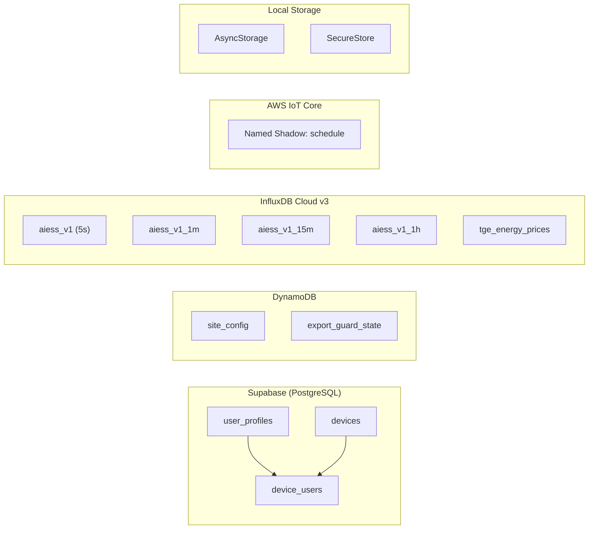
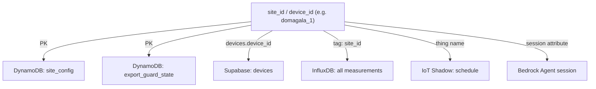

# 03 — Database Architecture

> Complete documentation of every data store used by the AIESS system:
> Supabase (PostgreSQL), DynamoDB, InfluxDB Cloud v3, AWS IoT Device Shadow,
> and local on-device storage.

---

## Database Overview



---

## 1. Supabase (PostgreSQL)

### Purpose
User authentication, user profiles, device registry, and role-based device access control. This is the only database the mobile app connects to directly for relational data.

### Client Configuration

- **File**: `lib/supabase.ts`
- **Package**: `@supabase/supabase-js` v2.86.0
- **Auth storage**: Expo SecureStore on native, `localStorage` on web
- **Env vars**: `EXPO_PUBLIC_SUPABASE_URL`, `EXPO_PUBLIC_SUPABASE_ANON_KEY`

### Tables

#### `auth.users` (Supabase managed)

Built-in Supabase Auth table. Handles email/password, Google OAuth, and Apple Sign-In.

#### `user_profiles`

Stores display info for authenticated users. Created on first login.

| Column | Type | Constraints | Description |
|--------|------|-------------|-------------|
| `id` | uuid | PK, FK → `auth.users.id` | User's auth ID |
| `full_name` | text | nullable | Display name |
| `phone` | text | nullable | Phone number |
| `avatar_url` | text | nullable | Profile picture URL |
| `created_at` | timestamptz | default now() | Profile creation time |
| `updated_at` | timestamptz | default now() | Last update time |

#### `devices`

Registry of all BESS devices/sites in the system.

| Column | Type | Constraints | Description |
|--------|------|-------------|-------------|
| `id` | uuid | PK | Internal UUID |
| `device_id` | text | unique, not null | Logical site ID (e.g. `domagala_1`) — used as `site_id` everywhere |
| `name` | text | not null | Human-readable name |
| `status` | text | enum: `active`, `inactive`, `maintenance`, `offline` | Current device status |
| `device_type` | text | enum: `on_grid`, `off_grid`, `hybrid` | Grid connection type |
| `location` | text | nullable | Human-readable location |
| `battery_capacity_kwh` | numeric | nullable | Nominal battery capacity (kWh) |
| `pcs_power_kw` | numeric | nullable | PCS (inverter) power rating (kW) |
| `pv_power_kw` | numeric | nullable | Total PV peak power (kW) |
| `influxdb_bucket` | text | nullable | Override for InfluxDB bucket name |
| `influxdb_measurement` | text | nullable | Override for InfluxDB measurement name |

#### `device_users`

Many-to-many junction table linking users to devices with role-based access.

| Column | Type | Constraints | Description |
|--------|------|-------------|-------------|
| `id` | uuid | PK | Row ID |
| `device_id` | uuid | FK → `devices.id`, not null | Device reference |
| `user_id` | uuid | FK → `auth.users.id`, not null | User reference |
| `role` | text | enum: `owner`, `admin`, `viewer` | Access level |
| `granted_at` | timestamptz | default now() | When access was granted |
| `granted_by` | uuid | nullable, FK → `auth.users.id` | Who granted access |

### Relationships

```mermaid
erDiagram
    AUTH_USERS ||--o| USER_PROFILES : "has profile"
    AUTH_USERS ||--o{ DEVICE_USERS : "has access to"
    DEVICES ||--o{ DEVICE_USERS : "accessible by"

    AUTH_USERS {
        uuid id PK
        text email
    }
    USER_PROFILES {
        uuid id PK_FK
        text full_name
        text phone
        text avatar_url
    }
    DEVICES {
        uuid id PK
        text device_id UK
        text name
        text status
        text device_type
        text location
        numeric battery_capacity_kwh
        numeric pcs_power_kw
        numeric pv_power_kw
    }
    DEVICE_USERS {
        uuid id PK
        uuid device_id FK
        uuid user_id FK
        text role
        timestamptz granted_at
    }
```

### Key Query (DeviceContext)

```sql
SELECT d.id, d.device_id, d.name, d.status, d.device_type, d.location,
       d.battery_capacity_kwh, d.pcs_power_kw, d.pv_power_kw
FROM devices d
INNER JOIN device_users du ON du.device_id = d.id
WHERE du.user_id = :current_user_id
ORDER BY d.name;
```

### Auth Methods

| Method | Implementation |
|--------|---------------|
| Email / Password | `supabase.auth.signInWithPassword()` / `signUp()` |
| Google OAuth | `@react-native-google-signin/google-signin` → Supabase |
| Apple Sign-In | Native Apple auth → Supabase |
| Password Reset | `supabase.auth.resetPasswordForEmail()` |
| Session Persistence | Expo SecureStore adapter |

---

## 2. DynamoDB

### Purpose
Stores semi-structured site configuration and export guard state. Never accessed directly from the mobile app — always via Lambda.

### Table: `site_config`

| Property | Value |
|----------|-------|
| **Partition Key** | `site_id` (String) |
| **Sort Key** | None |
| **Access** | `aiess-site-config` Lambda, `aiess-bedrock-action` Lambda |

#### Schema (TypeScript interfaces from `types/index.ts`)

```typescript
interface SiteConfig {
  site_id: string;                    // PK — matches devices.device_id
  general?: {
    name?: string;
    status?: 'active' | 'inactive' | 'commissioning';
    system_type?: 'hybrid' | 'on_grid' | 'off_grid';
    description?: string;
    commissioned_at?: string;         // ISO date
    timezone?: string;
  };
  location?: {
    address?: string;
    latitude?: number;
    longitude?: number;
    elevation_m?: number;
    climate_zone?: string;
  };
  battery?: {
    manufacturer?: string;
    model?: string;
    chemistry?: string;               // e.g. "LFP", "NMC"
    capacity_kwh?: number;
    nominal_voltage_v?: number;
    modules_count?: number;
    racks_count?: number;
    c_rate_charge?: number;
    c_rate_discharge?: number;
    cycle_warranty?: number;
    temp_min_c?: number;
    temp_max_c?: number;
  };
  inverter?: {
    manufacturer?: string;
    model?: string;
    power_kw?: number;
    count?: number;
    type?: 'hybrid' | 'string' | 'central';
  };
  pv_system?: {
    total_peak_kw?: number;
    arrays?: {
      name?: string;
      peak_kw?: number;
      panel_count?: number;
      panel_watt?: number;
      tilt_deg?: number;
      azimuth_deg?: number;
      tracker?: 'fixed' | 'single_axis' | 'dual_axis';
      shading_factor?: number;
    }[];
  };
  grid_connection?: {
    capacity_kva?: number;
    voltage_level?: string;
    operator?: string;
    contract_type?: string;
    export_allowed?: boolean;
    export_follows_sun?: boolean;
    metering_point_id?: string;
  };
  tariff?: {
    type?: 'flat' | 'time_of_use' | 'dynamic';
    currency?: string;
    periods?: {
      name: string;
      start: string;
      end: string;
      days: number[];
      import_rate?: number;
      export_rate?: number;
    }[];
    demand_charge_per_kw?: number;
    fixed_monthly?: number;
  };
  load_profile?: {
    type?: 'industrial' | 'commercial' | 'residential';
    typical_peak_kw?: number;
    typical_base_kw?: number;
    operating_hours?: { start: string; end: string };
    shift_pattern?: string;
    seasonal_notes?: string;
  };
  power_limits?: {
    max_charge_kw?: number;
    max_discharge_kw?: number;
  };
  influxdb?: {
    bucket?: string;
    measurement?: string;
  };
  automation?: {
    mode?: 'automatic' | 'semi-automatic' | 'manual';
    enabled?: boolean;
    intraday_interval_min?: number;
    daily_time?: string;
    weekly_day?: number;
    weekly_time?: string;
  };
  updated_at?: string;
  updated_by?: string;
  created_at?: string;
}
```

#### Operations

| Operation | Lambda | SDK Call |
|-----------|--------|---------|
| Read | `site-config`, `bedrock-agent-action` | `GetItemCommand` |
| Update (merge) | `site-config`, `bedrock-agent-action` | `UpdateItemCommand` with deep merge |

Updates are **non-destructive**: a partial config object is deep-merged with existing data so unchanged sections are preserved.

### Table: `export_guard_state`

| Property | Value |
|----------|-------|
| **Partition Key** | `guard_id` (String) |
| **Sort Key** | None |
| **Access** | `aiess-export-guard` Lambda, `aiess-export-guard-api` Lambda |

#### Record Types

**State Record** (`guard_id` = site ID, e.g. `domagala_1`):

| Field | Type | Description |
|-------|------|-------------|
| `guard_id` | String | PK — site ID |
| `inverter_off` | Boolean | Whether guard has turned inverter off |
| `shutdown_at` | String (ISO) | When inverter was last shut down |
| `next_check_at` | String (ISO) | When the next recheck is scheduled |
| `last_grid_power` | Number | Last observed grid power (kW) |
| `updated_at` | String (ISO) | Last state update time |

**Config Record** (`guard_id` = `{SITE_ID}_config`):

| Field | Type | Description |
|-------|------|-------------|
| `guard_id` | String | PK — `{site_id}_config` |
| `export_threshold` | Number | Grid power below this triggers shutdown (e.g. -40 kW) |
| `restart_threshold` | Number | Grid power above this allows restart (e.g. -20 kW) |
| `daylight_start` | Number | Hour when guard starts monitoring (e.g. 6) |
| `daylight_end` | Number | Hour when guard stops monitoring (e.g. 21) |
| `updated_at` | String (ISO) | Last config update |

---

## 3. InfluxDB Cloud v3

### Purpose
Stores all time-series energy telemetry, aggregated data at multiple resolutions, rule configuration snapshots, and TGE electricity market prices.

### Configuration

| Property | Value |
|----------|-------|
| **Provider** | InfluxDB Cloud v3 (AWS eu-central-1) |
| **Query Language** | Flux |
| **API** | HTTP `/api/v2/query` with CSV response |
| **Client (app)** | `lib/influxdb.ts` |
| **Client (Lambda)** | Raw `fetch()` in `bedrock-agent-action/index.mjs` |

### Buckets

| Bucket | Resolution | Retention | Source | Purpose |
|--------|------------|-----------|--------|---------|
| `aiess_v1` | 5 seconds | 90 days | BESS → MQTT → IoT Core → Telegraf | Real-time live data |
| `aiess_v1_1m` | 1 minute | 365 days | Aggregation Lambda | Daily charts, short-range analytics |
| `aiess_v1_15m` | 15 minutes | ~3 years | Aggregation Lambda | Weekly charts, medium-range |
| `aiess_v1_1h` | 1 hour | ~10 years | Aggregation Lambda | Monthly/yearly charts, long-range |
| `tge_energy_prices` | 1 hour | Long-term | External TGE price feed | Polish spot market electricity prices |

### Measurements & Fields

#### `energy_telemetry` (all `aiess_v1*` buckets)

**Tag**: `site_id` (e.g. `domagala_1`)

| Field | Unit | Description | Sign Convention |
|-------|------|-------------|-----------------|
| `grid_power` | kW | Power at grid connection point | + = import, - = export |
| `pcs_power` | kW | Battery inverter (PCS) power | + = discharge, - = charge |
| `soc` | % | Battery State of Charge | 0–100 |
| `total_pv_power` | kW | Total photovoltaic production | Always ≥ 0 |
| `compensated_power` | kW | Factory/facility load | Always ≥ 0 |
| `active_rule_id` | string | ID of currently executing rule | — |
| `active_rule_action` | string | Action type of active rule (ch/dis/sb) | — |
| `active_rule_power` | kW | Target power of active rule | — |

**Aggregated fields** (1m/15m/1h buckets): Each numeric field gets `_mean`, `_min`, `_max` suffixes plus `sample_count`.

#### `rule_config` (bucket: `aiess_v1_1m`)

**Tag**: `site_id`

Periodic snapshots of the schedule rule configuration, written by a separate aggregation Lambda approximately every 1 minute. Used by the `get_rule_history` agent tool.

#### `energy_prices` (bucket: `tge_energy_prices`)

| Field | Unit | Description |
|-------|------|-------------|
| `price` | PLN/MWh | TGE Polish day-ahead spot price |

### Time Range → Bucket Selection

The app and agent auto-select the appropriate bucket based on the requested time range:

| Requested Range | Bucket | Aggregation Window | Field Suffix |
|-----------------|--------|-------------------|--------------|
| ≤ 1 hour | `aiess_v1_1m` | 1m | `_mean` |
| ≤ 24 hours | `aiess_v1_1m` | 5m | `_mean` |
| ≤ 7 days | `aiess_v1_15m` | 1h | `_mean` |
| ≤ 30 days | `aiess_v1_1h` | 6h | `_mean` |
| ≤ 365 days | `aiess_v1_1h` | 1d | `_mean` |

### Data Ingestion Pipeline

```
BESS Controller
    → MQTT (5s interval)
        → AWS IoT Core
            → IoT Rule → Lambda → Telegraf
                → InfluxDB aiess_v1 (5s raw)

EventBridge (periodic)
    → Aggregation Lambdas
        → aiess_v1_1m  (1-minute means)
        → aiess_v1_15m (15-minute means)
        → aiess_v1_1h  (1-hour means)
```

### Key Derived Values

The app computes `factoryLoad` client-side:

```
factoryLoad = max(0, grid_power + total_pv_power + pcs_power)
```

Battery status thresholds:
- `pcs_power < -0.5` → Charging
- `pcs_power > 0.5` → Discharging
- Otherwise → Standby

---

## 4. AWS IoT Device Shadow

### Purpose
Stores the desired and reported state for schedule rules, safety limits, and system mode. This is how the mobile app and AI agent send commands to the physical BESS controller.

### Shadow Configuration

| Property | Value |
|----------|-------|
| **Shadow Type** | Named Shadow |
| **Shadow Name** | `schedule` |
| **Thing Name** | `{site_id}` (e.g. `domagala_1`) |
| **Access** | Via Schedules API (Lambda not in this repo) |

### Shadow Document Structure

```json
{
  "state": {
    "desired": {
      "v": "1.4.3",
      "safety": {
        "soc_min": 10,
        "soc_max": 90
      },
      "sch": {
        "p_4": [],
        "p_5": [{ "id": "baseline_charge", "a": { "t": "ch", "pw": 10 }, "c": { "ts": 2200, "te": 600 } }],
        "p_6": [],
        "p_7": [{ "id": "peak_discharge", "s": "ai", "a": { "t": "dis", "pw": 25 }, "c": { "ts": 1700, "te": 2000, "sm": 30 } }],
        "p_8": [],
        "p_9": [{ "id": "site_limit", "a": { "t": "sl", "hth": 30, "lth": -10 } }]
      },
      "metadata": {
        "total_rules": 3,
        "local_rules": 1,
        "cloud_rules": 1,
        "scada_safety_rules": 1
      }
    },
    "reported": { "...": "same structure, reported by BESS" },
    "delta": { "...": "differences between desired and reported" }
  }
}
```

### Priority Slots

| Priority | Name | Purpose |
|----------|------|---------|
| P1–P3 | Hardware Reserved | Safety/protection rules from SCADA |
| P4 | Reserved | Available but typically unused |
| P5 | Baseline | Default/baseline behaviors |
| P6 | Low | Lower-priority scheduled rules |
| P7 | Normal | Standard user/AI rules |
| P8 | High | Higher-priority overrides |
| P9 | Site Limit | Grid export/import limiters |
| P10–P11 | Hardware Reserved | System-level overrides |

### Access Pattern

The mobile app and AI agent never touch IoT Core directly. All access is through the Schedules API:

```
Mobile App / AI Agent
    → API Gateway
        → Schedules Lambda (not in repo)
            → AWS IoT Core: GetThingShadow / UpdateThingShadow
                → BESS Controller receives delta
```

---

## 5. Local Storage

### AsyncStorage

| Key | Value Type | Used In | Purpose |
|-----|-----------|---------|---------|
| `@aiess_settings` | JSON `{ language: 'en' \| 'pl' }` | `contexts/SettingsContext.tsx` | App language preference |
| `@aiess_selected_device` | String (device UUID) | `contexts/DeviceContext.tsx` | Remember last selected device |

### Expo SecureStore

| Purpose | Used In | Details |
|---------|---------|---------|
| Supabase auth session (tokens) | `lib/supabase.ts` | `ExpoSecureStoreAdapter` encrypts tokens at rest |

---

## 6. Cross-Database Relationships

The `site_id` / `device_id` is the universal key that connects all databases:



### Data Ownership by Database

| Data Domain | Database | Read By | Written By |
|-------------|----------|---------|------------|
| User identity & auth | Supabase | App | App, Supabase Auth |
| Device registry & access | Supabase | App | App (admin) |
| Site hardware config | DynamoDB | App, Agent | App, Agent |
| Schedule rules | IoT Shadow | App, Agent | App, Agent |
| Real-time telemetry | InfluxDB | App, Agent | BESS (via MQTT pipeline) |
| Historical analytics | InfluxDB | App, Agent | Aggregation Lambdas |
| TGE energy prices | InfluxDB | Agent | External price feed |
| Export guard state | DynamoDB | Export Guard API | Export Guard Lambda |
| App preferences | AsyncStorage | App | App |
| Auth tokens | SecureStore | App | Supabase Auth |
