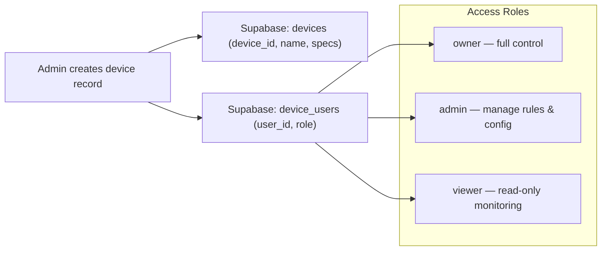
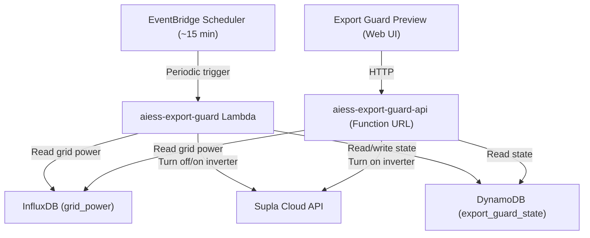
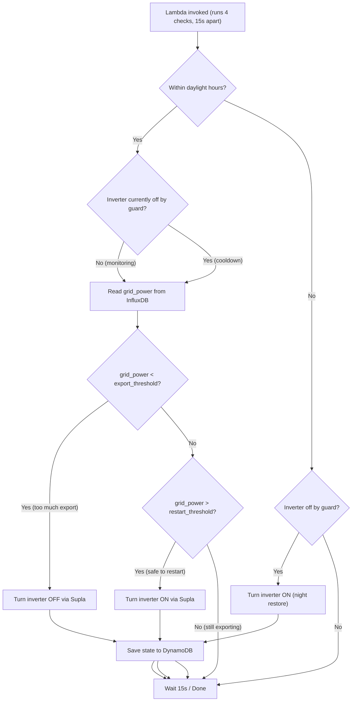

# 04 — Device & BESS Management

> How a single Battery Energy Storage System (BESS) is managed end-to-end:
> device lifecycle, live monitoring, schedule rules, system modes, safety,
> and the export guard subsystem.

---

## 1. Device Lifecycle

### 1.1 Device Registration (Supabase)

A device record in `devices` is created by an admin and linked to users via `device_users`:



### 1.2 Device Selection in App

```
App Launch
  → AuthProvider authenticates user (Supabase)
    → DeviceProvider fetches devices: SELECT * FROM devices INNER JOIN device_users WHERE user_id = :uid
      → Restores selectedDevice from AsyncStorage (@aiess_selected_device)
        → Falls back to first device if stored selection is invalid
          → selectedDevice.device_id becomes site_id for all operations
```

The `device_id` field (e.g. `domagala_1`) is used as `site_id` across:
- InfluxDB queries (tag filter)
- DynamoDB lookups (partition key)
- IoT Shadow commands (thing name)
- Bedrock agent sessions (session attribute)
- Schedules API calls (URL path parameter)

### 1.3 Device Status

| Status | Meaning |
|--------|---------|
| `active` | Operating normally, telemetry flowing |
| `inactive` | Registered but not operational |
| `maintenance` | Undergoing maintenance |
| `offline` | Communication lost |

### 1.4 Device Types

| Type | Description |
|------|-------------|
| `on_grid` | Grid-connected only (no islanding) |
| `off_grid` | Standalone / island mode |
| `hybrid` | Can operate both on-grid and off-grid |

---

## 2. Live Monitoring

### 2.1 Data Pipeline

```
BESS Controller
  → MQTT publish (every 5 seconds)
    → AWS IoT Core
      → IoT Rule → Lambda → Telegraf
        → InfluxDB aiess_v1 bucket (5s raw data)
```

### 2.2 App Polling (`useLiveData` hook)

The `DeviceContext` exposes a `useLiveData(siteId)` hook powered by React Query:

| Property | Value |
|----------|-------|
| **Query key** | `['liveData', siteId]` |
| **Refetch interval** | 5,000 ms (5 seconds) |
| **Retry** | 2 attempts, 1s delay |
| **Data source** | `fetchLiveData()` in `lib/influxdb.ts` |

### 2.3 LiveData Fields

Each poll returns a `LiveData` object:

| Field | Type | Unit | Description |
|-------|------|------|-------------|
| `gridPower` | number | kW | Grid power (+ import, - export) |
| `batteryPower` | number | kW | Battery PCS power (+ discharge, - charge) |
| `batterySoc` | number | % | State of Charge (0–100) |
| `batteryStatus` | string | — | `'Charging'` / `'Discharging'` / `'Standby'` |
| `pvPower` | number | kW | Total PV production |
| `factoryLoad` | number | kW | Computed: `max(0, grid + pv + battery)` |
| `lastUpdate` | Date | — | Timestamp of the data point |
| `activeRuleId` | string? | — | ID of the currently executing schedule rule |
| `activeRuleAction` | string? | — | Action type: `'ch'`, `'dis'`, `'sb'` |
| `activeRulePower` | number? | kW | Target power of the active rule |
| `gridPowerAvg1m` | number? | kW | 1-minute rolling average of grid power |
| `gridPowerAvg5m` | number? | kW | 5-minute rolling average of grid power |
| `pvPowerAvg1m` | number? | kW | 1-minute rolling average of PV power |
| `pvPowerAvg5m` | number? | kW | 5-minute rolling average of PV power |
| `factoryLoadAvg1m` | number? | kW | 1-minute rolling average of factory load |
| `factoryLoadAvg5m` | number? | kW | 5-minute rolling average of factory load |

### 2.4 Flux Queries

**Live data** — last data point from the raw 5s bucket:

```flux
from(bucket: "aiess_v1")
  |> range(start: -5m)
  |> filter(fn: (r) => r._measurement == "energy_telemetry")
  |> filter(fn: (r) => r.site_id == "{siteId}")
  |> filter(fn: (r) =>
       r._field == "grid_power" or
       r._field == "total_pv_power" or
       r._field == "pcs_power" or
       r._field == "soc" or
       r._field == "active_rule_id" or
       r._field == "active_rule_action" or
       r._field == "active_rule_power"
  )
  |> last()
```

**Rolling averages** — mean over 1m and 5m windows (run in parallel):

```flux
from(bucket: "aiess_v1")
  |> range(start: -{minutes}m)
  |> filter(fn: (r) => r._measurement == "energy_telemetry")
  |> filter(fn: (r) => r.site_id == "{siteId}")
  |> filter(fn: (r) => r._field == "grid_power" or r._field == "total_pv_power" or r._field == "pcs_power")
  |> mean()
```

---

## 3. Schedule Rule System

### 3.1 Overview

Schedule rules define automated behaviors for the BESS. They are stored in the AWS IoT Named Shadow `schedule` and are evaluated by the BESS controller based on priority (higher priority wins).

### 3.2 Rule Structure (Optimized Format v1.4.3)

```typescript
interface OptimizedScheduleRule {
  id: string;                           // Unique rule ID (max 63 chars)
  s?: 'ai' | 'man';                    // Source: AI-created or manual
  a: OptimizedAction;                   // What to do
  c?: OptimizedConditions;              // When to do it
  act?: boolean;                        // Active flag (default true)
  d?: WeekdayShorthand | number[];      // Day filter
  vf?: number;                          // Valid from (Unix epoch)
  vu?: number;                          // Valid until (Unix epoch)
}
```

### 3.3 Action Types

| Code | Name | Parameters | Description |
|------|------|-----------|-------------|
| `ch` | Charge | `pw` (kW), `pid?` | Charge battery at specified power |
| `dis` | Discharge | `pw` (kW), `pid?` | Discharge battery at specified power |
| `sb` | Standby | `pw: 0` | Hold battery idle (no charge/discharge) |
| `sl` | Site Limit | `hth` (kW), `lth` (kW) | Limit grid export/import between thresholds |
| `ct` | Charge to Target | `soc` (%), `maxp?`, `maxg?`, `str?`, `pid?` | Charge until SoC target reached |
| `dt` | Discharge to Target | `soc` (%), `maxp?`, `ming?`, `str?`, `pid?` | Discharge until SoC target reached |

### 3.4 Action Parameters

```typescript
interface OptimizedAction {
  t: ActionType;        // Required: action type
  pw?: number;          // Power setpoint (kW) — for ch, dis, sb
  pid?: boolean;        // PID controller enabled (smooth power ramp)
  hth?: number;         // High threshold (kW) — for sl
  lth?: number;         // Low threshold (kW) — for sl
  soc?: number;         // Target SoC (%) — for ct, dt
  maxp?: number;        // Max charge/discharge power (kW) — for ct, dt
  maxg?: number;        // Max grid power (kW) — for ct (limits grid draw)
  ming?: number;        // Min grid power (kW) — for dt (ensures grid feed)
  str?: Strategy;       // Ramping strategy: 'eq' | 'agg' | 'con'
}
```

### 3.5 Conditions

```typescript
interface OptimizedConditions {
  ts?: number;          // Time start (HHMM format, e.g. 2200 = 22:00)
  te?: number;          // Time end (HHMM format, e.g. 600 = 06:00)
  sm?: number;          // SoC minimum threshold (%)
  sx?: number;          // SoC maximum threshold (%)
  gpo?: GridOperator;   // Grid power operator
  gpv?: number;         // Grid power value (kW)
  gpx?: number;         // Grid power max value (kW) — for 'bt' (between)
}
```

**Grid Power Operators**:

| Code | Meaning | Use Case |
|------|---------|----------|
| `gt` | Grid power > value | Trigger when import exceeds threshold |
| `lt` | Grid power < value | Trigger when export exceeds threshold |
| `gte` | Grid power >= value | — |
| `lte` | Grid power <= value | — |
| `eq` | Grid power == value | — |
| `bt` | Grid power between `gpv` and `gpx` | Band trigger |

### 3.6 Day Masks

| Value | Meaning | Encoded As |
|-------|---------|------------|
| `'weekdays'` / `'wd'` | Monday–Friday | `[1,2,3,4,5]` |
| `'weekend'` / `'we'` | Saturday–Sunday | `[0,6]` |
| `'everyday'` / `'ed'` / `'all'` | Every day | `[0,1,2,3,4,5,6]` |
| `[0,1,3]` | Custom (Sun, Mon, Wed) | Direct array |

Day numbers: 0 = Sunday, 1 = Monday, ..., 6 = Saturday.

### 3.7 Strategies (for ct/dt actions)

| Code | Name | Behavior |
|------|------|----------|
| `eq` | Equal Spread | Distribute power evenly across time window |
| `agg` | Aggressive | Ramp up quickly, reach target ASAP |
| `con` | Conservative | Gentle ramp, prioritize battery health |

### 3.8 Priority System

Rules are organized by priority. Higher priority wins when conditions overlap.

| Priority | Label | Typical Use |
|----------|-------|-------------|
| P1–P3 | **Hardware Reserved** | SCADA safety/protection rules (not editable) |
| P4 | Reserved | Available but typically unused |
| P5 | Baseline | Default/baseline behaviors |
| P6 | Low | Lower-priority scheduled rules |
| P7 | Normal | Standard user and AI-created rules |
| P8 | High | Higher-priority overrides |
| P9 | Site Limit | Grid export/import limiters (sl action only) |
| P10–P11 | **Hardware Reserved** | System-level overrides (not editable) |

### 3.9 Validity Periods

| Field | Type | Description |
|-------|------|-------------|
| `vf` | number (Unix epoch) | Rule becomes active after this time |
| `vu` | number (Unix epoch) | Rule expires after this time |

An EventBridge one-time event can be scheduled for `vu` to clean up expired rules.

### 3.10 Rule Example

"Charge the battery at 15 kW from 22:00 to 06:00 on weekdays, only when SoC < 80%":

```json
{
  "id": "night_charge_weekdays",
  "s": "ai",
  "a": { "t": "ch", "pw": 15 },
  "c": { "ts": 2200, "te": 600, "sx": 80 },
  "d": [1, 2, 3, 4, 5]
}
```

---

## 4. Schedule Management in the App

### 4.1 `useSchedules` Hook (`hooks/useSchedules.ts`)

Built on `lib/aws-schedules.ts`, provides:

| Method | Description |
|--------|-------------|
| `rules` | Flattened and sorted array of all rules with priorities |
| `safety` | Current `{ soc_min, soc_max }` limits |
| `isLoading` / `error` | Query state |
| `createRule(formData)` | Convert form data → optimized rule → POST |
| `updateRule(formData)` | Update existing rule in-place |
| `deleteRule(id, priority)` | Remove rule from priority array |
| `toggleRule(id, priority)` | Toggle `act` flag |
| `setSafety(soc_min, soc_max)` | Update safety limits |
| `setSiteLimit(hth, lth)` | Create/update P9 site limit rule |

### 4.2 Form Data Conversion

The app uses a human-friendly `ScheduleRuleFormData` for the editor UI, converted to/from the optimized wire format:

```
User edits form (ScheduleRuleFormData)
  → formDataToOptimizedRule() — lib/aws-schedules.ts
    → OptimizedScheduleRule (wire format)
      → POST to Schedules API
        → IoT Shadow update
          → BESS controller receives delta
```

```
GET from Schedules API
  → SchedulesResponse (contains sch.p_4...p_9)
    → flattenRules() — extracts all rules with priority
      → optimizedRuleToFormData() — for editing
        → Display in rule editor UI
```

### 4.3 Validation

`validateRule()` checks:
- Rule ID is present and ≤ 63 characters
- Priority is 4–9
- `ch`/`dis` actions have power ≥ 0
- `sl` action has both thresholds and is on P9
- `ct`/`dt` actions have target SoC in 0–100 range
- SoC conditions are valid (min < max, 0–100)

---

## 5. Site Configuration

### 5.1 `useSiteConfig` Hook (`hooks/useSiteConfig.ts`)

| Property | Description |
|----------|-------------|
| `siteConfig` | Full `SiteConfig` object from DynamoDB |
| `isLoading` | Loading state |
| `updateConfig(patch)` | Deep-merge partial update |
| `siteConfigComplete` | Boolean — true if description + power limits are set |

The `siteConfigComplete` flag is checked before allowing rule creation, ensuring the system knows basic operational parameters.

### 5.2 Configuration Sections (13 total)

| Section | Key Data | Used By |
|---------|----------|---------|
| `general` | Name, status, system type, timezone | Display, AI context |
| `location` | Address, lat/lng, elevation, climate zone | AI context, geocoding |
| `battery` | Capacity, chemistry, C-rates, temp limits | AI recommendations, validation |
| `inverter` | Power rating, type, count | Power limit validation |
| `pv_system` | Total peak kW, array details | AI context, energy analysis |
| `grid_connection` | Capacity, operator, export rules | Export guard, AI context |
| `tariff` | Type (flat/ToU/dynamic), periods, rates | AI cost optimization |
| `load_profile` | Peak/base load, operating hours | AI load shifting |
| `power_limits` | Max charge/discharge kW | Rule validation, safety |
| `influxdb` | Custom bucket/measurement overrides | Data queries |
| `automation` | Mode, scheduling config | System behavior |
| `metadata` | Timestamps, updated_by | Audit trail |

---

## 6. System Modes

| Mode | Description | Rule Behavior |
|------|-------------|---------------|
| `automatic` | Full AI/schedule automation | All active rules execute normally |
| `semi-automatic` | Supervised automation | Rules execute but may require confirmation |
| `manual` | Manual control only | Schedule rules are paused |

Stored in DynamoDB `site_config.automation.mode`, changeable via:
- Settings > System screen in the app
- AI agent `set_system_mode` tool (with confirmation)

---

## 7. Safety Limits

### 7.1 SoC Safety Boundaries

| Limit | Range | Stored In | Purpose |
|-------|-------|-----------|---------|
| `soc_min` | 1–50 % | IoT Shadow `safety.soc_min` | Prevents deep discharge |
| `soc_max` | 50–100 % | IoT Shadow `safety.soc_max` | Prevents overcharge |

These are global limits that override any schedule rule. The BESS controller will stop charging above `soc_max` and stop discharging below `soc_min` regardless of active rules.

### 7.2 Power Limits

Defined in DynamoDB `site_config.power_limits`:

| Limit | Description |
|-------|-------------|
| `max_charge_kw` | Maximum allowed charging power |
| `max_discharge_kw` | Maximum allowed discharging power |

---

## 8. Export Guard

### 8.1 Purpose

The Export Guard is an autonomous safety system that prevents excessive grid export by controlling the inverter. It protects against regulatory violations or grid operator penalties when the installation is exporting more power than allowed.

### 8.2 Architecture



### 8.3 Logic Flow



### 8.4 Thresholds

| Threshold | Default | Meaning |
|-----------|---------|---------|
| `export_threshold` | -40 kW | Grid power below this triggers inverter shutdown (negative = export) |
| `restart_threshold` | -20 kW | Grid power above this allows inverter restart |
| `daylight_start` | 6 | Hour to begin monitoring |
| `daylight_end` | 21 | Hour to stop monitoring |
| `cooldown_minutes` | — | Minimum time before restart check |

### 8.5 Export Guard API

Exposed via Lambda Function URL (not API Gateway):

| Method | Action | Description |
|--------|--------|-------------|
| GET | Read state | Grid power, inverter status, guard state, thresholds |
| PATCH | Update config | Change `export_threshold` and `restart_threshold` |
| POST | `{ "action": "turn_on" }` | Force inverter on and clear cooldown |

### 8.6 Export Guard Preview (Web UI)

A standalone HTML/JS page (`export-guard-preview/`) for monitoring:
- Live state display (refreshes every 60s)
- Threshold adjustment
- Manual inverter turn-on
- Hosted on Vercel or aiess.pl

---

## 9. Analytics

### 9.1 Chart Data (`fetchChartData` in `lib/influxdb.ts`)

The analytics tab provides historical charts with configurable time ranges:

| Time Range | Bucket | Aggregation Window |
|------------|--------|-------------------|
| 1 hour | `aiess_v1_1m` | 1m |
| 24 hours | `aiess_v1_1m` | 5m |
| 7 days | `aiess_v1_15m` | 1h |
| 30 days | `aiess_v1_1h` | 6h |
| 365 days | `aiess_v1_1h` | 1d |

### 9.2 Chart Data Point

```typescript
interface ChartDataPoint {
  time: Date;
  gridPower: number;        // kW
  batteryPower: number;     // kW
  pvPower: number;          // kW
  soc: number;              // %
  factoryLoad: number;      // kW (computed)
  compensatedPower: number; // kW
  socMin?: number;          // Safety band lower
  socMax?: number;          // Safety band upper
}
```

### 9.3 Energy Statistics

```typescript
interface EnergyStats {
  gridImport: number;    // kWh imported from grid
  gridExport: number;    // kWh exported to grid
  charged: number;       // kWh charged into battery
  discharged: number;    // kWh discharged from battery
  avgSoc: number;        // Average SoC %
  pvProduction: number;  // kWh PV production
}
```

Computed from chart data using time-weighted integration: `Energy (kWh) = Sum(Power × hoursPerPoint)`.

### 9.4 Analytics Components

| Component | Purpose |
|-----------|---------|
| `EnergyFlowChart` | Power flow visualization |
| `EnergyBarsChart` | Import/export/charge/discharge bar chart |
| `CyclesBarChart` | Battery cycle analysis |
| `SocBandChart` | SoC with min/max safety bands |
| `LoadCompositionChart` | Load breakdown |
| `EnergySummaryCards` | KPI summary cards |
