# 06 — Data Flow Diagrams

> Visual documentation of every major data flow in the AIESS system.
> Each diagram shows the complete path from source to destination.

---

## 1. Telemetry Ingestion Pipeline

How energy data flows from the physical BESS to the app.

```mermaid
graph LR
    subgraph physical ["Physical BESS"]
        Controller["BESS Controller"]
    end

    subgraph iot ["AWS IoT Core"]
        MQTT["MQTT Broker"]
        IoTRule["IoT Rule Engine"]
    end

    subgraph ingestion ["Ingestion"]
        TeleLambda["Telemetry Lambda"]
        Telegraf["Telegraf Agent"]
    end

    subgraph influx ["InfluxDB Cloud v3"]
        Raw["aiess_v1 (5s)"]
        Agg1m["aiess_v1_1m"]
        Agg15m["aiess_v1_15m"]
        Agg1h["aiess_v1_1h"]
    end

    subgraph aggregation ["Aggregation (EventBridge)"]
        AggLambda1m["1m Aggregation Lambda"]
        AggLambda15m["15m Aggregation Lambda"]
        AggLambda1h["1h Aggregation Lambda"]
    end

    Controller -->|"MQTT publish (5s)"| MQTT
    MQTT --> IoTRule
    IoTRule --> TeleLambda --> Telegraf --> Raw

    Raw -->|"EventBridge trigger"| AggLambda1m --> Agg1m
    Agg1m -->|"EventBridge trigger"| AggLambda15m --> Agg15m
    Agg15m -->|"EventBridge trigger"| AggLambda1h --> Agg1h
```

**Data at each stage:**

| Stage | Fields | Resolution | Retention |
|-------|--------|------------|-----------|
| MQTT | `grid_power`, `pcs_power`, `soc`, `total_pv_power`, `compensated_power`, `active_rule_*` | 5s | Transient |
| `aiess_v1` | Same as MQTT + `site_id` tag | 5s | 90 days |
| `aiess_v1_1m` | `*_mean`, `*_min`, `*_max`, `sample_count` | 1m | 365 days |
| `aiess_v1_15m` | `*_mean`, `*_min`, `*_max` | 15m | ~3 years |
| `aiess_v1_1h` | `*_mean`, `*_min`, `*_max` | 1h | ~10 years |

---

## 2. User Authentication Flow

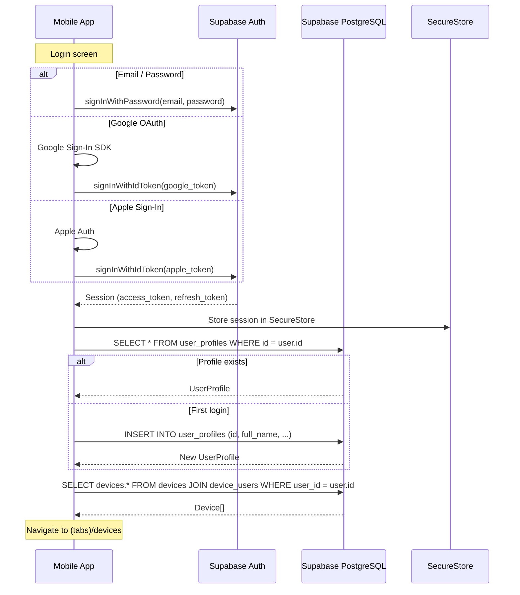

---

## 3. Device Selection & Live Data Flow

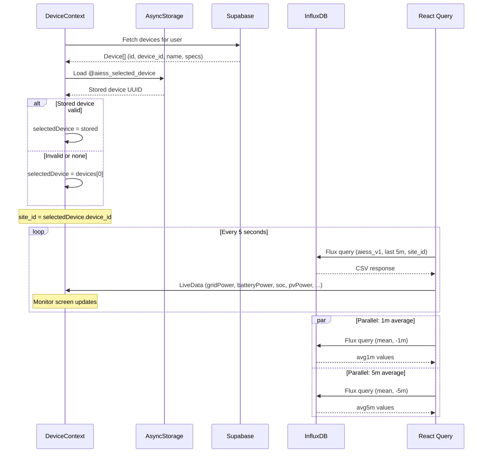

---

## 4. AI Chat Flow (Read Operation)

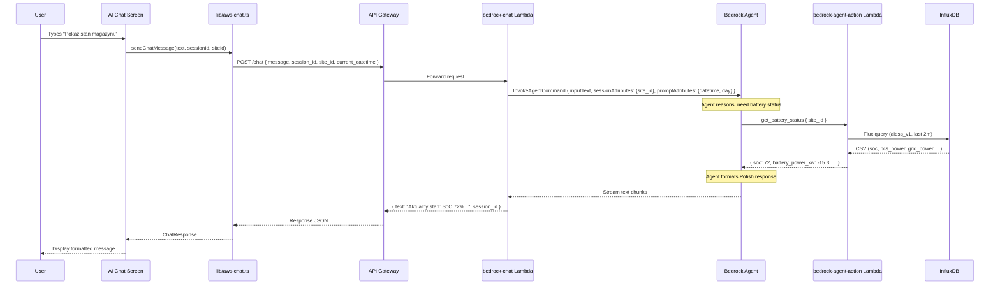

---

## 5. AI Chat Flow (Write Operation with Confirmation)

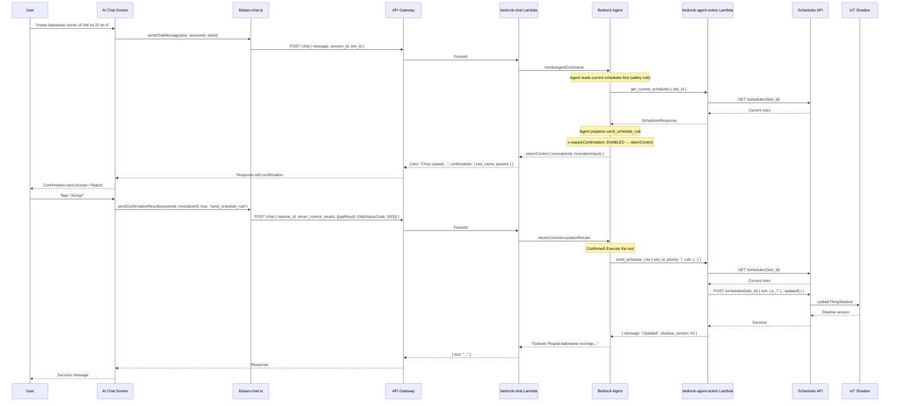

---

## 6. AI Chat Flow (Chart Response)

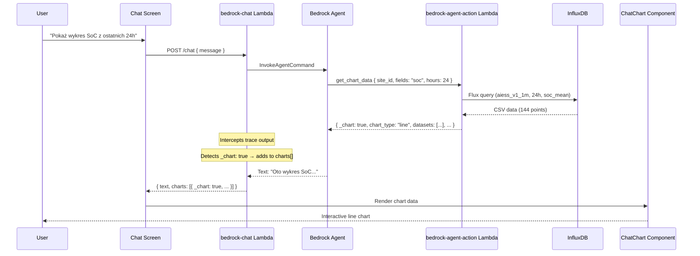

---

## 7. Schedule CRUD Flow

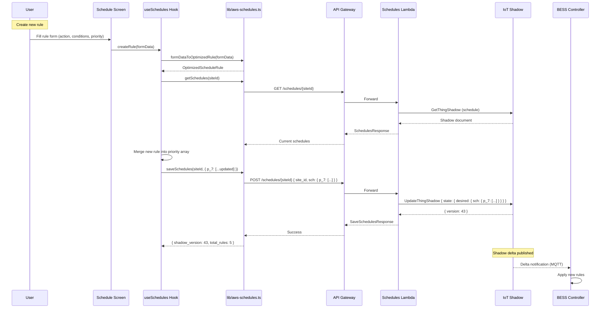

---

## 8. Export Guard Flow

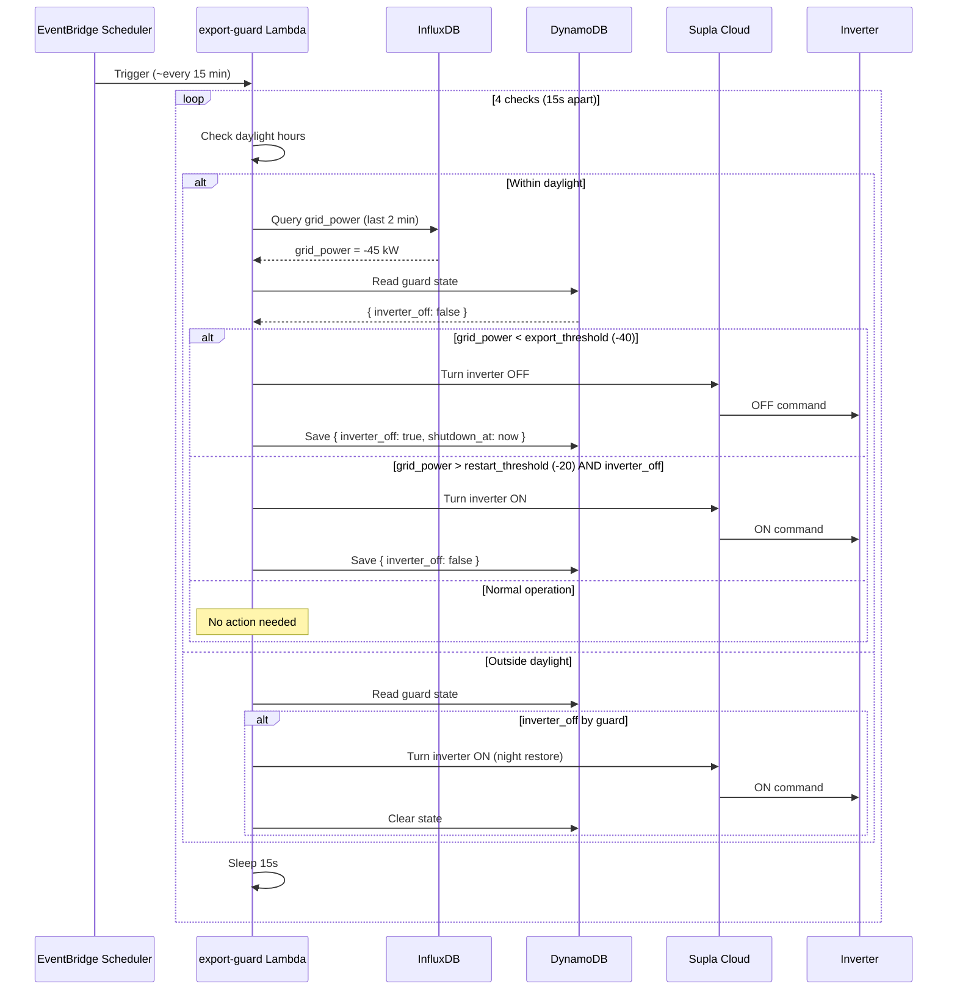

---

## 9. Analytics Data Flow

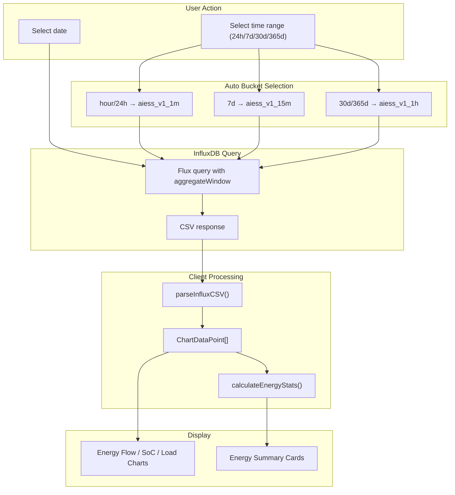

---

## 10. Site Configuration Update Flow

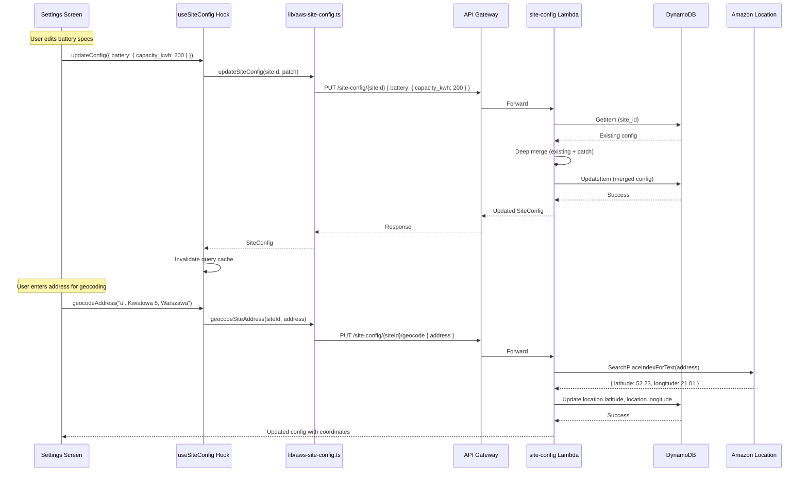

---

## 11. Complete System — Single Request Lifecycle

A complete lifecycle showing how a user's chat request touches every part of the system:

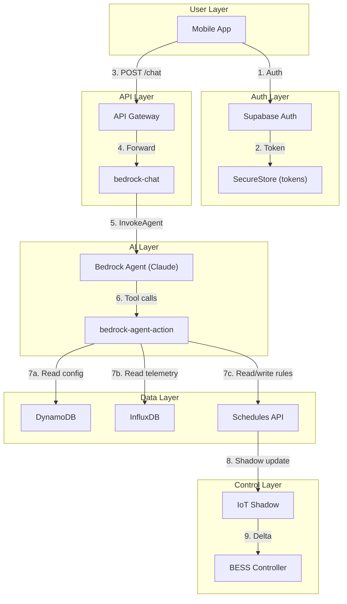
