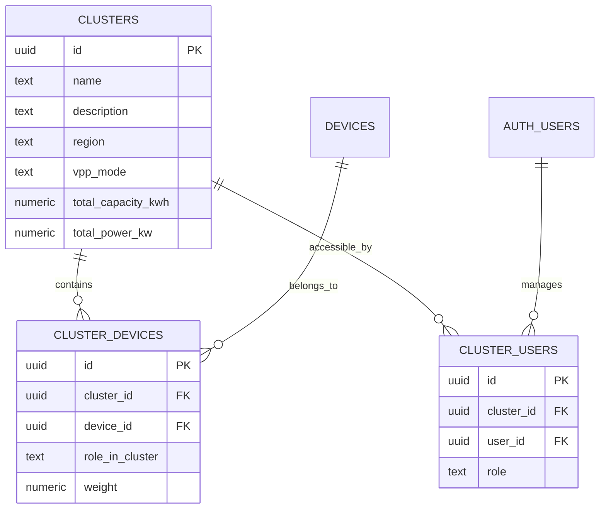
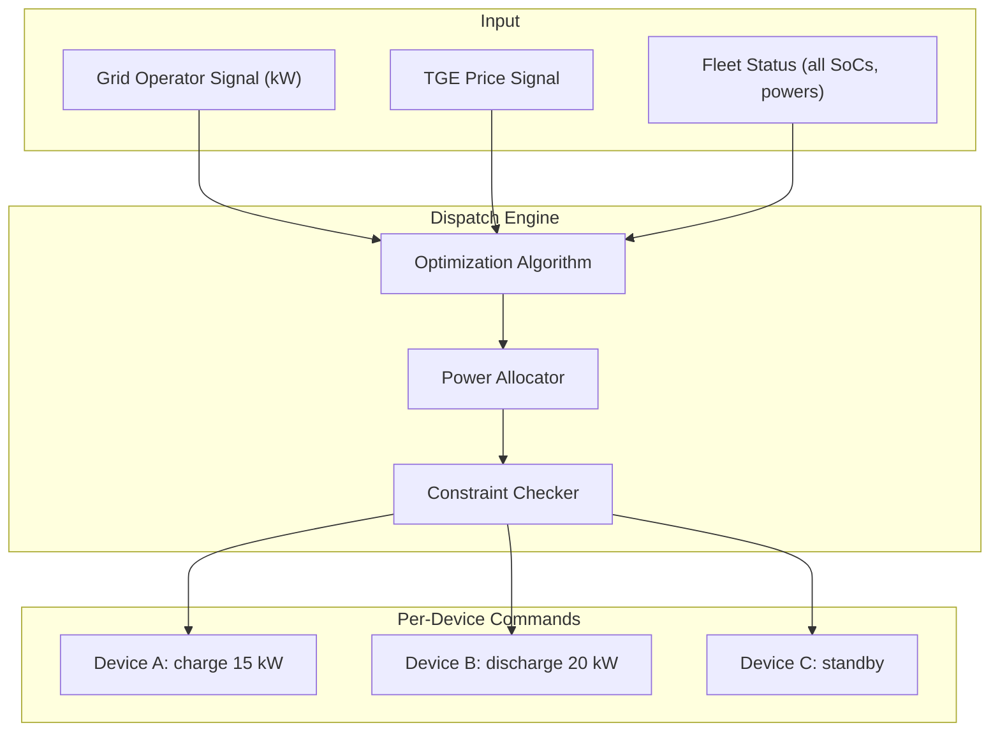
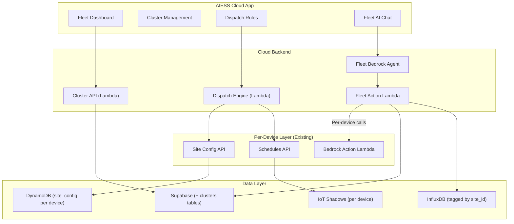
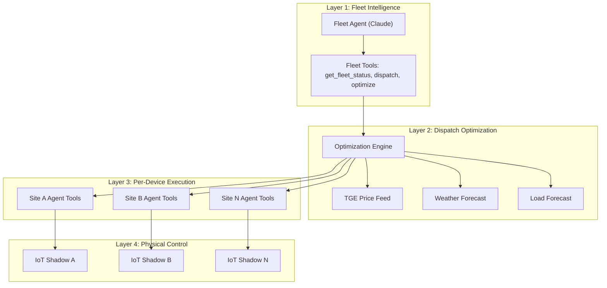

# 07 — AIESS Cloud Transition Notes

> Key observations, reusable patterns, and architectural considerations
> for scaling from the single-device AIESS app to the multi-device
> AIESS Cloud VPP / clustering platform.

---

## 1. Current Single-Device Assumptions

The existing AIESS app is built around a fundamental assumption: **one active device at a time**. Understanding where this assumption is embedded helps identify what needs to change.

| Area | Current Behavior | Where Encoded |
|------|-----------------|---------------|
| **Device selection** | One `selectedDevice` at a time | `DeviceContext` → `selectedDeviceId` |
| **Live data** | Polls one `site_id` every 5 seconds | `useLiveData(siteId)` |
| **AI agent session** | One `site_id` per session attribute | `bedrock-chat` Lambda → `sessionAttributes.site_id` |
| **Agent tools** | All tools take a single `site_id` parameter | `bedrock-agent-action` handlers |
| **Schedules** | CRUD for one site's IoT Shadow | `useSchedules` → `getSchedules(siteId)` |
| **Site config** | One config record per request | `useSiteConfig` → `getSiteConfig(siteId)` |
| **Analytics** | Charts for one site at a time | `fetchChartData(siteId, ...)` |
| **Export guard** | Hardcoded `SITE_ID` env var | `export-guard` Lambda |

---

## 2. What Already Scales

Several design decisions in the current system are naturally multi-device ready:

### 2.1 Supabase — User & Device Model

```
user_profiles  ←→  device_users (role-based)  ←→  devices
```

- A user can already be linked to **multiple devices** via `device_users`
- Role-based access (owner/admin/viewer) is already per-device
- The `DeviceContext` already fetches all devices for a user and lets them switch
- **Cloud readiness**: Add a `clusters` or `device_groups` table to group devices

### 2.2 DynamoDB — Site Config

- Each site has its own `site_config` record keyed by `site_id`
- No inter-site dependencies in the schema
- **Cloud readiness**: Already scales naturally. Add cluster-level config records

### 2.3 InfluxDB — Time Series

- All measurements use `site_id` as a tag
- Cross-site queries are natively supported by Flux:
  ```flux
  from(bucket: "aiess_v1_1m")
    |> range(start: -24h)
    |> filter(fn: (r) => r.site_id == "site_a" or r.site_id == "site_b" or r.site_id == "site_c")
    |> group(columns: ["site_id", "_field"])
    |> mean()
  ```
- Aggregation across sites is a Flux query pattern, no schema changes needed
- **Cloud readiness**: Add fleet-level aggregation queries and cluster-wide dashboards

### 2.4 IoT Shadow — Per-Device Control

- Each device has its own named shadow (`schedule`)
- Individual device control is preserved even in a fleet
- **Cloud readiness**: VPP dispatch translates cluster-level commands into per-device shadow updates

### 2.5 Schedule Rule Format

- The optimized rule format (v1.4.3) is device-agnostic
- Rules describe behaviors, not specific device addresses
- The same rule structure can be used across sites
- **Cloud readiness**: Rule templates can be shared across devices in a cluster

---

## 3. What Needs to Change for Multi-Device

### 3.1 New Data Layer — Clusters / Groups



**Suggested Supabase tables**:
- `clusters` — cluster/VPP definitions
- `cluster_devices` — device membership with role and weighting
- `cluster_users` — user access to clusters
- `cluster_schedules` — cluster-level dispatch rules (optional)

### 3.2 Multi-Site AI Agent

The current agent operates on a single `site_id`. For AIESS Cloud:

**Option A: Hierarchical Agents**
```
Fleet Agent (Claude) — cluster-level reasoning
  ├── Site Agent A (existing architecture)
  ├── Site Agent B
  └── Site Agent C
```

**Option B: Extended Single Agent**
- Add multi-site tools to the existing agent
- Pass `cluster_id` instead of or alongside `site_id`
- New action groups for fleet operations

**New tools needed**:

| Tool | Description |
|------|-------------|
| `get_fleet_status` | Aggregated status across all devices in a cluster |
| `get_fleet_capacity` | Total available charge/discharge capacity |
| `dispatch_fleet_command` | Distribute power setpoint across devices |
| `get_cluster_analytics` | Cross-site energy summaries and charts |
| `optimize_fleet_schedule` | AI-optimized dispatch based on prices, load, and capacity |
| `get_cluster_config` | Cluster definition, device weights, VPP mode |

### 3.3 VPP Dispatch Engine

The core new capability — translating cluster-level commands into individual device actions:



**Dispatch strategies**:
- **Proportional**: Distribute by battery capacity or power rating
- **SoC-balanced**: Prioritize devices with optimal SoC for the action
- **Priority-based**: Honor device roles (primary, secondary, reserve)
- **Cost-optimized**: Consider per-site tariffs and grid costs
- **Round-robin**: Distribute wear evenly across devices

### 3.4 Multi-Site InfluxDB Queries

**Fleet dashboard** — aggregated view:
```flux
from(bucket: "aiess_v1_1m")
  |> range(start: -24h)
  |> filter(fn: (r) => r._measurement == "energy_telemetry")
  |> filter(fn: (r) => r.site_id =~ /cluster_xyz_.*/)
  |> group(columns: ["_field"])
  |> sum()
```

**Per-site comparison** — side by side:
```flux
from(bucket: "aiess_v1_1m")
  |> range(start: -24h)
  |> filter(fn: (r) => r.site_id == "site_a" or r.site_id == "site_b")
  |> group(columns: ["site_id", "_field"])
  |> aggregateWindow(every: 1h, fn: mean)
```

Consider adding a `cluster_id` tag to InfluxDB for efficient cluster-wide queries.

### 3.5 Export Guard Fleet Mode

Current export guard is per-site with hardcoded `SITE_ID`. For AIESS Cloud:
- Parameterize the Lambda to handle multiple sites
- Coordinate export guards across a cluster (if sites share a grid connection point)
- Cluster-level export threshold (aggregate grid power across sites)

---

## 4. Reusable Patterns

### 4.1 Patterns to Reuse As-Is

| Pattern | Current Implementation | Cloud Reuse |
|---------|----------------------|-------------|
| Supabase auth | `AuthContext`, `lib/supabase.ts` | Same auth, add cluster permissions |
| React Query caching | All hooks use `useQuery` / `useMutation` | Add cluster query keys |
| Rule format | `OptimizedScheduleRule` v1.4.3 | Same format, applied per-device from dispatch |
| InfluxDB querying | `lib/influxdb.ts`, Flux over HTTP | Extend queries with multi-site filters |
| Bedrock agent pattern | Chat proxy + action Lambda | Add fleet action group |
| Confirmation flow | `returnControl` + UI cards | Same UX for fleet-level commands |
| Deep merge config | `deepMerge()` in Lambda | Reuse for cluster config updates |
| API Gateway + Lambda | REST routes with API key | Add cluster endpoints |

### 4.2 Patterns to Extend

| Pattern | What to Add |
|---------|-------------|
| `DeviceContext` | Add `ClusterContext` for selected cluster, fleet state |
| `useLiveData` | Add `useFleetLiveData(clusterId)` — polls multiple sites |
| `useSchedules` | Add `useFleetSchedules(clusterId)` — dispatch + per-device rules |
| `useSiteConfig` | Add `useClusterConfig(clusterId)` — cluster metadata + device list |
| Analytics | Add cross-site aggregation, comparison views |
| Export Guard | Parameterize for multi-site, add cluster-level guard |

### 4.3 Patterns to Redesign

| Pattern | Why Redesign |
|---------|-------------|
| Agent session attributes | Currently `site_id` only; needs `cluster_id`, multi-site awareness |
| Monitor screen | Currently single-device dashboard; needs fleet overview |
| Schedule screen | Currently single-device rules; needs dispatch rules + per-device overrides |

---

## 5. Suggested AIESS Cloud Architecture



### Multi-Layer AI Architecture



---

## 6. New Endpoints for AIESS Cloud

| Method | Path | Purpose |
|--------|------|---------|
| GET | `/clusters` | List user's clusters |
| POST | `/clusters` | Create cluster |
| GET | `/clusters/{id}` | Cluster details + device list |
| PUT | `/clusters/{id}` | Update cluster config |
| POST | `/clusters/{id}/devices` | Add device to cluster |
| DELETE | `/clusters/{id}/devices/{deviceId}` | Remove device |
| GET | `/clusters/{id}/status` | Aggregated fleet status |
| POST | `/clusters/{id}/dispatch` | Execute dispatch command |
| GET | `/clusters/{id}/analytics` | Fleet analytics |
| POST | `/clusters/{id}/chat` | Fleet AI chat |

---

## 7. Database Additions for Cloud

### Supabase (New Tables)

| Table | Purpose |
|-------|---------|
| `clusters` | Cluster/VPP definitions |
| `cluster_devices` | Device-to-cluster membership |
| `cluster_users` | User access to clusters |
| `dispatch_history` | Log of dispatch commands |

### DynamoDB (New Table)

| Table | PK | Purpose |
|-------|-----|---------|
| `cluster_config` | `cluster_id` | Cluster-level settings (VPP mode, dispatch strategy, constraints) |

### InfluxDB (New Measurements/Tags)

| Addition | Purpose |
|----------|---------|
| `cluster_id` tag on `energy_telemetry` | Efficient cluster-wide queries |
| `dispatch_events` measurement | Log of dispatch actions and results |
| `fleet_aggregates` bucket | Pre-aggregated fleet-level metrics |

---

## 8. Key Technical Decisions for AIESS Cloud

| Decision | Options | Recommendation |
|----------|---------|----------------|
| **Cluster data model** | Supabase vs DynamoDB | Supabase for relational cluster data; DynamoDB for cluster runtime config |
| **Dispatch engine** | Lambda vs ECS | Lambda for event-driven dispatch; ECS for long-running optimization |
| **Fleet agent** | Extend existing vs new agent | New Bedrock agent with fleet tools, reusing existing per-device action Lambda |
| **Real-time fleet view** | Poll vs WebSocket | WebSocket (AppSync or API Gateway WS) for multi-site live data |
| **Cross-site aggregation** | Client-side vs server-side | Server-side Lambda for fleet queries; client for display |
| **Dispatch persistence** | Shadow per cluster vs per device | Keep per-device shadows; dispatch engine writes to each device's shadow |

---

## 9. Migration Path

### Phase 1: Foundation
- Add `clusters`, `cluster_devices`, `cluster_users` to Supabase
- Build cluster CRUD API
- Build fleet status endpoint (aggregates across sites)

### Phase 2: Fleet Monitoring
- Fleet dashboard (aggregated live data)
- Cross-site analytics and comparison views
- Fleet-level alert system

### Phase 3: AI & Dispatch
- Fleet Bedrock agent with multi-site tools
- Dispatch engine (translates fleet commands → per-device rules)
- VPP integration (grid operator signals)

### Phase 4: Advanced Optimization
- Price-optimized dispatch (TGE + per-site tariffs)
- Weather-aware scheduling (PV forecast integration)
- Load forecasting and demand response
- Multi-cluster hierarchy
