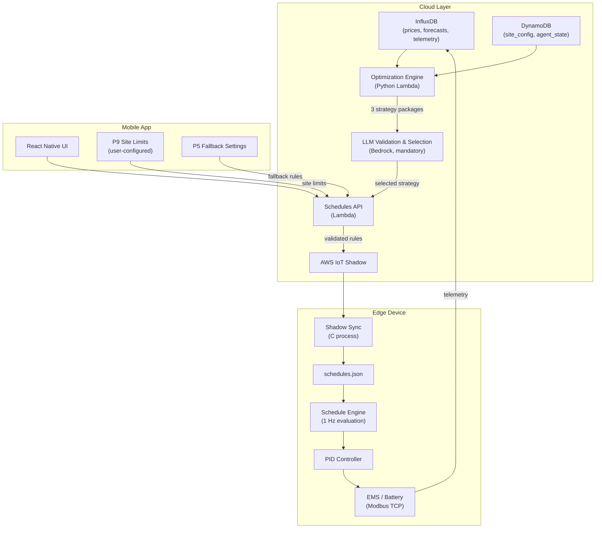
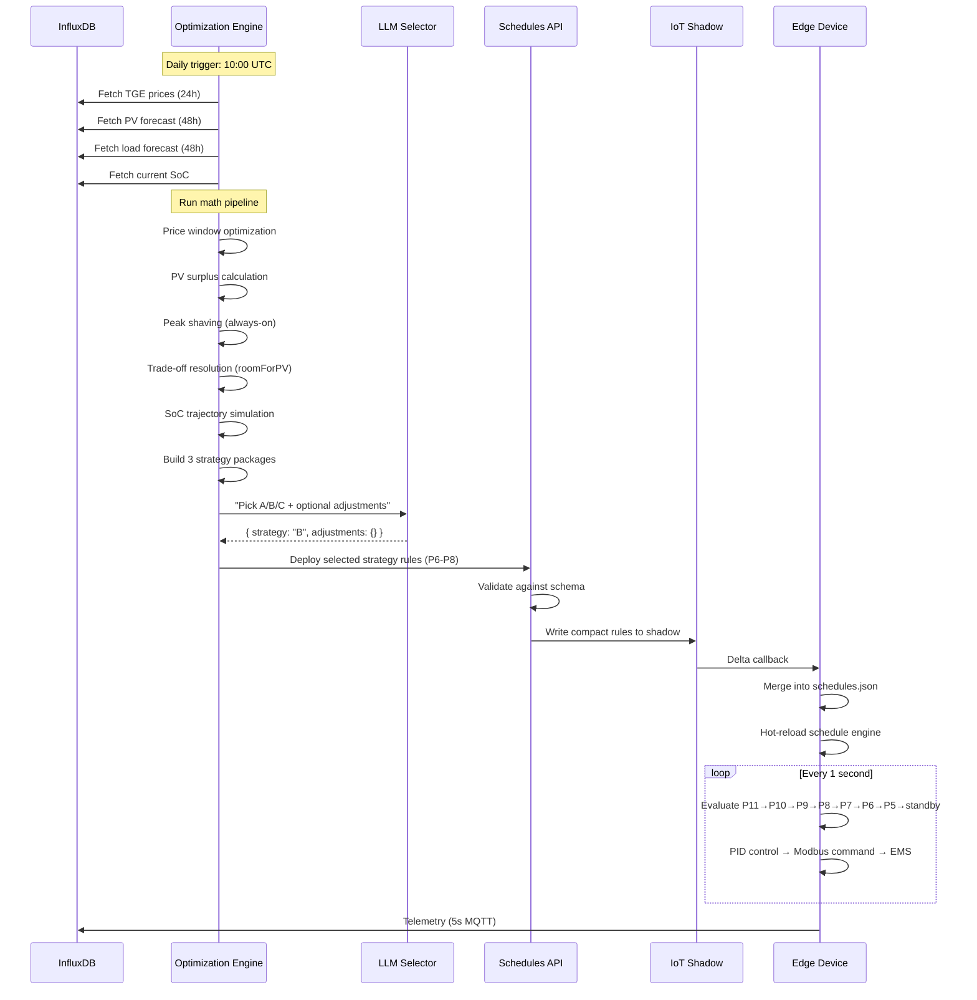
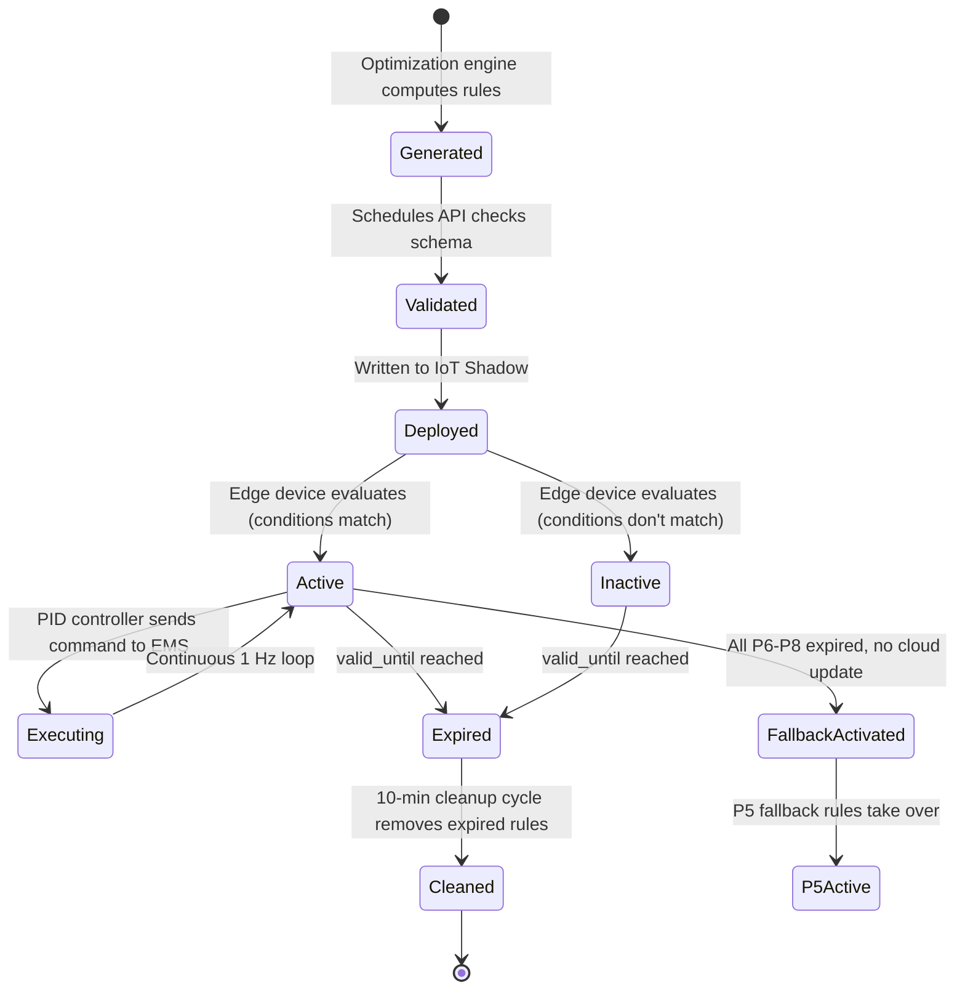

# AIESS v2.0 — Optimization Engine Architecture

> **Status**: Design specification
> **Last Updated**: 2026-03-19

---

## 1. Design Philosophy

The AIESS optimization architecture is built on four core principles:

1. **Math over AI** — Schedule rules are generated by deterministic mathematical algorithms, not LLM inference. Same inputs always produce the same outputs. This makes the system testable, predictable, and debuggable.

2. **Offline-first** — The edge device must operate correctly without cloud connectivity. Cloud intelligence enhances performance but is never required for safe, profitable operation.

3. **Real-world defensive** — The system assumes forecasts will be wrong. Every strategy includes defensive rules (peak shaving, PV surplus capture) even when forecasts predict they won't be needed. Grid thresholds must never be breached.

4. **Compact and centralized** — One canonical rule format used everywhere: optimization engine output, Schedules API, IoT Shadow, mobile app, edge device parser. No translation layers, no format mismatches.

---

## 2. System Overview



---

## 3. The Key Architectural Shift

### Before (v1.x): LLM Generates Rules

```
Optimization Engine          →  "hints" (windows, recommendations)
       ↓
LLM (Claude Sonnet 4)       →  generates full rule JSON (error-prone)
       ↓
Schedules API                →  no validation, passes through
       ↓
IoT Shadow → Edge Device     →  edge parser may reject malformed rules silently
```

**Problems**: Messy rules, format mismatches, unpredictable output, expensive ($0.30+/day LLM tokens), untestable.

### After (v2.0): Math Generates Rules, LLM Validates & Selects

```
Optimization Engine          →  3 complete, validated strategy packages
       ↓
LLM (mandatory)              →  validates sanity, picks strategy A/B/C, adjusts 1-2 params
       ↓
Schedules API                →  schema validation gate (rejects invalid rules)
       ↓
IoT Shadow → Edge Device     →  guaranteed valid rules, compact format
```

**Benefits**: Deterministic, testable, cheap (~$0.02/day tokens), predictable, LLM as validation layer ensures human-like sanity check. If LLM fails, Strategy B (balanced) auto-deploys — the system is fully offline-capable even without the LLM, but the LLM is always invoked when available.

---

## 4. Component Responsibilities

### Optimization Engine (Python Lambda)

- **Owns**: Mathematical computation of optimal charge/discharge schedules
- **Reads & understands**: Full site specification from DynamoDB `site_config` — battery capacity, charge/discharge power limits, grid connection parameters (moc_zamowiona, grid_capacity_kva, export/import limits), tariff structure, PV installation details, site profile/preferences. The engine must interpret all site-specific constraints to produce rules that are physically valid and economically optimal for *that specific site*.
- **Inputs**: TGE prices, PV forecast, load forecast, historical load data (for confidence bands), site_config (DynamoDB), current SoC, active P9 limits
- **Outputs**: 3 strategy packages, each containing a complete set of validated P6-P8 rules in canonical compact format
- **Does NOT**: Generate P9 site limits (user-configured via app), touch P10/P11, call any LLM
- **Note for integrators**: The site_config schema is defined in DynamoDB and may evolve. When integrating this documentation with other agents or systems, treat the site_config as the authoritative source of site-specific constraints. The engine must gracefully handle missing optional fields (e.g., if `export_limit_kw` is not set, skip export clamping).

### LLM Validation & Selection Layer (Bedrock Lambda) — MANDATORY

- **Owns**: Validation of engine output sanity + strategy selection based on site profile, weekly plan, and lessons learned
- **Inputs**: 3 strategy packages from optimization engine + context (profile, lessons, yesterday outcome, site specification)
- **Outputs**: Strategy choice (A/B/C) + optional parameter adjustments (e.g., +-10% power, +-5% SoC target) + optional flag for anomalies detected
- **Always invoked**: The LLM is a required part of the deployment pipeline, not an optional enhancement. It serves as a human-like validation layer that can catch edge cases the math may miss (e.g., "Strategy A charges during a national holiday when the factory is closed — switch to C").
- **Fallback on failure**: If the LLM is unavailable, times out, or returns garbage, Strategy B (balanced) is auto-deployed. The system degrades gracefully but never blocks on LLM unavailability.
- **Does NOT**: Generate rule JSON, modify rule structure, create new rule types

### Schedules API (Lambda)

- **Owns**: Rule validation, conflict detection, IoT Shadow writes
- **Inputs**: Rules from any source (optimization engine, mobile app manual rules, user adjustments)
- **Outputs**: Validated rules written to IoT Shadow in compact format
- **Validates**: Every rule against `schedules.schema.json` before deployment
- **Does NOT**: Generate or optimize rules

### Edge Device Schedule Engine (C daemon)

- **Owns**: Real-time rule evaluation (1 Hz), PID control, safety enforcement
- **Inputs**: `schedules.json` (from shadow sync or local)
- **Outputs**: EMS Modbus commands (charge/discharge/standby with power level)
- **Does NOT**: Optimize, call cloud APIs, generate rules (except P11 safety and P9 active controller)

### Mobile App

- **Owns**: P9 site limit configuration, P5 fallback settings, manual rule creation, schedule visualization
- **Does NOT**: Generate optimized rules (that's the engine's job)

---

## 5. Data Flow: Daily Schedule Cycle



---

## 6. Rule Lifecycle



---

## 7. What The Optimization Engine Does NOT Control

| Component | Controlled by | Notes |
|-----------|---------------|-------|
| P9 site limits (`hth`/`lth`) | User via mobile app | Import/export thresholds for grid connection agreement |
| P10 SCADA commands | Grid operator / TSO | Future capacity market integration |
| P11 safety rules | Edge device automatically | SoC limits, grid meter offline |
| P5 fallback rules | User via mobile app "Fallback Settings" | Defensive rules for when cloud schedules expire |
| PID tuning parameters | `control_config.json` | Kp, Ki, Kd, ramp rates |
| Device config | Setup wizard / installer | Battery capacity, max power, device addresses |

The optimization engine generates **P6, P7, P8 rules only**. Everything else is configured separately and treated as input constraints.

---

## 8. Offline Behavior

| Connectivity State | Behavior |
|-------------------|----------|
| **Normal** | P6-P8 from optimization engine, P9 from app, P11 from device |
| **Cloud stale** (P6-P8 expired, no update within configurable window) | P5 fallback rules activate (zero-export protection + peak shaving + standby) |
| **Shadow disconnected** | Same as stale; shadow_sync reconnects automatically when connectivity returns |
| **Full offline** (never connected) | P5 fallback + P9 (if pre-configured) + P11 safety. System is safe and useful without ever seeing the cloud. |

---

## 9. Technology Stack

| Component | Technology | Deployment |
|-----------|-----------|------------|
| Optimization Engine | Python 3.11+ (numpy) | AWS Lambda container |
| LLM Selector | Node.js / Python | AWS Lambda |
| Schedules API | Node.js | AWS Lambda + API Gateway |
| IoT Shadow | AWS IoT Core | Managed service |
| Edge daemon | C (gcc, ARM) | Robustel EG5120 |
| Shadow sync | C (coreMQTT, MbedTLS) | Robustel EG5120 |
| Mobile app | React Native (Expo) | iOS/Android |
| Telemetry DB | InfluxDB Cloud | Managed service |
| Config DB | DynamoDB | Managed service |
| Auth | Supabase | Managed service |
