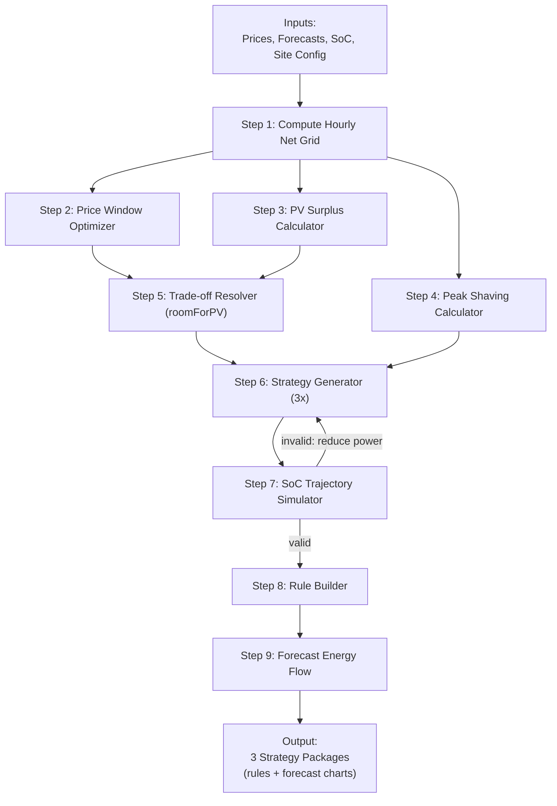

# Optimization Engine — Mathematical Core

> **Purpose**: Detailed specification of the deterministic optimization pipeline that produces strategy packages.
> **Implementation**: Python Lambda (containerized), ~300 lines of core logic.
> **Last Updated**: 2026-03-19

---

## 1. Philosophy

The optimization engine is **pure math**. It takes numerical inputs (prices, forecasts, site config) and produces numerical outputs (complete rule sets). No LLM calls, no heuristics, no randomness.

**Key properties:**
- **Deterministic**: Same inputs always produce the same outputs.
- **Testable**: Every function can be unit-tested with known inputs and expected outputs.
- **Fast**: Microseconds of computation for 48 hourly data points. No external API calls during computation.
- **Defensive**: Assumes forecasts will be wrong. Every strategy includes protective rules regardless of forecast.

---

## 2. Inputs

### 2.1 Site Configuration (from DynamoDB `site_config`)

The engine reads the full site specification from DynamoDB. When integrating this documentation with other agents, treat `site_config` as the authoritative source of site constraints. Missing optional fields are handled gracefully (skip that constraint).

#### Battery Parameters

| Parameter | Source | Example | Used by |
|-----------|--------|---------|---------|
| `battery_capacity_kwh` | Site config | 200 | All modules |
| `max_charge_kw` | Site config | 50 | Power clamping |
| `max_discharge_kw` | Site config | 50 | Power clamping |
| `safety_soc_min` | Site config | 5 | SoC trajectory |
| `safety_soc_max` | Site config | 95 | SoC trajectory |
| `backup_reserve_pct` | Site config / AI profile | 10 | Usable capacity |
| `round_trip_efficiency` | Constant | 0.90 | Arbitrage spread |

#### Grid Connection Limits (3 distinct types)

These are the three independent grid limit types. The engine must understand all three and apply the most conservative (lowest) applicable limit for each direction.

| Parameter | Source | Example | Meaning | Applies to |
|-----------|--------|---------|---------|------------|
| `moc_zamowiona_kw` | Site config | 80 | Contracted demand power. Exceeding triggers severe penalty tariffs in Poland. | **Import only** (there is no moc zamowiona for export) |
| `grid_capacity_kva` | Site config | 100 | Physical grid connection capacity (transformer/fuse). Hard electrical limit. | **Both import and export** |
| `export_limit_kw` | P9 `lth` (abs value) | 40 | User-configured export threshold (P9 site limit from mobile app). | **Export only** |
| `import_limit_kw` | P9 `hth` | 70 | User-configured import threshold (P9 site limit from mobile app). | **Import only** |

#### Effective Limit Calculation

The engine computes effective limits by taking the **minimum of all applicable constraints**, skipping any that are not configured (null/absent):

```python
def compute_effective_limits(site_config):
    # --- Import (charging) direction ---
    # All three can limit import. Take the most conservative.
    import_candidates = [
        site_config.get("moc_zamowiona_kw"),   # Contracted demand (import only)
        site_config.get("grid_capacity_kva"),    # Physical connection (both)
        site_config.get("import_limit_kw"),      # P9 user-configured (import only)
    ]
    import_candidates = [x for x in import_candidates if x is not None]
    effective_import_limit = min(import_candidates) if import_candidates else None

    # --- Export (discharging/PV) direction ---
    # Only grid_capacity and export_limit apply. NO moc_zamowiona for export.
    export_candidates = [
        site_config.get("grid_capacity_kva"),    # Physical connection (both)
        site_config.get("export_limit_kw"),      # P9 user-configured (export only)
    ]
    export_candidates = [x for x in export_candidates if x is not None]
    effective_export_limit = min(export_candidates) if export_candidates else None

    return {
        effective_import_limit_kw: effective_import_limit,
        effective_export_limit_kw: effective_export_limit,
    }
```

**Example**: Site has moc_zamowiona=80kW, grid_capacity=100kVA, P9 import_limit=70kW, P9 export_limit=40kW.
- Effective import limit: min(80, 100, 70) = **70 kW** (P9 is the binding constraint)
- Effective export limit: min(100, 40) = **40 kW** (P9 export is the binding constraint)

**Example**: Site has moc_zamowiona=200kW, grid_capacity=250kVA, no P9 configured.
- Effective import limit: min(200, 250) = **200 kW** (moc_zamowiona is the binding constraint)
- Effective export limit: min(250) = **250 kW** (only grid capacity applies)

#### How limits are used in rule generation

| Rule action | Limit applied to `maxg` / `ming` | Why |
|-------------|-----------------------------------|-----|
| Charge (import from grid) | `maxg` <= effective_import_limit * safety_margin | Prevent exceeding moc_zamowiona/grid_capacity/P9 during charging |
| Discharge (export to grid) | `ming` >= -(effective_export_limit * safety_margin) | Prevent exceeding grid_capacity/export_limit during export |
| PV surplus capture | Respects effective_export_limit | Even when charging from PV, total grid export must stay within limit |
| Peak shaving threshold | Uses moc_zamowiona specifically (not P9) | Peak shaving protects against moc_zamowiona penalties; P9 is a separate softer constraint |

#### Other Site Parameters

| Parameter | Source | Example | Used by |
|-----------|--------|---------|---------|
| `export_allowed` | Site config | true | PV surplus logic |
| `peak_confidence` | Site config | 0.99 | Confidence band for peak shaving reserve (see 4.4) |
| `pv_installed_kwp` | Site config | 100 | PV surplus estimation context |
| `site_profile` | Site config | "industrial" | LLM context for strategy selection |

### 2.2 Market Data (from InfluxDB)

| Data | Measurement | Resolution | Horizon |
|------|-------------|------------|---------|
| TGE RDN prices | `tge_rdn_prices` | Hourly | 24-48 hours |
| Distribution tariff zones | `aiess_tariff_data` (DynamoDB) | Hourly zones | Day |

### 2.3 Forecasts (from InfluxDB)

| Data | Measurement | Resolution | Horizon |
|------|-------------|------------|---------|
| PV production forecast | `energy_forecast.pv_forecast_kw` | Hourly | 48 hours |
| Load forecast | `energy_forecast.load_forecast_kw` | Hourly | 48 hours |

### 2.4 Derived Input: Expected Surplus Shape

The engine computes `net_grid[h] = load_forecast[h] - pv_forecast[h]` in Step 1. Hours where `net_grid[h] < 0` represent expected surplus. The **shape** of this surplus curve is critical for rule generation:

```
Example surplus shape (summer weekend):
Hour:     06  07  08  09  10  11  12  13  14  15  16  17  18
Surplus:   0   5  20  45  60  70  65  55  40  25  10   0   0
(kW)
```

From this shape, the engine derives:
- **Surplus windows**: consecutive hours grouped into blocks (e.g., 07:00-17:00)
- **Peak surplus kW**: the maximum instantaneous surplus (70 kW at 11:00 above)
- **Total capturable kWh**: area under the curve, capped by battery capacity and charge rate
- **Surplus ramp profile**: how quickly surplus builds and decays (informs charge timing)

This shape data is used by the PV Surplus Calculator (Step 3) to set grid power thresholds for charge rules. A steep, narrow surplus peak needs a lower trigger threshold than a broad, flat surplus.

### 2.5 Current State (from InfluxDB telemetry)

| Data | Source | Example |
|------|--------|---------|
| Current SoC | `energy_telemetry.battery_soc_percent` | 45% |
| Current time | System clock | 10:00 UTC |

---

## 3. Pipeline Overview



---

## 4. Pipeline Components

### 4.1 Step 1: Compute Hourly Net Grid

For each hour in the horizon, compute what the grid power would be without battery intervention:

```
net_grid[h] = load_forecast[h] - pv_forecast[h]
```

- **Positive**: Site is importing (load > PV)
- **Negative**: Site is exporting (PV > load)

This is the baseline from which all optimization decisions are made.

### 4.2 Step 2: Price Window Optimizer

**Goal**: Find the cheapest hours to charge and most expensive hours to discharge, then check if the spread is profitable.

```python
def optimize_price_windows(prices, site_config):
    usable_capacity = (soc_max - soc_min - backup_reserve) / 100 * battery_capacity
    charge_hours_needed = ceil(usable_capacity / max_charge_kw)
    discharge_hours_needed = ceil(usable_capacity / max_discharge_kw)

    sorted_by_price = sort(enumerate(prices), key=price)
    cheap_hours = sorted_by_price[:charge_hours_needed]
    expensive_hours = sorted_by_price[-discharge_hours_needed:]

    avg_charge_price = mean(prices[h] for h in cheap_hours)
    avg_discharge_price = mean(prices[h] for h in expensive_hours)

    spread = avg_discharge_price - (avg_charge_price / round_trip_efficiency)

    if spread <= 0:
        return { profitable: False }

    charge_windows = group_consecutive(sorted(cheap_hours))
    discharge_windows = group_consecutive(sorted(expensive_hours))

    estimated_profit = usable_capacity * spread / 1000  # PLN

    return {
        profitable: True,
        charge_windows,      # [{ start_hour, end_hour, avg_price }]
        discharge_windows,   # [{ start_hour, end_hour, avg_price }]
        spread_pln_mwh: spread,
        estimated_profit_pln: estimated_profit,
        avg_charge_price,
        avg_discharge_price
    }
```

**`group_consecutive()`**: Groups hours [2, 3, 4, 7, 8] into windows [{start: 2, end: 4}, {start: 7, end: 8}].

### 4.3 Step 3: PV Surplus Calculator

**Goal**: Identify hours when PV production exceeds load, compute how much surplus energy is available, and how much can be stored.

```python
def calculate_pv_surplus(net_grid, site_config, current_soc):
    surplus_hours = []
    total_surplus_kwh = 0
    capturable_kwh = 0
    simulated_soc = current_soc

    for h in range(len(net_grid)):
        if net_grid[h] < 0:  # PV surplus
            surplus_kw = abs(net_grid[h])
            surplus_hours.append({ hour: h, surplus_kw })
            total_surplus_kwh += surplus_kw

            charge_kw = min(surplus_kw, max_charge_kw)
            charge_kwh = charge_kw * round_trip_efficiency
            room = (soc_max / 100 * battery_capacity) - (simulated_soc / 100 * battery_capacity)

            actual_kwh = min(charge_kwh, room)
            capturable_kwh += actual_kwh
            simulated_soc += (actual_kwh / battery_capacity) * 100

    surplus_windows = group_consecutive(surplus_hours)

    return {
        surplus_windows,             # Grouped time blocks of surplus
        surplus_shape: surplus_hours, # Full hourly shape: [{ hour, surplus_kw }]
        total_surplus_kwh,           # Total area under surplus curve
        capturable_kwh,              # How much we can actually store (capped by battery)
        peak_surplus_kw: max(s.surplus_kw for s in surplus_hours) if surplus_hours else 0,
        avg_surplus_kw: total_surplus_kwh / len(surplus_hours) if surplus_hours else 0,
    }
```

The `surplus_shape` array preserves the full hourly profile. This is used by:
- **Strategy generator**: to set appropriate `gpv` (grid power threshold) in charge rules. A high peak surplus (e.g., 70 kW) means the charge rule can use a less aggressive trigger (e.g., `gpv: -10`), while a low flat surplus (e.g., 15 kW) needs a more aggressive trigger (e.g., `gpv: -2`).
- **Trade-off resolver**: to decide how much room to leave for PV vs night charging.
- **SoC trajectory simulator**: to realistically model how SoC evolves during surplus hours.

### 4.4 Step 4: Peak Shaving Calculator (with Confidence Bands)

**Goal**: Compute the battery reserve needed to protect against `moc_zamowiona` breaches with a **statistical confidence guarantee**, not just a forecast-based guess.

**Why confidence bands, not simple forecasts?**

In Poland, exceeding `moc_zamowiona` (contracted demand power) triggers severe penalty tariffs — often 10× or more the normal energy rate for the exceeded portion. The cost structure is deeply **asymmetric**:

| Action | Cost |
|--------|------|
| Charge 50 kWh overnight (over-prepare) | ~15-25 PLN (fixed-price electricity) |
| 1 hour breach of moc_zamowiona by 20 kW | Hundreds to thousands of PLN (penalty tariff) |

A single missed peak can cost more than a month of overnight charging. This means we must design for **high confidence** (99%+), not expected values.

**CRITICAL DESIGN DECISION**: Peak shaving rules are ALWAYS generated, even when the forecast shows no risk. The reserve SoC is computed from historical load statistics, not from today's forecast.

#### 4.4.1 Statistical Peak Demand Analysis

```python
def calculate_peak_shaving(load_forecast, historical_load_data, site_config):
    safe_limit = moc_zamowiona * (1 - safety_margin_pct / 100)  # Default: 3%
    confidence_level = site_config.get("peak_confidence", 0.99)  # Default: 99%

    # --- Step A: Forecast-based peak windows (for scheduling discharge rules) ---
    peak_hours = []
    for h in range(len(load_forecast)):
        if load_forecast[h] > safe_limit:
            overshoot = load_forecast[h] - safe_limit
            discharge_needed = min(overshoot, max_discharge_kw)
            peak_hours.append({ hour: h, overshoot, discharge_needed })

    peak_windows = group_consecutive(peak_hours)

    # --- Step B: Statistical reserve (for overnight charge target) ---
    # Use historical load data to compute confidence-band reserve.
    # historical_load_data: array of daily peak demand values (kW) from InfluxDB,
    # ideally 30-90 days of 15-min or hourly peak readings.
    reserve = calculate_confidence_reserve(
        historical_load_data, safe_limit, confidence_level, site_config
    )

    return {
        peak_shaving_needed: len(peak_hours) > 0,
        peak_windows,
        safe_limit_kw: safe_limit,
        max_overshoot_kw: max(p.overshoot for p in peak_hours) if peak_hours else 0,
        # Confidence-band outputs:
        reserve_kwh: reserve.energy_needed_kwh,
        reserve_soc: reserve.min_reserve_soc,
        P_conf_peak_kw: reserve.P_conf_peak_kw,
        confidence_level: confidence_level,
    }
```

#### 4.4.2 Confidence Reserve Calculator

```python
def calculate_confidence_reserve(historical_peaks, safe_limit, confidence, site_config):
    """
    Compute the minimum battery reserve to cover peak demand breaches
    at a given confidence level.

    Uses empirical percentiles (no normality assumption) because industrial
    load profiles often have fat tails from machine startups, HVAC, etc.
    """
    if len(historical_peaks) < 7:
        # Insufficient data — use conservative fallback
        return fallback_reserve(safe_limit, site_config)

    # Empirical percentile of daily peak demand (kW)
    # e.g., P99 = "99% of days, peak demand was below this value"
    P_conf_peak = empirical_percentile(historical_peaks, confidence * 100)

    # How much does the P99 peak exceed our safe limit?
    peak_overshoot_kw = max(0, P_conf_peak - safe_limit)

    if peak_overshoot_kw == 0:
        # Even at P99, we don't breach moc_zamowiona
        # Still keep a small defensive reserve for tail events beyond P99
        energy_needed_kwh = usable_capacity * 0.15  # 15% minimum reserve
        min_reserve_soc = (energy_needed_kwh / battery_capacity * 100) + soc_min
        return {
            P_conf_peak_kw: P_conf_peak,
            peak_overshoot_kw: 0,
            energy_needed_kwh: energy_needed_kwh,
            min_reserve_soc: min(min_reserve_soc, soc_max),
        }

    # Estimate peak duration from historical data
    avg_peak_duration_h = estimate_peak_duration(historical_peaks, safe_limit)
    avg_peak_duration_h = max(avg_peak_duration_h, 0.5)  # Floor: 30 min

    # Energy needed to shave the P99 peak for its expected duration
    energy_needed_kwh = peak_overshoot_kw * avg_peak_duration_h

    # Add 10% for battery response delay (ramp-up isn't instant)
    energy_needed_kwh *= 1.10

    # Cap at usable capacity (can't reserve more than the battery holds)
    energy_needed_kwh = min(energy_needed_kwh, usable_capacity)

    # Convert to SoC target
    min_reserve_soc = (energy_needed_kwh / battery_capacity * 100) + soc_min
    min_reserve_soc = min(min_reserve_soc, soc_max)

    return {
        P_conf_peak_kw: P_conf_peak,
        peak_overshoot_kw: peak_overshoot_kw,
        avg_peak_duration_h: avg_peak_duration_h,
        energy_needed_kwh: energy_needed_kwh,
        min_reserve_soc: round(min_reserve_soc),
    }


def fallback_reserve(safe_limit, site_config):
    """
    When historical data is insufficient (<7 days), use a conservative
    fixed reserve based on battery capacity and moc_zamowiona headroom.
    """
    headroom_pct = (moc_zamowiona - safe_limit) / moc_zamowiona
    # Less headroom → more reserve needed
    reserve_pct = lerp(0.70, 0.40, headroom_pct / 0.10)  # 70% if tight, 40% if comfortable
    energy_needed_kwh = usable_capacity * reserve_pct
    min_reserve_soc = (energy_needed_kwh / battery_capacity * 100) + soc_min

    return {
        P_conf_peak_kw: None,  # Unknown
        peak_overshoot_kw: None,
        energy_needed_kwh: energy_needed_kwh,
        min_reserve_soc: min(round(min_reserve_soc), soc_max),
        fallback: True,
    }
```

#### 4.4.3 Confidence Level Selection

The `peak_confidence` parameter is configurable per site (stored in `site_config`):

| Confidence | Meaning | Typical Use |
|------------|---------|-------------|
| 0.95 (95%) | ~1 breach per 20 working days (~monthly) | Low-penalty sites, testing phase |
| 0.99 (99%) | ~1 breach per 100 working days (~5 months) | **Default.** Most industrial sites |
| 0.995 (99.5%) | ~1 breach per 200 working days (~10 months) | High-penalty, tight moc_zamowiona |
| 0.999 (99.9%) | ~1 breach per 1000 working days (~4 years) | Critical sites, very expensive penalties |

Higher confidence → higher reserve SoC → higher overnight electricity cost. The trade-off is always: **cost of electricity vs cost of penalty**. For most Polish industrial sites, 99% is the right default because the penalty asymmetry is so severe.

#### 4.4.4 Numerical Example

Site: 200 kWh battery, moc_zamowiona = 100 kW, safe_limit = 97 kW (3% margin).
Historical daily peaks (30 days): mean = 82 kW, σ ≈ 12 kW.

| Confidence | Pconf peak (kW) | Overshoot (kW) | Duration (h) | Reserve (kWh) | Reserve SoC |
|------------|-----------------|----------------|--------------|---------------|-------------|
| 95% | 98 kW | 1 kW | 1.5h | 1.65 → 15% min floor | ~18% |
| 99% | 108 kW | 11 kW | 1.5h | 18.2 | ~19% |
| 99.5% | 114 kW | 17 kW | 1.5h | 28.1 | ~24% |
| 99.9% | 126 kW | 29 kW | 1.5h | 47.9 | ~34% |

A tighter site (mean = 92 kW, same σ):

| Confidence | Pconf peak (kW) | Overshoot (kW) | Duration (h) | Reserve (kWh) | Reserve SoC |
|------------|-----------------|----------------|--------------|---------------|-------------|
| 95% | 108 kW | 11 kW | 2.0h | 24.2 | ~22% |
| 99% | 118 kW | 21 kW | 2.0h | 46.2 | ~33% |
| 99.5% | 124 kW | 27 kW | 2.0h | 59.4 | ~40% |
| 99.9% | 136 kW | 39 kW | 2.0h | 85.8 | ~53% |

The reserve SoC adapts to each site's actual load volatility. A calm site needs 20%; a volatile site near its moc_zamowiona limit might need 50-60%.

**Even when `peak_shaving_needed` is False** (forecast shows no peaks), the strategy generator still creates a defensive peak shaving rule using the grid power condition `gpo: "gt"` with a threshold at `safe_limit`. And the confidence-band reserve ensures the battery HAS energy to discharge when that rule triggers.

#### 4.4.5 Data Source

Historical peak data comes from InfluxDB, queried by the optimization Lambda:

```
SELECT max("grid_power_kw") AS daily_peak
FROM "aiess_telemetry"
WHERE time > now() - 90d
GROUP BY time(1d)
```

For new sites with <7 days of data, the `fallback_reserve()` function uses a conservative fixed percentage (40-70% of usable capacity depending on headroom).

### 4.5 Step 5: Trade-off Resolver (roomForPV + Peak Shaving Readiness)

**Goal**: Determine the optimal night charge level by balancing three competing needs:

1. **Arbitrage** — charge cheap, discharge expensive (economic value)
2. **PV room** — leave capacity for free daytime PV surplus (free energy)
3. **Peak shaving readiness** — keep battery charged so peak shaving has energy to discharge (risk mitigation)

This third consideration is critical for sites with fixed prices and no PV surplus on weekdays. Without it, the battery sits empty and peak shaving rules have nothing to discharge.

**Holiday awareness**: The `day_of_week` and `is_pre_weekend` logic must also account for **Polish public holidays** and bridge days. A Thursday holiday followed by a Friday bridge day creates a 4-day weekend pattern identical to Sat-Sun. The forecasting system already includes holidays in its load/PV predictions, but the trade-off resolver must also treat holiday days as "weekend-like" for battery planning (lower load, potential PV surplus, no peak shaving needed). See `04_REAL_WORLD_PATTERNS.md` Section 6 (Holiday Handling) for the full list of Polish holidays and multi-day patterns.

```python
def resolve_tradeoff(price_result, pv_result, peak_result, site_config, day_of_week,
                     is_holiday=False, is_pre_holiday=False):
    is_pre_weekend = (day_of_week == 4) or is_pre_holiday  # Friday OR day before holiday
    is_weekend = (day_of_week in [5, 6]) or is_holiday       # Sat/Sun OR holiday

    # --- Peak shaving readiness (from confidence-band calculator) ---
    # These values come from Step 4's statistical analysis, NOT from forecasts.
    peak_reserve_kwh = peak_result.reserve_kwh
    peak_reserve_soc = peak_result.reserve_soc

    # --- Arbitrage value ---
    if price_result.profitable:
        night_cost_per_kwh = price_result.avg_charge_price / 1000
        evening_value_per_kwh = price_result.avg_discharge_price / 1000
        arbitrage_value = evening_value_per_kwh - (night_cost_per_kwh / round_trip_efficiency)
    else:
        arbitrage_value = 0

    # --- PV value ---
    pv_value_per_kwh = avg_tariff_rate_pln_kwh  # Typically 0.40-0.70 PLN/kWh
    potential_pv_kwh = pv_result.capturable_kwh

    # --- Decision logic ---

    if is_pre_weekend and potential_pv_kwh > usable_capacity * 0.3:
        # Friday before a sunny weekend: minimize night charge, maximize room for PV
        # Battery will be filled from weekend surplus
        night_charge_kwh = 0
        room_for_pv = usable_capacity
        charge_reason = "pre_weekend_pv"

    elif is_weekend:
        # Weekend: no night charge, all capacity for PV surplus
        night_charge_kwh = 0
        room_for_pv = usable_capacity
        charge_reason = "weekend_pv"

    elif not price_result.profitable and potential_pv_kwh == 0:
        # NO arbitrage AND NO PV surplus today (e.g., fixed prices, weekday)
        # Charge for peak shaving readiness only
        night_charge_kwh = peak_reserve_kwh
        room_for_pv = usable_capacity - night_charge_kwh
        charge_reason = "peak_shaving_readiness"

    elif not price_result.profitable and potential_pv_kwh > 0:
        # No arbitrage but PV surplus expected today
        # Charge minimum for peak shaving, leave rest for PV
        night_charge_kwh = max(0, peak_reserve_kwh - potential_pv_kwh)
        room_for_pv = usable_capacity - night_charge_kwh
        charge_reason = "peak_reserve_plus_pv"

    elif pv_value_per_kwh > arbitrage_value:
        # PV is more valuable than arbitrage — leave room for PV
        room_for_pv = min(potential_pv_kwh, usable_capacity * 0.6)
        night_charge_kwh = max(usable_capacity - room_for_pv, peak_reserve_kwh)
        charge_reason = "pv_preferred"

    else:
        # Arbitrage is more valuable — charge more at night
        room_for_pv = min(potential_pv_kwh * 0.3, usable_capacity * 0.2)
        night_charge_kwh = max(usable_capacity - room_for_pv, peak_reserve_kwh)
        charge_reason = "arbitrage_preferred"

    return {
        night_charge_kwh: night_charge_kwh,
        room_for_pv_kwh: room_for_pv,
        peak_reserve_kwh: peak_reserve_kwh,
        peak_reserve_soc: round(peak_reserve_soc),
        arbitrage_value_per_kwh: arbitrage_value,
        pv_value_per_kwh: pv_value_per_kwh,
        charge_reason: charge_reason,
    }
```

### Edge Case: Fixed Prices, Weekend PV, Occasional Peaks

This scenario demonstrates why peak shaving readiness is essential:

- **Fixed prices** → `arbitrage_value = 0`, `profitable: false`
- **No weekday PV** → `potential_pv_kwh = 0` on Mon-Fri
- **Peak shaving sometimes needed** → `peak_reserve_kwh > 0`

**Without peak shaving readiness**: `night_charge_kwh = 0`. Battery stays empty. Peak shaving rule has nothing to discharge. The moc_zamowiona threshold can be breached.

**With peak shaving readiness**: `night_charge_kwh = peak_reserve_kwh` (from §4.4 confidence calculator). Battery charges overnight to R% SoC where R is data-driven. Peak shaving rule has energy available. Threshold is protected at the configured confidence level (default 99%).

**Weekly pattern for this site** (R% = confidence-based reserve, varies per site):

| Day | Night Charge | Reason | Daytime Behavior |
|-----|-------------|--------|------------------|
| Mon night | Charge to R% | Confidence reserve | Discharge only on peaks, recharge next night |
| Tue night | Charge to R% | Confidence reserve | Same |
| Wed night | Charge to R% | Confidence reserve | Same |
| Thu night | Charge to R% | Confidence reserve | Same |
| Fri night | DO NOT charge | Pre-weekend PV | Let battery deplete for weekend surplus |
| Sat daytime | PV surplus charging | Weekend PV | Charge from surplus |
| Sun daytime | PV surplus charging | Weekend PV | Charge from surplus to max |

R% might be ~20% for a calm site with lots of headroom, or ~85% for a volatile site near its moc_zamowiona limit. See §4.4.4 for numerical examples.

### 4.6 Step 6: Strategy Generator

**Goal**: Produce three complete strategies with different aggressiveness levels.

```python
STRATEGIES = [
    { "name": "aggressive",   "aggression": 1.2, "risk": "moderate" },
    { "name": "balanced",     "aggression": 1.0, "risk": "low" },
    { "name": "conservative", "aggression": 0.8, "risk": "very_low" },
]

def generate_strategies(tradeoff, price_result, pv_result, peak_result, site_config):
    strategies = []

    for strat in STRATEGIES:
        agg = strat.aggression
        rules = []

        # --- Always-on: Peak Shaving (P8) ---
        # Even when forecast shows no risk, create a defensive threshold rule
        ps_threshold = moc_zamowiona * (1 - lerp(0.03, 0.10, agg))
        rules.append({
            "priority": 8,
            "id": f"opt-ps-{strat.name[0]}",
            "s": "ai",
            "a": { "t": "dis", "pw": max_discharge_kw * agg, "pid": True },
            "c": { "gpo": "gt", "gpv": round(ps_threshold, 1), "sm": 10, "sx": 95 },
        })

        # --- P7: Arbitrage OR Peak Shaving Readiness Charge ---
        if price_result.profitable:
            # Arbitrage mode: charge cheap, discharge expensive
            night_soc_target = current_soc + (tradeoff.night_charge_kwh / battery_capacity * 100)
            night_soc_target = min(night_soc_target, soc_max)
            charge_window = price_result.charge_windows[0]

            rules.append({
                "priority": 7,
                "id": f"opt-arb-c-{strat.name[0]}",
                "s": "ai",
                "a": {
                    "t": "ct",
                    "soc": round(night_soc_target),
                    "str": "eq",
                    "maxp": round(max_charge_kw * agg),
                    "maxg": round(effective_import_limit * 0.95),
                },
                "c": {
                    "ts": charge_window.start_hour * 100,
                    "te": charge_window.end_hour * 100,
                },
                "d": "wkd",
            })

            discharge_window = price_result.discharge_windows[0]
            discharge_soc_target = lerp(30, 50, 1 - agg)

            rules.append({
                "priority": 7,
                "id": f"opt-arb-d-{strat.name[0]}",
                "s": "ai",
                "a": {
                    "t": "dt",
                    "soc": round(discharge_soc_target),
                    "str": "eq",
                    "maxp": round(max_discharge_kw * agg),
                    "ming": round(lerp(5, 20, 1 - agg)),
                },
                "c": {
                    "ts": discharge_window.start_hour * 100,
                    "te": (discharge_window.end_hour + 1) * 100,
                },
                "d": "wkd",
            })

        elif tradeoff.charge_reason == "peak_shaving_readiness":
            # No arbitrage — charge overnight purely for peak shaving reserve
            reserve_soc = tradeoff.peak_reserve_soc * agg
            reserve_soc = min(reserve_soc, soc_max)

            # Determine which weekdays need overnight charge (exclude pre-weekend)
            # Weekly planner determines if Friday should be excluded
            charge_days = tradeoff.get("charge_days", [1, 2, 3, 4])  # Mon-Thu default

            rules.append({
                "priority": 7,
                "id": f"opt-reserve-c-{strat.name[0]}",
                "s": "ai",
                "a": {
                    "t": "ct",
                    "soc": round(reserve_soc),
                    "str": "con",  # Conservative: gentle overnight charge
                    "maxp": round(max_charge_kw * 0.6),  # Lower power, grid-friendly
                    "maxg": round(effective_import_limit * 0.80),
                },
                "c": { "ts": 2300, "te": 600 },  # Overnight
                "d": charge_days,
            })

            # Friday: discharge to empty battery for weekend PV
            if tradeoff.get("pre_weekend_discharge", False):
                rules.append({
                    "priority": 7,
                    "id": f"opt-fri-empty-{strat.name[0]}",
                    "s": "ai",
                    "a": {
                        "t": "dt",
                        "soc": round(soc_min + 5),
                        "str": "eq",
                        "maxp": round(max_discharge_kw * agg),
                        "ming": round(lerp(5, 15, 1 - agg)),
                    },
                    "c": { "ts": 1400, "te": 2100 },
                    "d": [5],  # Friday only
                })

        # --- Always-on: PV Surplus Capture (P6) ---
        # Always included, even if forecast says no surplus
        pv_threshold = lerp(-2, -10, 1 - agg)  # Aggressive: -2 kW, Conservative: -10 kW
        pv_soc_max = lerp(95, 80, 1 - agg)     # Aggressive: 95%, Conservative: 80%

        rules.append({
            "priority": 6,
            "id": f"opt-pv-{strat.name[0]}",
            "s": "ai",
            "a": { "t": "ch", "pw": max_charge_kw, "pid": True },
            "c": {
                "gpo": "lt",
                "gpv": round(pv_threshold),
                "sm": 5,
                "sx": round(pv_soc_max),
            },
        })

        # Simulate SoC trajectory for validation (Step 7)
        sim = simulate_soc_trajectory(rules, net_grid, current_soc, site_config)

        # Build forecast energy flow for client charts (Step 9)
        forecast = build_forecast_energy_flow(
            strat, sim.trajectory, net_grid, pv_forecast, load_forecast, prices, site_config
        )

        strategies.append({
            "name": strat.name,
            "rules": rules,
            "forecast": forecast,
            "simulation_valid": sim.valid,
            "risk": strat.risk,
        })

    return strategies
```

**`lerp(a, b, t)`**: Linear interpolation. `lerp(5, 20, 0.5)` = 12.5.

### 4.7 Step 7: SoC Trajectory Simulator

**Goal**: Simulate the hour-by-hour SoC of the battery under the proposed rule set against the forecast data. Ensure no SoC violations and no grid limit breaches.

```python
def simulate_soc_trajectory(rules, net_grid, current_soc, site_config):
    soc = current_soc
    trajectory = []
    violations = []

    for h in range(len(net_grid)):
        battery_power = 0  # kW, positive = discharge, negative = charge

        # Find highest-priority matching rule for this hour
        active_rule = evaluate_rules_for_hour(rules, h, soc, net_grid[h])

        if active_rule:
            if active_rule.action.type in ["ch", "ct"]:
                battery_power = -active_rule.effective_power  # Charging (negative)
            elif active_rule.action.type in ["dis", "dt"]:
                battery_power = active_rule.effective_power   # Discharging (positive)

        # Apply grid limit capping (most conservative from all applicable limits)
        expected_grid = net_grid[h] + battery_power
        if effective_import_limit and expected_grid > effective_import_limit:
            battery_power = effective_import_limit - net_grid[h]
        if effective_export_limit and expected_grid < -effective_export_limit:
            battery_power = -effective_export_limit - net_grid[h]

        # Update SoC
        energy_delta_kwh = battery_power  # 1 hour = 1 kWh per kW
        if battery_power < 0:  # Charging
            energy_delta_kwh *= round_trip_efficiency
        soc_delta = (energy_delta_kwh / battery_capacity) * 100
        new_soc = soc - soc_delta  # Discharge reduces SoC, charge increases

        # Check bounds
        if new_soc > soc_max:
            violations.append({ hour: h, type: "soc_overflow", value: new_soc })
            new_soc = soc_max
        if new_soc < soc_min:
            violations.append({ hour: h, type: "soc_underflow", value: new_soc })
            new_soc = soc_min

        trajectory.append({
            hour: h,
            soc: new_soc,
            battery_power,
            grid_power: net_grid[h] + battery_power,
            active_rule: active_rule.id if active_rule else None
        })
        soc = new_soc

    return {
        trajectory,
        valid: len(violations) == 0,
        violations,
        min_soc: min(t.soc for t in trajectory),
        max_soc: max(t.soc for t in trajectory),
        final_soc: trajectory[-1].soc
    }
```

If `violations` are found, the strategy generator reduces power levels and re-simulates until the trajectory is valid.

### 4.8 Step 8: Rule Builder

**Goal**: Convert the internal rule objects into canonical compact format ready for deployment.

```python
def build_rules_for_deployment(strategy, valid_until_timestamp):
    output = { "sch": {} }

    for rule in strategy.rules:
        priority_key = f"p_{rule['priority']}"
        if priority_key not in output["sch"]:
            output["sch"][priority_key] = []

        deployed_rule = {
            "id": rule["id"],
            "s": rule["s"],
            "a": rule["a"],
            "c": rule.get("c", {}),
            "vu": valid_until_timestamp,
        }

        if "d" in rule:
            deployed_rule["d"] = rule["d"]

        output["sch"][priority_key].append(deployed_rule)

    return output
```

### 4.9 Step 9: Forecast Energy Flow (Client-Facing Output)

**Goal**: Produce an hour-by-hour energy flow forecast for each strategy, suitable for rendering in the mobile app charts. This is a direct byproduct of the SoC trajectory simulation — no extra computation needed, just enriching and formatting the data that Step 7 already computes.

```python
def build_forecast_energy_flow(strategy, trajectory, net_grid, pv_forecast,
                                load_forecast, prices, site_config):
    hourly_flow = []

    for h in range(len(trajectory)):
        t = trajectory[h]
        pv = pv_forecast[h]
        load = load_forecast[h]
        batt = t.battery_power     # positive = discharge, negative = charge

        # PV self-consumption: min of PV and load (how much PV directly feeds load)
        pv_self_consumed = min(pv, load)

        # PV to battery: if charging AND surplus exists
        pv_to_battery = 0
        if batt < 0 and net_grid[h] < 0:
            pv_to_battery = min(abs(batt), abs(net_grid[h]))

        # PV exported: surplus not captured by battery
        pv_exported = max(0, pv - load - pv_to_battery)

        # Grid import: positive grid_power means importing
        grid_import = max(0, t.grid_power)
        grid_export = max(0, -t.grid_power)

        # Battery to load: discharge going to load (not export)
        batt_to_load = min(max(0, batt), max(0, load - pv))

        # Battery to grid: discharge going to export
        batt_to_grid = max(0, batt) - batt_to_load

        # Economics
        energy_cost = grid_import * (prices[h] / 1000)  # PLN (import cost)
        energy_revenue = grid_export * (prices[h] / 1000)  # PLN (export revenue)
        net_cost = energy_cost - energy_revenue

        hourly_flow.append({
            "hour": h,
            "soc_pct": round(t.soc, 1),
            "battery_kw": round(batt, 1),
            "grid_kw": round(t.grid_power, 1),
            "pv_kw": round(pv, 1),
            "load_kw": round(load, 1),
            "pv_self_consumed_kw": round(pv_self_consumed, 1),
            "pv_to_battery_kw": round(pv_to_battery, 1),
            "pv_exported_kw": round(pv_exported, 1),
            "grid_import_kw": round(grid_import, 1),
            "grid_export_kw": round(grid_export, 1),
            "batt_to_load_kw": round(batt_to_load, 1),
            "batt_to_grid_kw": round(batt_to_grid, 1),
            "active_rule": t.active_rule,
            "price_pln_mwh": prices[h],
            "net_cost_pln": round(net_cost, 2),
        })

    # Summary totals
    total_import_kwh = sum(f["grid_import_kw"] for f in hourly_flow)
    total_export_kwh = sum(f["grid_export_kw"] for f in hourly_flow)
    total_pv_self_kwh = sum(f["pv_self_consumed_kw"] for f in hourly_flow)
    total_pv_battery_kwh = sum(f["pv_to_battery_kw"] for f in hourly_flow)
    total_cost = sum(f["net_cost_pln"] for f in hourly_flow)
    self_consumption_pct = (total_pv_self_kwh + total_pv_battery_kwh) / sum(pv_forecast) * 100 if sum(pv_forecast) > 0 else 0

    return {
        "strategy": strategy.name,
        "horizon_hours": len(hourly_flow),
        "hourly": hourly_flow,
        "summary": {
            "total_grid_import_kwh": round(total_import_kwh, 1),
            "total_grid_export_kwh": round(total_export_kwh, 1),
            "total_pv_self_consumed_kwh": round(total_pv_self_kwh, 1),
            "total_pv_to_battery_kwh": round(total_pv_battery_kwh, 1),
            "self_consumption_pct": round(self_consumption_pct, 1),
            "soc_start": round(hourly_flow[0]["soc_pct"], 1),
            "soc_end": round(hourly_flow[-1]["soc_pct"], 1),
            "soc_min": round(min(f["soc_pct"] for f in hourly_flow), 1),
            "soc_max": round(max(f["soc_pct"] for f in hourly_flow), 1),
            "peak_grid_import_kw": round(max(f["grid_import_kw"] for f in hourly_flow), 1),
            "peak_grid_export_kw": round(max(f["grid_export_kw"] for f in hourly_flow), 1),
            "total_net_cost_pln": round(total_cost, 2),
            "estimated_savings_pln": round(-total_cost, 2),
        },
    }
```

#### What the mobile app receives per strategy

Each of the 3 strategy packages includes its forecast energy flow:

```json
{
  "strategy": "balanced",
  "rules": [ ... ],
  "risk": "low",
  "forecast": {
    "horizon_hours": 24,
    "hourly": [
      {
        "hour": 0,
        "soc_pct": 45.0,
        "battery_kw": -45.0,
        "grid_kw": 53.0,
        "pv_kw": 0, "load_kw": 8,
        "grid_import_kw": 53.0, "grid_export_kw": 0,
        "active_rule": "opt-arb-c-b",
        "price_pln_mwh": 180,
        "net_cost_pln": 9.54
      },
      { "hour": 1, "..." : "..." },
      { "hour": 10, "soc_pct": 72.0, "battery_kw": -30.0, "grid_kw": 0.0,
        "pv_kw": 85, "load_kw": 55, "pv_self_consumed_kw": 55, "pv_to_battery_kw": 30,
        "grid_import_kw": 0, "grid_export_kw": 0,
        "active_rule": "opt-pv-b", "..." : "..." },
      { "hour": 17, "soc_pct": 85.0, "battery_kw": 50.0, "grid_kw": -30.0,
        "pv_kw": 10, "load_kw": 20, "batt_to_load_kw": 10, "batt_to_grid_kw": 40,
        "active_rule": "opt-arb-d-b", "..." : "..." }
    ],
    "summary": {
      "total_grid_import_kwh": 185.0,
      "total_grid_export_kwh": 120.0,
      "total_pv_self_consumed_kwh": 320.0,
      "total_pv_to_battery_kwh": 80.0,
      "self_consumption_pct": 66.7,
      "soc_start": 45.0,
      "soc_end": 35.0,
      "soc_min": 35.0,
      "soc_max": 90.0,
      "peak_grid_import_kw": 58.0,
      "peak_grid_export_kw": 40.0,
      "total_net_cost_pln": -12.50,
      "estimated_savings_pln": 12.50
    }
  }
}
```

#### Mobile app chart types enabled by this data

| Chart | Data source | Visualization |
|-------|-------------|---------------|
| **SoC Forecast** | `hourly[].soc_pct` | Line chart, 0-100%, color-coded zones |
| **Energy Flows** | `battery_kw`, `grid_kw`, `pv_kw`, `load_kw` | Stacked area chart showing where energy comes from and goes |
| **PV Utilization** | `pv_self_consumed_kw`, `pv_to_battery_kw`, `pv_exported_kw` | Stacked bar showing PV breakdown |
| **Grid Power** | `grid_import_kw`, `grid_export_kw` | Bidirectional bar chart |
| **Cost Timeline** | `net_cost_pln` per hour | Bar chart showing when money flows in/out |
| **Strategy Comparison** | `summary` from all 3 strategies side-by-side | Table or grouped bars |

#### After the LLM selects a strategy

Once the LLM picks (e.g.) Strategy B, the Schedules API stores the selected forecast alongside the deployed rules. The mobile app can then overlay **forecast vs actual** as telemetry arrives throughout the day, giving the client real-time visibility into how closely the battery is tracking its plan.

```
Forecast: SoC should be 72% at 14:00, grid import should peak at 58 kW
Actual:   SoC was 68% at 14:00, grid import peaked at 62 kW
Delta:    -4% SoC, +4 kW grid (slightly behind plan)
```

This forecast-vs-actual comparison also feeds the **self-learning loop** (see `05_AI_AGENT_ROLE.md` Section 6): yesterday's accuracy helps the LLM adjust its strategy selection for tomorrow.

---

## 5. Concrete Numerical Example

### Site: Polish Industrial Factory

```
Battery: 200 kWh, 50 kW max charge/discharge
Grid: 80 kW moc zamówiona, 70 kW import limit (P9), 40 kW export limit (P9)
PV: 100 kWp
SoC range: 5-95%, backup reserve: 10%
Current SoC: 45%
```

### Input Data (Wednesday, March 19, 2026)

**TGE RDN Prices (PLN/MWh):**

| Hour | 00 | 01 | 02 | 03 | 04 | 05 | 06 | 07 | 08 | 09 | 10 | 11 |
|------|----|----|----|----|----|----|----|----|----|----|----|----|
| Price | 180 | 175 | 170 | 165 | 168 | 172 | 210 | 280 | 320 | 360 | 390 | 380 |

| Hour | 12 | 13 | 14 | 15 | 16 | 17 | 18 | 19 | 20 | 21 | 22 | 23 |
|------|----|----|----|----|----|----|----|----|----|----|----|----|
| Price | 350 | 340 | 320 | 350 | 400 | 450 | 480 | 420 | 350 | 280 | 220 | 190 |

**PV Forecast (kW):**

| Hour | 00-05 | 06 | 07 | 08 | 09 | 10 | 11 | 12 | 13 | 14 | 15 | 16 | 17 | 18-23 |
|------|-------|----|----|----|----|----|----|----|----|----|----|----|-------|-------|
| PV | 0 | 5 | 20 | 45 | 70 | 85 | 95 | 100 | 90 | 75 | 55 | 30 | 10 | 0 |

**Load Forecast (kW):**

| Hour | 00-05 | 06 | 07 | 08 | 09 | 10 | 11 | 12 | 13 | 14 | 15 | 16 | 17 | 18-23 |
|------|-------|----|----|----|----|----|----|----|----|----|----|----|-------|-------|
| Load | 8 | 15 | 30 | 40 | 50 | 55 | 50 | 45 | 40 | 35 | 30 | 25 | 20 | 10 |

### Step 1: Net Grid

| Hour | 06 | 07 | 08 | 09 | 10 | 11 | 12 | 13 | 14 | 15 | 16 | 17 |
|------|----|----|----|----|----|----|----|----|----|----|----|----|
| Net | +10 | +10 | -5 | -20 | -30 | -45 | -55 | -50 | -40 | -25 | -5 | +10 |

**Surplus hours**: H08-H16 (net grid < 0, site is exporting)

### Step 2: Price Windows

- Usable capacity: (95% - 5% - 10%) * 200 = 160 kWh
- Charge hours needed: ceil(160 / 50) = 4 hours
- Cheapest 4 hours: H03 (165), H04 (168), H02 (170), H01 (175) = avg 169.5
- Most expensive 4 hours: H18 (480), H17 (450), H19 (420), H16 (400) = avg 437.5
- Spread: 437.5 - (169.5 / 0.90) = 437.5 - 188.3 = **249.2 PLN/MWh**
- Estimated profit: 160 * 249.2 / 1000 = **39.87 PLN**

### Step 3: PV Surplus

- Surplus hours: H08-H16 (8 hours)
- Total surplus: 5+20+30+45+55+50+40+25+5 = 275 kWh potential
- Capturable (limited by battery and max power): ~120 kWh (after efficiency losses and SoC limits)

### Step 4: Peak Shaving

- Safe limit: 80 * 0.97 = 77.6 kW
- Max load in forecast: 55 kW (H10)
- Peak shaving needed: No (but defensive rule still generated)

### Step 5: Trade-off (roomForPV)

- Arbitrage value: 249.2 / 1000 = 0.249 PLN/kWh
- PV self-consumption value: ~0.55 PLN/kWh (avoided import at tariff rate)
- **PV wins** (0.55 > 0.249)
- Room for PV: min(120, 160 * 0.6) = 96 kWh
- Night charge: 160 - 96 = 64 kWh
- Night SoC target: 45% + (64/200)*100 = 45% + 32% = **77%** (not 95%)

### Step 6: Strategy Generation (Balanced)

**Rules for "Balanced" strategy:**

1. **P8: Defensive peak shaving** — Discharge when grid > 75 kW
2. **P7: Night charge** — Charge to 77% SoC, 02:00-06:00, equal spread
3. **P7: Evening discharge** — Discharge to 35% SoC, 17:00-21:00, equal spread, min grid 10 kW
4. **P6: PV surplus capture** — Charge when grid < -3 kW, SoC < 88%

### Step 7: SoC Trajectory (Balanced)

```
H00: 45% (standby)
H01: 45% (standby)
H02: 45% + 12.5% = 57.5% (charging 25 kW, 2 of 4 hours to reach 77%)
H03: 57.5% + 12.5% = 70% (charging 25 kW)
H04: 70% + 7% = 77% (charging ~15 kW, target reached)
H05: 77% (standby, target already reached)
H08: 77% + 2% = 79% (PV surplus starts, grid < -3)
H09: 79% + 5% = 84% (more surplus)
H10: 84% + 4% = 88% (SoC max for PV rule reached, stop charging)
H11-H16: 88% (surplus goes to grid export, battery full)
H17: 88% - 6% = 82% (discharge starts, 30 kW)
H18: 82% - 6% = 76%
H19: 76% - 6% = 70%
H20: 70% - 6% = 64%
--- Beyond valid_until ---

No SoC violations ✓
Grid never exceeds 70 kW (P9 hth) ✓
Grid never below -40 kW (P9 lth) ✓
```

---

## 6. Output Structure

### Strategy Package

```json
{
  "site_id": "domagala_1",
  "timestamp": "2026-03-19T10:00:00Z",
  "mode": "daily",
  "current_soc": 45,
  "strategies": [
    {
      "name": "aggressive",
      "risk": "moderate",
      "rules": [ ... ],
      "expected": {
        "arbitrage_profit_pln": 45.2,
        "pv_self_consumed_kwh": 110,
        "pv_savings_pln": 55.0,
        "peak_reduction_kw": 0,
        "total_value_pln": 100.2
      },
      "soc_trajectory": {
        "min_soc": 15,
        "max_soc": 95,
        "final_soc": 30
      }
    },
    {
      "name": "balanced",
      "risk": "low",
      "rules": [ ... ],
      "expected": { ... },
      "soc_trajectory": { ... }
    },
    {
      "name": "conservative",
      "risk": "very_low",
      "rules": [ ... ],
      "expected": { ... },
      "soc_trajectory": { ... }
    }
  ],
  "tradeoff_analysis": {
    "winner": "pv",
    "arbitrage_value_per_kwh": 0.249,
    "pv_value_per_kwh": 0.55,
    "night_charge_kwh": 64,
    "room_for_pv_kwh": 96
  },
  "data_summary": {
    "tge_price_range": { "min": 165, "max": 480, "avg": 310 },
    "pv_total_kwh": 680,
    "load_total_kwh": 480,
    "surplus_total_kwh": 275
  }
}
```

### Rules Array (per strategy)

Each strategy's `rules` array contains canonical compact format rules ready for deployment via the Schedules API. See `02_CANONICAL_RULE_SCHEMA.md` for format details.

---

## 7. Module Structure

```
aiess-optimization-engine/
├── handler.py                  # Lambda entry point
├── optimizer/
│   ├── __init__.py
│   ├── price_windows.py        # Step 2: Price window optimization
│   ├── pv_surplus.py           # Step 3: PV surplus calculation
│   ├── peak_shaving.py         # Step 4: Peak shaving (always-on)
│   ├── tradeoff.py             # Step 5: roomForPV trade-off resolver
│   ├── strategy_generator.py   # Step 6: Generate 3 strategies
│   ├── soc_simulator.py        # Step 7: SoC trajectory validation
│   ├── rule_builder.py         # Step 8: Build canonical compact rules
│   └── helpers.py              # lerp, group_consecutive, etc.
├── data/
│   ├── influx_client.py        # InfluxDB data fetching
│   └── dynamo_client.py        # DynamoDB site config
├── tests/
│   ├── test_price_windows.py
│   ├── test_pv_surplus.py
│   ├── test_peak_shaving.py
│   ├── test_tradeoff.py
│   ├── test_strategy_generator.py
│   ├── test_soc_simulator.py
│   └── fixtures/
│       ├── summer_weekday.json    # Known input/output pairs
│       ├── winter_weekday.json
│       ├── weekend_surplus.json
│       └── no_arbitrage.json
├── Dockerfile
└── requirements.txt            # numpy only
```

Each module is a pure function with no side effects (except `data/` clients). All optimizer modules take data as arguments and return results — no global state, no file I/O.
