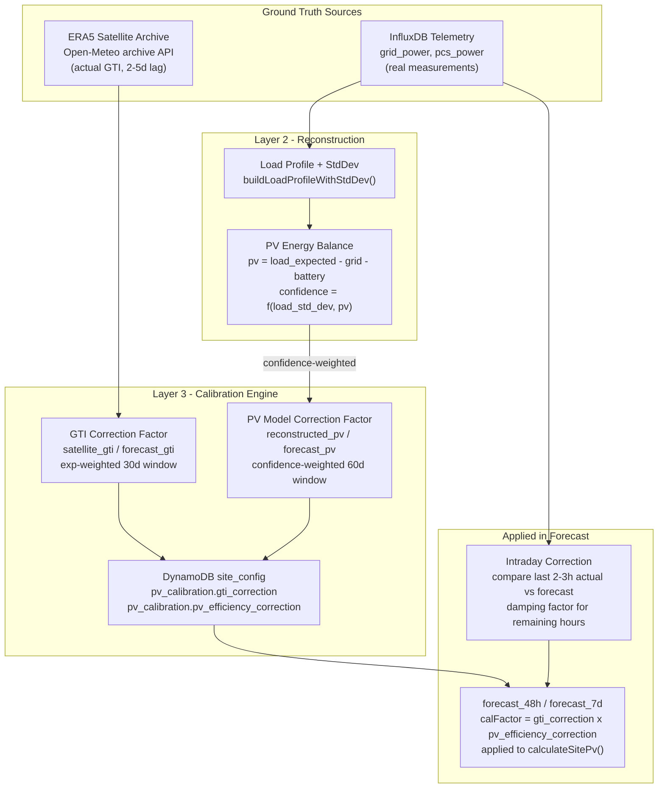

# Self-Aligning PV Forecast

**Status:** Implemented  
**Last Updated:** 2026-03-20

This document describes the self-calibrating PV forecast pipeline added to the AIESS forecast engine. It corrects systematic biases in PV production estimates using two independent ground-truth sources, without requiring physical PV meters.

---

## 1. The Problem

Every layer of the PV forecast pipeline was model-based before this feature:

| Layer | Source | Type |
|-------|--------|------|
| Solar irradiance (GTI) | Open-Meteo NWP model | Model forecast |
| PV power output | Physics model (Faiman + STC) | Computed |
| Historical backfill | Open-Meteo ERA5 archive | Model reanalysis |
| PV production | All arrays at domagala_1 are unmonitored | No hardware meter |

Calibrating a model against its own output is circular — it will always appear "accurate." Two independent sources of ground truth are needed to detect and correct real-world bias.

**Typical sources of sustained error:**

- Open-Meteo ICON D2 overestimates clear-sky GTI by 5–10% for specific locations
- Panel degradation / soiling not reflected in the efficiency factor
- Shading worse than the modeled `shading_factor` (nearby trees grow, new buildings)
- Inverter clipping during peak hours not captured in the physics model
- Seasonal effects: low sun angle in winter, snow cover, morning fog

---

## 2. Ground Truth Sources

### Source 1: Satellite-Observed Radiation

Open-Meteo archive (ERA5 reanalysis with EUMETSAT MSG satellite assimilation) provides **observed** solar irradiance derived from geostationary satellite imagery, not NWP model output.

- Coverage: Poland at ~5–25 km resolution
- Fields fetched: `shortwave_radiation` (GHI), `direct_radiation`, `diffuse_radiation`, `global_tilted_irradiance` (GTI per array orientation)
- Availability: 2–5 day lag from present (satellite processing pipeline)
- Independence: Completely separate source from the Open-Meteo forecast model

**Fetched daily** via `fetchSatelliteForOrientations()` in `lambda/forecast-engine/open-meteo-client.mjs`. Written to InfluxDB `energy_simulation` measurement with `source=satellite` tag.

### Source 2: Energy Balance PV Reconstruction

From real site telemetry in InfluxDB (`grid_power_mean`, `pcs_power_mean`), combined with the statistical load profile, actual PV can be estimated for any hour:

```
pv_reconstructed = expected_load[dayType_hour] - grid_power - pcs_power
```

Where `expected_load[dayType_hour]` is the median factory load for that day-type and hour-of-day, from the historical load profile built by the load forecaster.

**Confidence scoring:** The reconstruction quality depends on how predictable the load was at that hour. Each reconstructed point receives a confidence score:

```
pv_confidence = 1 / (1 + load_std_dev[dayType_hour] / max(pv_estimate, 1))
```

| Scenario | load_std_dev | PV ~50 kW | Confidence |
|----------|-------------|-----------|------------|
| Factory idle / weekend | ~1 kW | 50 kW | ~0.98 |
| Steady production | ~10 kW | 50 kW | ~0.83 |
| Shift transitions | ~25 kW | 50 kW | ~0.67 |
| Variable load, cloudy | ~25 kW | ~5 kW | ~0.17 (discarded) |

**Works for any operating schedule.** A Mon–Fri site gets high-confidence weekends. A 7-day-operation site gets high-confidence holidays and overnight baseline, plus usable (weighted-down) daytime hours. The system never hardcodes "weekends = calibration window" — it uses load variance from the actual historical profile.

---

## 3. Architecture



---

## 4. Implementation Details

### 4.1 Layer 1 — Satellite Download

**File:** `lambda/forecast-engine/calibration-engine.mjs` → `runSatelliteFetch(site)`

Runs once daily (09:00 UTC via EventBridge). Fetches the day `SATELLITE_LAG_DAYS` ago (default: 5) for each unique PV orientation. Writes to InfluxDB:

```
Measurement: energy_simulation
Tags:        site_id=<id>, source=satellite
Fields:      satellite_ghi, satellite_gti, satellite_dni, satellite_dhi
```

The `OPEN_METEO_SATELLITE_URL` env var defaults to the standard ERA5 archive endpoint. If Open-Meteo releases a dedicated satellite API endpoint, override without code changes.

### 4.2 Layer 2 — PV Reconstruction

**File:** `lambda/forecast-engine/calibration-engine.mjs` → `runPvReconstruction(site)`

Runs once daily for yesterday's data (1-day lag ensures all hourly telemetry aggregates are complete). Steps:

1. Fetch 180 days of load history → build `loadProfileWithStdDev` (median + std_dev per `dayType_hour` bucket)
2. Fetch yesterday's telemetry (`grid_power_mean`, `pcs_power_mean`) from `aiess_v1_1h`
3. Fetch yesterday's `pv_estimated` from forecast simulation
4. For each daylight hour: compute `pv_reconstructed` and `pv_confidence`
5. Filter out hours where PV signal is too weak (both `pv_estimate < 0.1` and `pv_reconstructed < 0.5`)
6. Write to InfluxDB with `source=reconstructed`

**New function in `load-forecaster.mjs`:** `buildLoadProfileWithStdDev(loadMap, classifyFn)` — same as `buildLoadProfile` but also computes standard deviation per bucket. Used by both reconstruction and intraday correction.

### 4.3 Layer 3 — Rolling Calibration

**File:** `lambda/forecast-engine/calibration-engine.mjs` → `runCalibration(site)`

Reads the last 30 days of satellite vs. forecast GTI, and 60 days of reconstructed vs. forecast PV. Computes exponentially-weighted ratios:

**GTI correction (weather model bias):**
```
gti_ratio = satellite_gti / forecast_gti   (per daylight hour, min 10 W/m²)
weight = exp(-0.05 * days_ago)             (30-day effective window)
gti_correction = weighted_mean(gti_ratio)  (clamped 0.5–1.5)
```

**PV model correction (site-specific bias):**
```
pv_ratio = pv_reconstructed / pv_estimated  (min both > 1 kW, confidence > 0.3)
weight = pv_confidence * exp(-0.03 * days_ago)  (60-day effective window)
pv_correction = weighted_mean(pv_ratio)         (clamped 0.3–2.0)
```

Requires at least 10 samples before producing a non-unity correction. With ~7 daylight hours per day, corrections become meaningful within 2–3 weeks of running.

**Stored in DynamoDB `site_config`:**
```json
{
  "pv_calibration": {
    "gti_correction": 0.97,
    "pv_efficiency_correction": 0.92,
    "last_calibrated": "2026-03-20",
    "gti_sample_count": 124,
    "pv_sample_count": 86,
    "gti_confidence": 0.82,
    "pv_confidence": 0.68
  }
}
```

**Applied in `runForecast()` in `index.mjs`:**
```javascript
const calibration = site.pv_calibration || {};
const calFactor = (calibration.gti_correction ?? 1.0)
                * (calibration.pv_efficiency_correction ?? 1.0);
// passed as 5th argument to calculateSitePv() / calculateSitePvFromSubhourly()
```

The two correction factors are multiplied. If GTI is overestimated by 5% and the PV model is 8% too optimistic, the combined factor is ~0.87.

### 4.4 Layer 3b — Intraday Correction

**File:** `lambda/forecast-engine/calibration-engine.mjs` → `computeIntradayCorrection()`  
**Called from:** `runForecast()` in `index.mjs`

Runs every forecast cycle (every 3h). Compares the last 2–3 hours of telemetry-derived actual PV against what was forecast. Returns a multiplier for all future hours in the current forecast:

```
pv_actual_hour = profile_median - grid_power - battery_power  (energy balance)
recent_ratio = mean(pv_actual / pv_forecast)  over last 2-3h
correction = 0.6 * recent_ratio + 0.4          (blended toward 1.0 to avoid over-reaction)
```

Requires at least 2 daylight hours of data. Clamped to 0.3–2.0. Applied only to future timestamps (past hours in the forecast window are not modified).

**Example:** It's 13:00, cloud cover came in unexpectedly. Last 3h actual PV = 12 kW, forecast was 40 kW (ratio 0.30). Intraday correction = `0.6 × 0.30 + 0.4 = 0.58`. The 13:00–24:00 forecast hours are multiplied by 0.58. This allows the optimization engine (next run at 15:00) to plan conservatively for the remainder of the day.

---

## 5. Operating Schedule Awareness

Sites that operate 7 days a week require a configuration change. The optimization engine's tradeoff logic previously hardcoded `is_weekend = day_of_week in (5, 6)`, which incorrectly skips night charging on Saturdays assuming low load and PV capture opportunity.

**New field in `site_config`:**
```json
{
  "operating_days": [0, 1, 2, 3, 4]
}
```

- `[0,1,2,3,4]` — Mon–Fri (default, backward-compatible)
- `[0,1,2,3,4,5,6]` — 7-day operation
- `[0,1,2,3,4,5]` — Mon–Sat
- Any subset in Mon=0 … Sun=6 convention

**Used in `tradeoff.py`:**
```python
operating_days = config.get("operating_days", [0, 1, 2, 3, 4])
is_non_operating = day_of_week not in operating_days
next_day = (day_of_week + 1) % 7
is_pre_non_operating = not is_non_operating and next_day not in operating_days

is_weekend = is_non_operating or is_holiday
is_pre_weekend = is_pre_non_operating or is_pre_holiday
```

The PV reconstruction confidence scoring and load forecaster already handle 7-day sites correctly via the `buildLoadProfileWithStdDev` approach — they learn from the actual variance, not from hardcoded day assumptions.

---

## 6. Scheduling

All three daily tasks run sequentially in the same Lambda invocation (mode `self_align`):

| Task | Trigger | UTC | Lag | Depends on |
|------|---------|-----|-----|------------|
| Satellite GTI fetch | EventBridge daily | 09:00 | 5 days | Open-Meteo archive API |
| PV reconstruction | EventBridge daily | 09:00 | 1 day | aiess_v1_1h telemetry aggregates |
| Calibration update | EventBridge daily | 09:00 | — | Both above being written |
| Intraday correction | Every 3h forecast run | — | 0 | Live telemetry |

The `self_align` EventBridge rule runs at 09:00 UTC, after the 07:00 daily forecast run and after overnight telemetry aggregation completes. The IAM role for the forecast Lambda was updated to include `dynamodb:UpdateItem` for writing back to `site_config`.

---

## 7. InfluxDB Storage Impact

New data written per site per day:

| Source | Points/day | Fields | Approx size |
|--------|-----------|--------|-------------|
| `satellite` | 24/orientation × N orientations | 4 fields | ~384 bytes/orientation |
| `reconstructed` | ~10 (daylight hours) | 2 fields | ~120 bytes |
| Total/site/day | ~58 for 2 orientations | — | ~600 bytes |

**Overwrite semantics:** InfluxDB line protocol is idempotent on `(measurement, tags, timestamp)`. Re-running `self_align` for the same day overwrites existing points — no accumulation or duplication. The satellite fetch always writes to the same timestamp for the same orientation, so running it twice produces the same stored data.

---

## 8. Bootstrap Behavior

The correction factors gracefully degrade to 1.0 (no change) when insufficient data is available:

- `< 10` satellite GTI vs. forecast pairs → `gti_correction = 1.0`
- `< 10` reconstructed PV vs. forecast pairs → `pv_efficiency_correction = 1.0`
- Intraday: `< 2` recent hours with both actual and forecast PV → no correction applied

The system becomes effective after approximately:
- **GTI correction:** 2–3 weeks (7 daylight hours/day × 14 days = 98 pairs)
- **PV correction:** 3–4 weeks (only daylight hours with confidence > 0.3 count)
- **Intraday correction:** immediate (first sunny day with telemetry)

---

## 9. Backfilling Existing Sites

The calibration pipeline normally fills one day at a time going forward. Without a backfill, a newly-deployed site would need 2–4 weeks before correction factors become meaningful, even though months of historical telemetry and ERA5 archive data already exist.

### `calibration_backfill` mode

Invoke the forecast engine Lambda with:

```json
{
  "mode": "calibration_backfill",
  "site_id": "domagala_1",
  "start_date": "2025-01-01",
  "end_date": "2026-03-20"
}
```

This runs all three stages over the full date range:
1. **Satellite backfill** — ERA5 archive in 90-day chunks per orientation
2. **PV reconstruction backfill** — energy balance over the full range, or direct PV meter readings if available
3. **Final calibration run** — recomputes correction factors from the newly populated data

**Duration:** For a ~15-month backfill (2025-01-01 to 2026-03-20) with 2 orientations, expect ~6–10 minutes total (ERA5 API calls are the bottleneck at ~2s per 90-day chunk).

**Idempotent:** Re-running overwrites the same InfluxDB timestamps. Safe to run multiple times.

### Real PV Meter Readings (domagala_1 / olmar_1)

Once hardware PV meters are installed and `total_pv_power_mean` appears in telemetry, the reconstruction backfill automatically detects and uses it:

```
if total_pv_power_mean is available for this hour:
    pv_reconstructed = total_pv_power_mean  (direct reading)
    pv_confidence = 1.0                     (maximum — no load uncertainty)
else:
    pv_reconstructed = expected_load - grid_power - pcs_power
    pv_confidence = 1 / (1 + load_std_dev / pv)
```

Real meter readings have `pv_confidence = 1.0` and carry maximum weight in the calibration EMA. Even a few weeks of meter readings will quickly correct any systematic bias that accumulated from energy balance reconstruction.

**No config change required.** The system detects meter availability by checking whether `total_pv_power_mean` exists in the telemetry for the requested date range.

### Recommended First-Time Setup Sequence

```
1. Deploy the new forecast engine Lambda (includes calibration-engine.mjs)
2. Invoke calibration_backfill for each site covering all available history
3. Let the daily self_align run normally going forward
4. When PV meters are installed: re-run calibration_backfill for the metered period
   to replace energy-balance estimates with high-confidence meter readings
```

## 10. Files Changed

| File | Change |
|------|--------|
| `lambda/forecast-engine/calibration-engine.mjs` | New file — all four layers + backfill functions |
| `lambda/forecast-engine/open-meteo-client.mjs` | Added `fetchSatelliteRadiation()`, `parseSatelliteHourlyWeather()`, `fetchSatelliteForOrientations()` |
| `lambda/forecast-engine/influxdb-writer.mjs` | Added `writeSatelliteData()`, `writeReconstructedPvData()`, `readSimulationField()`, `readTelemetryFields()`, `readActualPvMeter()` |
| `lambda/forecast-engine/load-forecaster.mjs` | Added `buildLoadProfileWithStdDev()` with per-bucket standard deviation |
| `lambda/forecast-engine/pv-calculator.mjs` | Added `calibrationFactor` param to `calculateSitePv()` / `calculateSitePvFromSubhourly()` |
| `lambda/forecast-engine/index.mjs` | Added `self_align` and `calibration_backfill` modes, calibration factor application, intraday correction in `runForecast()` |
| `lambda/forecast-engine/cloudformation.yaml` | Added `dynamodb:UpdateItem` permission, `SelfAlignRule` EventBridge (09:00 UTC daily), timeout 120s |
| `lambda/optimization-engine-v2/optimizer/tradeoff.py` | `operating_days` from config replaces hardcoded `(5, 6)` for `is_weekend` |
