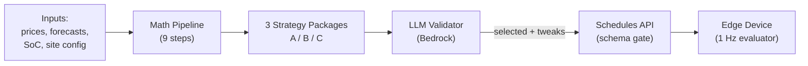

# Optimization Engine — Concise Summary

> One-page summary of what the AIESS optimization engine does, what data it uses, and where the system can grow next.

---

## 1. Overall Idea

**Math generates rules. LLM validates and selects. The edge runs them.**

The optimization engine is a deterministic Python pipeline (running on AWS Lambda) that produces three complete strategy packages — `aggressive`, `balanced`, `conservative` — every day for every site. Each strategy is a self-contained set of priority-tagged rules (P6 PV capture, P7 arbitrage / reserve charge, P8 peak shaving) covering the next 24 hours.

**Key design properties:**

- **Deterministic** — same inputs always produce the same rules. Testable, debuggable.
- **Defensive by default** — every strategy includes peak-shaving and PV-capture rules even when the forecast says they aren't needed today (forecasts are wrong; defenses are cheap).
- **Offline-capable** — if the LLM fails, the balanced strategy auto-deploys. If the cloud is gone, P5 fallback rules take over on-device.
- **Compact & centralized** — one canonical rule format used by engine, API, IoT Shadow, edge parser, and mobile app. No translation layers.

The 9-step math pipeline (see [03_OPTIMIZATION_ENGINE.md](03_OPTIMIZATION_ENGINE.md)):

1. Net grid baseline = `load - PV` per hour
2. Price window optimization (cheapest charge / most expensive discharge windows; profit check after round-trip efficiency)
3. PV surplus calculation (capturable kWh, peak surplus shape)
4. Peak shaving with **statistical confidence bands** — uses 90 days of historical 15-min peak data to compute the reserve needed to protect `moc_zamowiona` at 99% confidence
5. Trade-off resolver — balances arbitrage vs PV-room vs peak-shaving readiness, holiday/weekend-aware, **schedule-aware** via `operating_days` config
6. Strategy generator — produces 3 versions at different aggression levels
7. SoC trajectory simulator — validates each strategy hour-by-hour, no SoC violations, no grid limit breaches; if invalid, reduces power and re-simulates
8. Rule builder — emits canonical compact format
9. Forecast energy flow — hour-by-hour energy/SoC/cost forecast for the mobile app

---

## 2. Tools & Data Available to the Engine

### Site Configuration (DynamoDB `site_config`)

The engine treats this as the authoritative source of every site-specific constraint:

| Category | Fields |
|----------|--------|
| **Battery** | `battery_capacity_kwh`, `max_charge_kw`, `max_discharge_kw`, `safety_soc_min/max`, `backup_reserve_pct` |
| **Grid limits** | `moc_zamowiona_kw` (contracted demand, import-only), `grid_capacity_kva` (physical, both directions), P9 `import_limit_kw` / `export_limit_kw` (user-configured) |
| **Pricing** | `energy_price_model` (`tge_rdn` or `fixed`), `fixed_price_pln_kwh`, `avg_tariff_rate_pln_kwh` |
| **PV** | `pv_system.arrays[]` (tilt, azimuth, peak_kw, monitored, shading_factor, efficiency_factor) |
| **Schedule** | `operating_days` (e.g. `[0,1,2,3,4]` for Mon-Fri, `[0..6]` for 7-day) |
| **Calibration** | `pv_calibration` (auto-populated by self-aligning forecast: `gti_correction`, `pv_efficiency_correction`) |
| **Risk** | `peak_confidence` (default 99%), `safety_margin_pct` |

Effective import/export limits are computed as the **min of all applicable constraints**, never assuming any one source.

### Time-Series Data (InfluxDB `aiess_v1_1h` / `aiess_v1_15m`)

| Data | Measurement / Field | Resolution | Use |
|------|---------------------|-----------|-----|
| TGE RDN day-ahead prices | `tge_energy_prices.price_pln_mwh` | hourly, 24-48h | Arbitrage windows |
| PV forecast | `energy_simulation.pv_estimated` (source=`forecast`) | hourly, 48-168h | Surplus capture, room-for-PV |
| Load forecast | `energy_simulation.load_forecast` | hourly, 48h | Net grid, peak shaving |
| Historical daily peaks | `energy_telemetry.grid_power_mean` (15-min agg) | 15-min, 90d | Confidence-band peak shaving |
| Live SoC | `energy_telemetry.battery_soc_percent` | 5-30s | Current state |
| Telemetry (grid, PCS, PV meter) | `grid_power`, `pcs_power`, `total_pv_power` | 5-30s, 1h agg | Self-alignment, intraday correction |
| Satellite GTI (ground truth) | `energy_simulation.satellite_gti` (source=`satellite`) | hourly, daily backfill | GTI calibration |
| Reconstructed PV | `energy_simulation.pv_reconstructed` (source=`reconstructed`) | hourly | PV model calibration |

### Forecast Engine (separate Lambda, runs every 3h)

The optimization engine doesn't generate forecasts — it consumes them from a dedicated Node.js Lambda that:

- Pulls weather from Open-Meteo (15-min ICON D2 + hourly ECMWF) for each unique panel orientation
- Runs Faiman thermal model for cell-temperature-derated PV power
- Builds statistical load profiles from 180 days of telemetry, classified by `dayType_hour` (workday/weekend/holiday) with temperature regression
- Applies the **self-aligning calibration factors** stored in `site_config.pv_calibration`
- Applies **intraday correction** based on the last 2-3h of actual vs forecasted PV
- Writes everything back to InfluxDB for the engine to consume

See [08_SELF_ALIGNING_PV_FORECAST.md](08_SELF_ALIGNING_PV_FORECAST.md) for the full self-calibration design.

### Decision Logging

Every pipeline step writes structured reasoning to a `decision_log` blob saved alongside each daily run in DynamoDB `aiess_agent_decisions`. Used by the mobile app's "AI Logic View" to show *why* a particular rule was created.

---

## 3. AWS Stack & Architecture (Current + Future Ideas)

### Current Stack

| Component | Service | Trigger | Notes |
|-----------|---------|---------|-------|
| Optimization Engine | Lambda (Python container) | Daily 10:00 UTC via EventBridge | 9-step pipeline, ~10s runtime |
| Forecast Engine | Lambda (Node.js) | Every 3h | Weather + PV + load forecasts |
| Self-Align (calibration) | Same Lambda, mode=`self_align` | Daily 09:00 UTC | Satellite + reconstruction + EMA correction |
| Daily Agent | Lambda (Node.js) | Daily 10:30 UTC | Calls engine, invokes Bedrock LLM, deploys via Schedules API |
| Weekly Agent | Lambda (Node.js) | Weekly Sunday 18:00 UTC | Multi-day plan + lessons learned |
| Intraday Agent | Lambda (Node.js) | Every 30 min | Reactive adjustments to running rules |
| Schedules API | Lambda + API Gateway | On-demand | Schema validation, IoT Shadow writes |
| Edge daemon | C process on Robustel EG5120 | 1 Hz | Rule evaluation, PID, Modbus to EMS |
| Telemetry | InfluxDB Cloud | Continuous | Live + historical aggregates |
| Site config / decisions / state | DynamoDB | On-demand | `site_config`, `aiess_agent_decisions`, `aiess_agent_state` |
| LLM validation | Bedrock (Claude Sonnet) | Per agent run | Mandatory but with auto-fallback to balanced strategy |
| Auth | Supabase | App login | Used by mobile app + Schedules API |
| Mobile app | React Native + Expo (EAS Build) | — | Reads forecasts/decisions, writes P5/P9 |

### Future Ideas Worth Implementing

**A. Observability & Reliability**

1. **CloudWatch dashboards per site** — per-site widgets for forecast accuracy, peak-shaving hit rate, battery cycles/day, savings vs. baseline. Today the data exists in InfluxDB but isn't surfaced in AWS-native ops tools.
2. **EventBridge Pipes for forecast-vs-actual delta alerts** — when actual SoC trajectory diverges >15% from forecast for >2 hours, fire SNS alert. Helps catch broken sensors / wrong site config without manual checking.
3. **AWS X-Ray distributed tracing** across the chain Engine → Bedrock → Schedules API → IoT Shadow. Currently there's no cross-Lambda trace ID; debugging "why did this rule appear" still requires log correlation.
4. **Step Functions** to orchestrate the daily flow (forecast → engine → LLM → deploy → notify). Currently each Lambda invokes the next one directly; a Step Functions state machine would give retry semantics, visualization, and per-step DLQ for free.

**B. Cost & Performance**

5. **Lambda SnapStart** for the Python optimization engine (or move to Lambda Layers + zip instead of container). Cold-start is ~3s today; SnapStart cuts it to <100ms. Matters more for intraday than daily.
6. **DynamoDB on-demand → provisioned with auto-scaling** once we exceed ~5 sites. On-demand is cheap at low scale but ~5× more expensive per write at high volume.
7. **InfluxDB downsampling tasks** — keep 5s telemetry for 14 days, 1-min for 90 days, 15-min for 1 year, 1h forever. Currently 5s is kept for 90 days which dominates storage cost.
8. **Bedrock prompt caching** — the system prompt for daily-agent is ~2k tokens and identical across sites. Anthropic's prompt caching cuts that cost by ~90%.

**C. Architectural Improvements**

9. **Per-site Bedrock guardrails** — different sites need different LLM tone (industrial vs. commercial). Bedrock Guardrails can enforce per-tenant safety rules and topic allow-lists.
10. **AWS IoT Device Defender** profiles for the edge devices — anomaly detection on telemetry frequency, certificate validity, unauthorized topic publishes. Today the C daemon publishes freely.
11. **Schedules API → AppSync (GraphQL)** — the mobile app currently does N round trips for "give me forecast + rules + decisions + telemetry". A single GraphQL query with subscriptions for live SoC would be cleaner and ~50% less data over the wire.
12. **OpenSearch Serverless for decision history** — DynamoDB is fine for the latest decision per site, but explaining "why did the engine pick strategy B 17 days ago" needs full-text search across decision logs. OpenSearch with a small TTL'd index does this well.

**D. Self-Learning Extensions** (beyond the current calibration loop)

13. **Strategy-outcome reinforcement** — after each day, score the deployed strategy on `(actual_savings - forecast_savings) / max_possible`. Feed the rolling 30-day score per strategy back into the LLM prompt so it learns which strategy class works for *this site* in *this season*.
14. **Anomaly DB for "lessons learned"** — when intraday telemetry diverges from forecast significantly, log the cause (cloudy day forecast was clear, factory ran on Saturday, etc.) into a structured table the next-day's LLM context pulls from. This is the missing piece between today's rolling calibration (which corrects bias) and explicit lesson learning (which corrects logic).
15. **Federated calibration** — when 3+ sites in the same TGE zone show the same GTI bias, propagate a regional correction factor instead of letting each site learn from scratch. Cuts time-to-accuracy for new sites from weeks to hours.

**E. Mobile App / UX**

16. **EventBridge → SNS → app push** for "Strategy B was deployed for tomorrow, expected savings 47 PLN" — currently users must open the app to find out. Push notifications close that loop.
17. **What-if sandbox** — let users tweak `peak_confidence` or `backup_reserve_pct` in the app and re-run the engine in dry-run mode against today's data without deploying. Built on the same Lambda with a new `mode=preview` flag.

---

### TL;DR

The engine is **mathematics-first, AI-validated, edge-executed**. It already has rich inputs (prices, forecasts, telemetry, satellite ground truth, calibration, holiday/schedule awareness) and a self-aligning forecast loop. The biggest near-term wins are **observability** (CloudWatch dashboards, X-Ray, Step Functions) and **reinforcement learning across days** (strategy-outcome scoring + structured lesson DB), both small AWS deltas with high product value.
